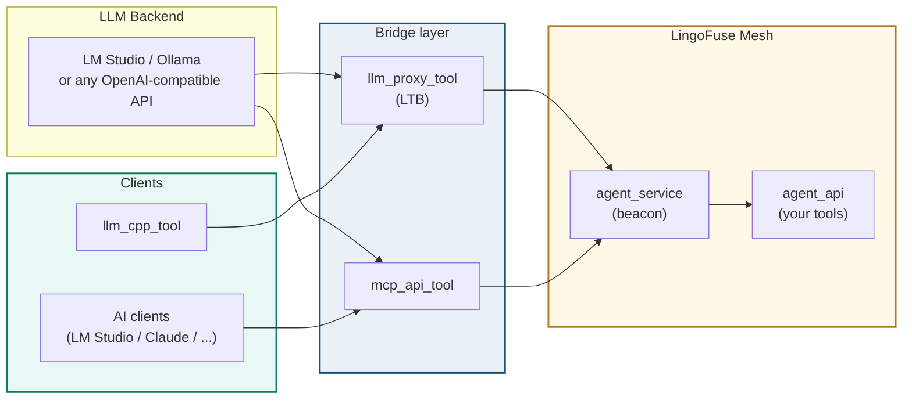
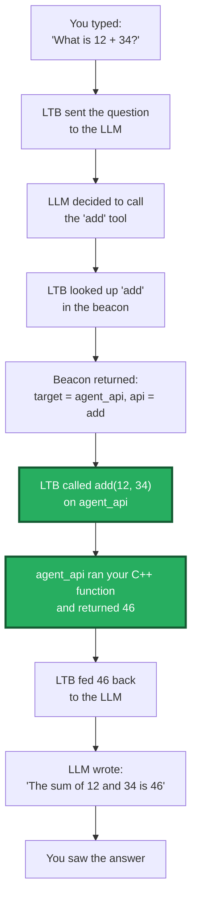

# LingoFuse-cppAgent — Quick Start Guide

> **Get the LLM running with a pre-built package. No compiler, no IDE, no Python install.**
>
> This guide is for first-time users. Follow it step by step. In about 15 minutes you will have a working AI agent that can call your C++ tools.

---

## Before You Start

You need two things:

| # | What | Where |
|---|---|---|
| 1 | **The pre-built package** | Download from the releases page (see below) |
| 2 | **A running LLM backend** | LM Studio, Ollama, or any OpenAI-compatible server |

No CMake. No Visual Studio. No Python runtime setup. The pre-built package contains everything.

---

## Download the Pre-Built Package

Go to the releases page and download the latest package:

**https://github.com/PassByYou888/LingoFuse-cppAgent/releases**

The package contains:

```
LingoFuse-cppAgent/
├── agent_service.exe         # Beacon
├── agent_api.exe             # Example tool provider
├── llm_cpp_tool.exe          # C++ client (REPL + one-shot)
├── llm_service.exe           # Local inference (optional)
├── llm_proxy.exe             # Pure text forwarder
├── llm_proxy_tool.exe        # Tool bridge (LTB)
├── mcp_api_tool.exe          # MCP gateway
├── LingoFuse64.dll           # Runtime library
└── *.py                      # Python service components
```

Extract the archive to a folder. That folder is your workspace.

---

## What Each Component Does



**The two paths to tool execution:**

| Path | Who calls tools | What you run |
|---|---|---|
| **Path A** (client-side) | The AI client itself | `mcp_api_tool.exe` |
| **Path B** (server-side) | The bridge (LTB) | `llm_proxy_tool.exe` |

**You only need one path.** For a first test, use **Path B** — it requires no AI client configuration.

---

## Step 1 — Start an LLM Backend

You need an OpenAI-compatible server running. Pick one:

### Option A — LM Studio (recommended for beginners)

1. Download and install LM Studio from https://lmstudio.ai
2. Open LM Studio, search for a model, download it
3. Go to the "Developer" tab
4. Click "Start Server" (default port: 1234)
5. Note the model name shown in the server panel

**Verify it works:**

```bash
curl http://127.0.0.1:1234/v1/models
```

You should see a JSON response with model IDs.

### Option B — Cloud API

If you have a DeepSeek, OpenAI, or other API key, use it directly:

```powershell
.\llm_proxy_tool.exe `
  --backend-url https://api.deepseek.com/v1 `
  --backend-key sk-xxxxxxxxxxxx `
  --backend-model deepseek-chat
```

### Option C — Local inference with the bundled model

If you downloaded the model file (`NVIDIA-Nemotron-...gguf`), you can run inference locally. This requires `llama-cpp-python` installed. See the model notes document for setup.

---

## Step 2 — Start the Beacon

Open a terminal in your extracted folder:

```powershell
.\agent_service.exe
```

You should see:

```
[MAIN] Application "agent_main_app" created
[MAIN] Registered APIs: agent_log, agent_main, register_agent
[MAIN] Service is running. Type "exit" to quit.
```

**Leave this terminal running.**

---

## Step 3 — Start the Tool Provider

Open a **second terminal** in the same folder:

```powershell
.\agent_api.exe
```

You should see:

```
[MAIN] Registered APIs: add, sub, mul, div
[MAIN] Connected to beacon; registering tools...
[OK] Registered tool: add
[OK] Registered tool: sub
[OK] Registered tool: mul
[OK] Registered tool: div
```

**Leave this terminal running.** The beacon now knows about four tools: `add`, `sub`, `mul`, `div`.

---

## Step 4 — Start the Tool Bridge (LTB)

Open a **third terminal**:

```powershell
.\llm_proxy_tool.exe `
  --backend-url http://127.0.0.1:1234/v1 `
  --backend-model "<your-model-id>"
```

Replace `<your-model-id>` with the model name from LM Studio (Step 1).

You should see:

```
[INFO] MCP middleware ready: 8 tool(s) cached
[INFO] LLM Tool Bridge service 'LLM_Service' running on ipc:llm_service
[INFO] Press Ctrl+C to stop...
```

**Leave this terminal running.** The bridge is now connected to both the LLM backend and the tool mesh.

---

## Step 5 — Talk to the AI

Open a **fourth terminal**:

```powershell
.\llm_cpp_tool.exe --content "What is 12 + 34?" --keep
```

You should see:

```
[Client] Connected (client_name=@__generate__@...)
[Client] Created session 74ed43aa-...
[Client] Session 74ed43aa-... queued, streaming...
------------------------------------------------------------
The sum of 12 and 34 is 46.
------------------------------------------------------------
[Client] Turn finished (reason=stop)
```

**The AI called your C++ tool `add` internally.** The client never saw the tool call.

---

## What Just Happened



---

## Interactive Mode (REPL)

Launch without `--content` to enter the interactive REPL:

```powershell
.\llm_cpp_tool.exe
```

```
> What is 100 / 4?
<streamed model output>
> /quit
```

Useful commands:

| Command | What it does |
|---|---|
| `/new` | Start a new session |
| `/sessions` | List your sessions |
| `/close` | Close the current session |
| `/quit` | Exit |

---

## Using the MCP Gateway Instead (Path A)

If your AI client supports MCP (LM Studio, Claude Desktop, Continue.dev), you can use `mcp_api_tool.exe` instead of `llm_proxy_tool.exe`.

### Generate the configuration

```powershell
.\mcp_api_tool.exe --generate-configs --output-dir .\mcp_configs
```

This creates ready-to-use JSON files for six MCP clients. Open the one for your client (e.g. `lmstudio_stdio.json`) and merge it into the client's MCP settings.

### Start the gateway

```powershell
.\mcp_api_tool.exe --transport stdio
```

### Point your MCP client at it

In your MCP client's settings, add an entry that launches `mcp_api_tool.exe --transport stdio`. The exact JSON depends on the client. See the generated configs for the correct format.

---

## Troubleshooting

| Symptom | Likely cause | Fix |
|---|---|---|
| `Failed to load LingoFuse64.dll` | Runtime library not next to the executable | Ensure `LingoFuse64.dll` is in the same folder as the `.exe` files |
| `LF_PrepareClient returned -1` | Another instance is already using the same endpoint | Close other instances, or use a different `--endpoint` |
| `no found app("...")` | The beacon or tool provider is not running | Start `agent_service.exe` and `agent_api.exe` first |
| LTB says `MCP middleware pre-connect did not yield any tools` | The beacon is not reachable | Check that `agent_service.exe` is running |
| The AI replies without calling any tool | The model does not support Function Calling | Switch to a model that does (e.g. Nemotron Omni, DeepSeek-V3, Qwen2.5) |
| `empty response from API generate` | Wrong `--server-app` or the bridge is not running | Ensure `llm_proxy_tool.exe` is running and `--server-app` is `LLM_Service` |
| MCP client stuck at "initializing" | Old `mcp_api_proxy.exe` with `bufsize=0` | Use the latest pre-built package |

---

## Next Steps

Once the demo works:

1. **Replace the example tools.** Edit `agent_api.cpp` and rebuild — or use the code generator to produce a new tool provider from your function declarations.
2. **Try the MCP path.** Configure LM Studio (or Claude Desktop) to use `mcp_api_tool.exe`, and talk to the AI through the client's own UI.
3. **Read the full guides.** The `LingoFuse_LLM_Proxy_Tool_CLI_Guide.md` and `llm_cpp_tool_User_Guide.md` documents cover every option.

---

**Document version**: v1.0
**Applies to**: LingoFuse-cppAgent pre-built package
**Feedback**: Open an issue on the repository