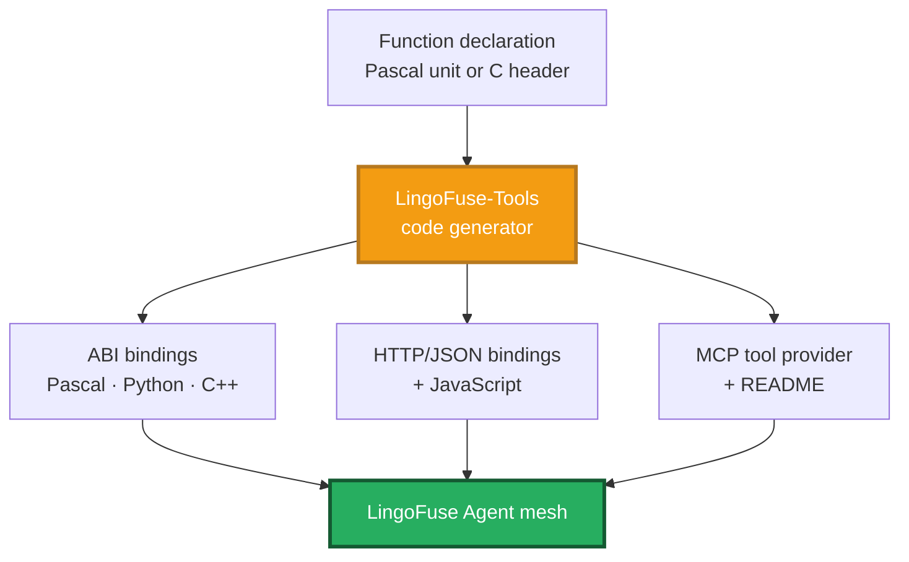
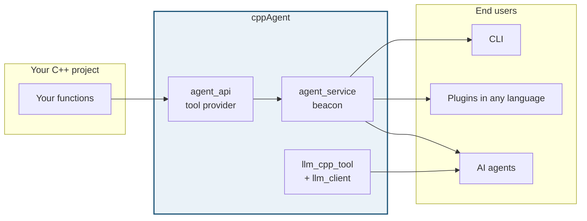
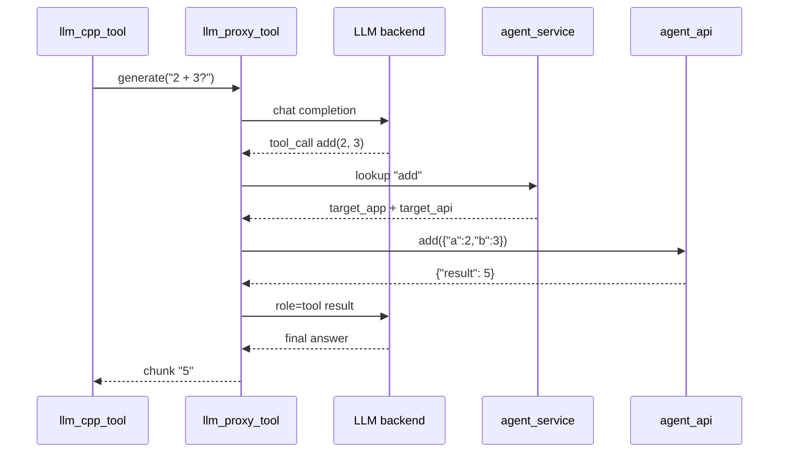

# LingoFuse-cppAgent

**C++ / Python agent for the LingoFuse mesh.**

Write a function in C++. Get an agent tool, a CLI command, and a multi-language plugin — from the same declaration.

---

## The Ecosystem

One declaration. Every language. Every agent.



**LingoFuse-Tools** turns one declaration into bindings for dozens of languages, three protocols, and three equal entry points:

| Entry point | Who uses it |
|---|---|
| **GUI** | Human operator |
| **CLI** | Scripts, CI |
| **MCP API** | AI agent |

Same backend. Identical output. Whichever you pick.

---

## What cppAgent Does

cppAgent is the **C++ / Python front-end** of the LingoFuse agent family. It exposes the same mesh, the same tool model, and the same wire format — so a Pascal tool and a C++ tool are indistinguishable at the mesh level.



**The lifecycle:**

1. You declare a function in C++.
2. cppAgent registers it on the mesh.
3. An AI agent calls it like a built-in tool.
4. An end user writes a plugin in Python, JavaScript, or any other language — and calls the same function.

No MCP protocol. No JSON Schema. No HTTP service.

---

## Four Components

| # | Component | Job |
|---|---|---|
| 1 | `agent_service` | Beacon. One per mesh. |
| 2 | `agent_api` | Tool provider. Replace with your functions. |
| 3 | `llm_cpp_tool` + `llm_client` | C++ client SDK + CLI. |
| 4 | `llm_proxy_tool.py` | Server-side tool execution. Zero client changes. |

Supporting services: `llm_service.py`, `llm_proxy.py`, `bridge.py`, `mcp_api_tool.py`.

---

## One Call, End to End



The client never sees a tool call.

---

## Quick Start

```powershell
cd src

# Build C++ components
cmake -S . -B ..\x64 -G "Visual Studio 17 2022" -A x64 `
      -DLINGOFUSE_CPP_DIR="<path to LingoFuse/cpp>"
cmake --build ..\x64 --config Release

# Install Python dependencies
pip install -r requirements.txt
```

```powershell
# Four terminals
.\agent_service.exe                                     # beacon
.\agent_api.exe                                         # tools
python llm_proxy_tool.py --backend-url http://127.0.0.1:1234/v1
.\llm_cpp_tool.exe --content "What is 12 + 34?" --keep
```

---

## Documentation

All docs live alongside the source in `src/`.

| Topic | File |
|---|---|
| Ecosystem overview | [`src/LingoFuse_LLM_Ecosystem_User_Guide.md`](src/LingoFuse_LLM_Ecosystem_User_Guide.md) |
| Local inference service | [`src/LingoFuse_LLM_Service_CLI_guide.md`](src/LingoFuse_LLM_Service_CLI_guide.md) |
| Pure text proxy | [`src/LingoFuse_LLM_Proxy_CLI_Guide.md`](src/LingoFuse_LLM_Proxy_CLI_Guide.md) |
| Tool execution bridge (LTB) | [`src/LingoFuse_LLM_Proxy_Tool_CLI_Guide.md`](src/LingoFuse_LLM_Proxy_Tool_CLI_Guide.md) |
| Backend compatibility | [`src/LingoFuse_LLM_Proxy_Compatibility_Guide.md`](src/LingoFuse_LLM_Proxy_Compatibility_Guide.md) |
| C++ client guide | [`src/llm_cpp_tool_User_Guide.md`](src/llm_cpp_tool_User_Guide.md) |
| HTTP bridge | [`src/lingofuse/Bridge_User_Guide.md`](src/lingofuse/Bridge_User_Guide.md) |
| Default model notes | [`src/NVIDIA-Nemotron-3-Nano-Omni-30B-A3B-Reasoning-UD-IQ4_XS.md`](src/NVIDIA-Nemotron-3-Nano-Omni-30B-A3B-Reasoning-UD-IQ4_XS.md) |

---

## Ecosystem

| Repository | Role |
|---|---|
| [LingoFuse](https://github.com/PassByYou888/LingoFuse) | Core RPC engine |
| [LingoFuse-Tools](https://github.com/PassByYou888/LingoFuse-Tools) | Code generator |
| [LingoFuse-pasAgent-v3](https://github.com/PassByYou888/LingoFuse-pasAgent-v3) | Pascal agent |
| [LingoFuse-pasAgent](https://github.com/PassByYou888/LingoFuse-pasAgent) | First-gen Pascal agent |

---

## License

MIT.

---

**Maintainer**: LingoFuse Team
**Status**: Active development