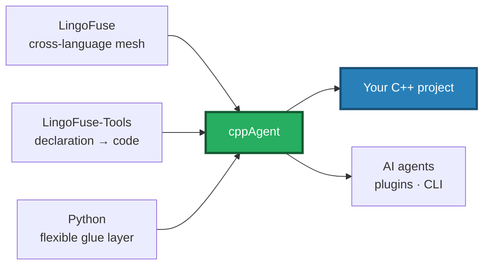
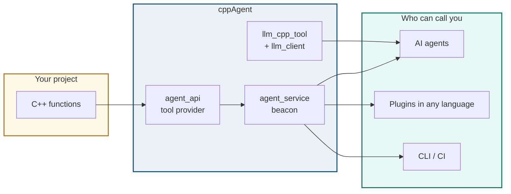
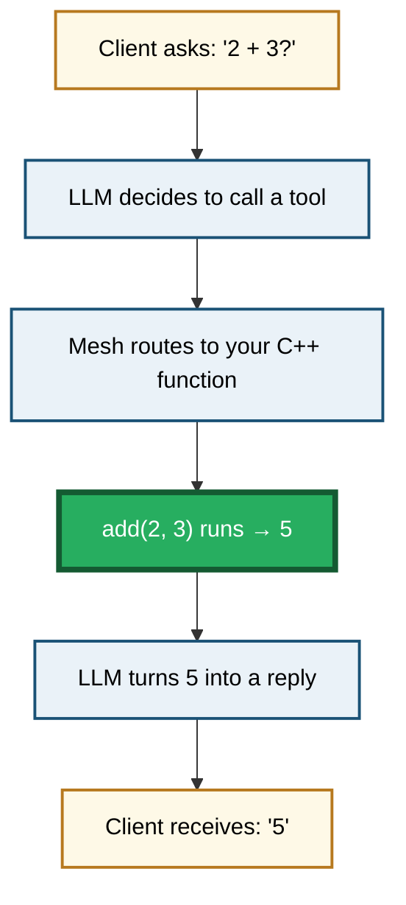

# LingoFuse-cppAgent

**Bring any C++ project into the AI agent era.**

Declare a function once. Get an agent tool, a CLI command, and a multi-language plugin — automatically.

cppAgent is not an accessory to LingoFuse. It is a **C++ integration layer** that borrows the LingoFuse mesh, the LingoFuse-Tools code generator, and a thin Python interface to give C++ projects something they have never had: a fast, automated path into the agent ecosystem.

---

## New Here? Start With the Quick Start Guide

**[QUICK_START.md](QUICK_START.md)** — run the LLM in 15 minutes with the pre-built package. No compiler, no IDE, no Python setup.

---

## What Makes This Possible

Three things together. None alone would be enough.



| Layer | Contribution |
|---|---|
| **LingoFuse** | A cross-language RPC mesh. Wire format, capability matrix, JSON policy — all solved. |
| **LingoFuse-Tools** | Code generator. One declaration becomes bindings in dozens of languages and three protocols. |
| **Python** | Interface layer. Easy to write, easy to glue, easy to change. |
| **cppAgent** | The C++ side of the story. Wire it all together; expose your functions. |

---

## What You Get



**The lifecycle:**

1. Declare a function in C++.
2. cppAgent registers it on the mesh.
3. An AI agent calls it like a built-in tool.
4. An end user writes a plugin in Python, JavaScript, or any other language — and calls the same function.

No MCP protocol boilerplate. No JSON Schema hand-writing. No HTTP service.

---

## Why This Matters for C++

C++ has always been fast, portable, and hard to glue. Getting a C++ library to talk to an AI agent used to mean:

- Writing an MCP server
- Writing a JSON Schema by hand
- Writing an HTTP bridge
- Maintaining all of the above

With cppAgent, that collapses into one step: **declare the function**. The generator, the mesh, and the Python glue do the rest.

And the same function is then reachable from every language in the ecosystem — not just C++.

---

## Components

| # | Component | Language | Job |
|---|---|---|---|
| 1 | `agent_service` | C++ | Beacon. One per mesh. |
| 2 | `agent_api` | C++ | Tool provider. Replace with your functions. |
| 3 | `llm_cpp_tool` + `llm_client` | C++ | Client SDK + CLI / REPL. |
| 4 | `llm_proxy_tool.py` | Python | Server-side tool execution. Zero client changes. |

Supporting services: `llm_service.py`, `llm_proxy.py`, `bridge.py`, `mcp_api_tool.py`.

---

## One Call, End to End

The client only sees a question go out and an answer come back. Everything else happens behind the scenes.



The client is unaware of the tool. Your C++ function is the only thing that actually runs.

---

## Build Guide

### Prerequisites

| Item | Version |
|---|---|
| **CMake** | 3.16+ |
| **C++ Compiler** | MSVC 2019+ (Windows), GCC 9+ (Linux), Clang 10+ (macOS) |
| **C++ Standard** | C++17 |
| **Python** | 3.10+ (for the Python service layer) |
| **LingoFuse** | Latest main branch |

### Step 1 — Clone LingoFuse

The C++ interface headers and the prebuilt runtime libraries live in the LingoFuse repository. Clone it first:

```bash
git clone https://github.com/PassByYou888/LingoFuse.git
```

After cloning, the repository layout is:

```
LingoFuse/
├── Binary/                     # Prebuilt runtime libraries (Win32 / Win64)
│   ├── LingoFuse64.dll
│   └── ...
├── cpp/                        # C++ interface directory
│   ├── LingoFuse.h
│   ├── LingoFuse.c
│   ├── LingoFuse.hpp
│   ├── lf_io.hpp
│   ├── json.hpp
│   └── CMakeLists.txt
├── pascal/
└── Py/
```

The **C++ interface directory** is `LingoFuse/cpp/`. It contains the five header and source files required by cppAgent, plus the runtime libraries in the sibling `Binary/` directory.

### Step 2 — Configure cppAgent

Pass the path to the C++ interface directory via `-DLINGOFUSE_CPP_DIR`:

**Windows (PowerShell) — Visual Studio**

```powershell
cd LingoFuse-cppAgent\src

cmake -S . -B ..\x64 `
      -G "Visual Studio 17 2022" -A x64 `
      -DLINGOFUSE_CPP_DIR="..\..\LingoFuse\cpp"
```

**Linux / macOS — Makefiles**

```bash
cd LingoFuse-cppAgent/src

cmake -S . -B ../build \
      -DCMAKE_BUILD_TYPE=Release \
      -DLINGOFUSE_CPP_DIR="../../LingoFuse/cpp"
```

`LINGOFUSE_CPP_DIR` must point to the directory containing:

```
LingoFuse.h
LingoFuse.c
LingoFuse.hpp
lf_io.hpp
json.hpp
```

There is no auto-detection. The path must be given explicitly.

### Step 3 — Build

**Windows**

```powershell
cmake --build ..\x64 --config Release
```

**Linux / macOS**

```bash
cmake --build ../build -j
```

### Step 4 — Output

Executables are written directly into `src/` (matching the Pascal project layout):

| Artifact | Type | Description |
|---|---|---|
| `agent_service` | Executable | Beacon / tool registry |
| `agent_api` | Executable | Tool provider template |
| `llm_cpp_tool` | Executable | C++ LLM CLI / REPL |
| `llm_client.lib` / `libllm_client.a` | Static library | Link into your C++ application |
| `lingofuse_c_wrapper.lib` / `.a` | Static library | C ABI dynamic loader |

### Step 5 — Place the Runtime Library

Copy the LingoFuse runtime library from `LingoFuse/Binary/` next to the executables:

| Platform | File |
|---|---|
| Windows | `LingoFuse64.dll` |
| Linux | `liblingofuse.so` |
| macOS | `liblingofuse.dylib` |

The loader searches the executable's own directory first, then the system loader path. Placing the library next to the executable is the recommended deployment.

### Step 6 — Install Python Dependencies

```powershell
pip install -r requirements.txt
```

### Step 7 — Run

```powershell
# Four terminals
.\agent_service.exe                                     # beacon
.\agent_api.exe                                         # your tools
python llm_proxy_tool.py --backend-url http://127.0.0.1:1234/v1
.\llm_cpp_tool.exe --content "What is 12 + 34?" --keep
```

For a complete build reference, see [`src/CMakeLists.txt`](src/CMakeLists.txt). For a deeper understanding of the C++ interface and its ABI loading contract, see `LingoFuse_Cpp_Knowledge_Base.md` in the LingoFuse repository.

---

## Documentation

### Start here

| Document | What it covers |
|---|---|
| [**QUICK_START.md**](QUICK_START.md) | Run the LLM in 15 minutes with the pre-built package. No compiler needed. |

### Architecture and ecosystem

| Document | What it covers |
|---|---|
| [LingoFuse_LLM_Ecosystem_User_Guide.md](src/LingoFuse_LLM_Ecosystem_User_Guide.md) | Four core application components, two tool execution paths, capability matrix, streaming protocol |
| [LingoFuse_LLM_Proxy_Compatibility_Guide.md](src/LingoFuse_LLM_Proxy_Compatibility_Guide.md) | 250+ OpenAI-compatible backends (cloud APIs, local servers, gateways, desktop clients) |

### Component reference

| Document | What it covers |
|---|---|
| [LingoFuse_LLM_Service_CLI_guide.md](src/LingoFuse_LLM_Service_CLI_guide.md) | Local inference service (`llm_service`) — text-only, embeddable |
| [LingoFuse_LLM_Proxy_CLI_Guide.md](src/LingoFuse_LLM_Proxy_CLI_Guide.md) | Pure text forwarder (`llm_proxy`) — no tools |
| [LingoFuse_LLM_Proxy_Tool_CLI_Guide.md](src/LingoFuse_LLM_Proxy_Tool_CLI_Guide.md) | Tool execution bridge (`llm_proxy_tool` / LTB) — server-side tools |
| [llm_cpp_tool_User_Guide.md](src/llm_cpp_tool_User_Guide.md) | C++ command-line client — REPL, attachments, Structured Output |

### Model and bridge

| Document | What it covers |
|---|---|
| [NVIDIA-Nemotron-3-Nano-Omni-30B-A3B-Reasoning-UD-IQ4_XS.md](src/NVIDIA-Nemotron-3-Nano-Omni-30B-A3B-Reasoning-UD-IQ4_XS.md) | Recommended multimodal model — download, quantization, deployment |
| [Bridge_User_Guide.md](src/lingofuse/Bridge_User_Guide.md) | HTTP ↔ LingoFuse gateway and JSON repair service |

---

## Ecosystem

| Repository | Role |
|---|---|
| [LingoFuse](https://github.com/PassByYou888/LingoFuse) | Core cross-language mesh |
| [LingoFuse-Tools](https://github.com/PassByYou888/LingoFuse-Tools) | Declaration → code generator |
| [LingoFuse-pasAgent-v3](https://github.com/PassByYou888/LingoFuse-pasAgent-v3) | Reference agent implementation |
| [LingoFuse-pasAgent](https://github.com/PassByYou888/LingoFuse-pasAgent) | Earlier generation |

---

## License

MIT.

---

**Maintainer**: LingoFuse Team
**Status**: Active development