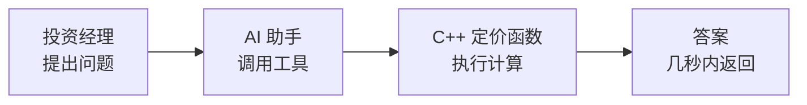
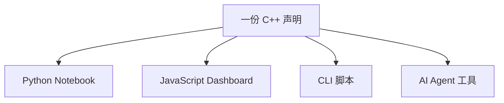
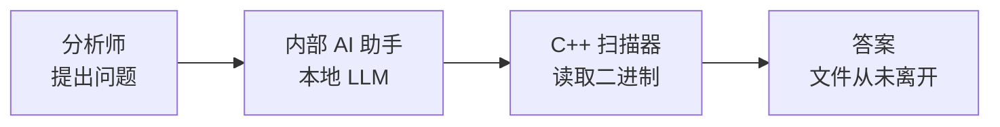
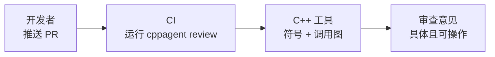
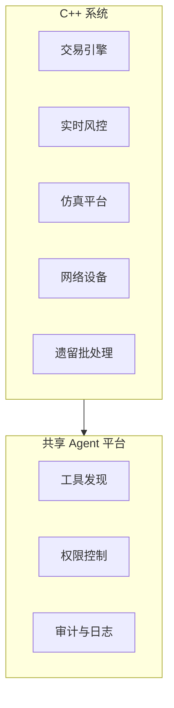
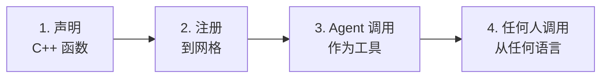
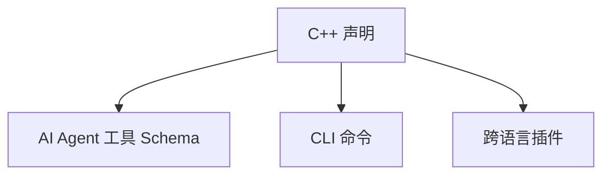
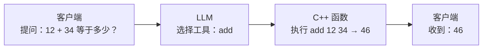
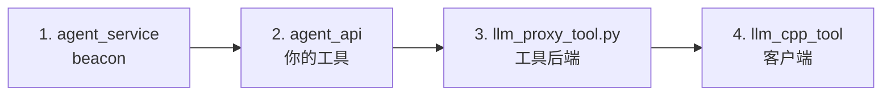

# LingoFuse-cppAgent

**让你已有的 C++ 代码进入 AI Agent 工作流——无需重写。**

声明一次函数，自动获得 AI Agent 工具、CLI 命令和跨语言插件。

cppAgent 是构建在 LingoFuse 网格、LingoFuse-Tools 代码生成器和轻量 Python 服务层之上的 C++ 集成层。它只为一件事而生：C++ 系统运行快、久经考验，但很难与现代 AI 工作流对接。cppAgent 消除这个对接成本。

---

## 这套东西是给谁用的

你手上有一份能跑的 C++ 代码。可能是一个定价引擎、一个仿真核心、一个网络扫描器、一个批处理程序，或者一个没人敢动的遗留系统。你希望 AI Agent、CLI 用户和其他编程语言都能调用它——不想重写代码，不想写 MCP 服务器，也不想手工维护 HTTP 桥接层。

cppAgent 就是干这个的。

---

## 知识库驱动：AI 接管接口

这是 cppAgent 与 LingoFuse-Tools 体系最核心的设计理念：**每个工具都自带一份知识库**（knowledge base），它是一份自包含的 Markdown 文档，用 AI 可以直接消费的形式描述了工具的完整契约。

知识库包含：

- **所有 API 签名、通信协议和类型映射**——AI 不需要读源码就能理解每个函数接受什么、返回什么。
- **所有生成产物及其用途**——每个文件是干什么的、放在哪里、怎么构建。
- **已知陷阱和反模式**——避免 AI 生成错误代码或错误调用序列。
- **调试树、扩展指南和修改流程**——AI 可以自行排查问题、扩展功能。

设计目标很直接：**把知识库喂给 AI Agent，Agent 就能接管整个接口**——它可以通过 MCP 调用工具、代替你操作 GUI、或者从 CLI 生成代码，全程不需要读工具源码。

---

## 不写代码，生成全接口

LingoFuse-Tools 提供了三个独立的代码生成器，全程支持贾维斯助理，使用方法：拉下来，喂全部MD，问。。。。

- 真实工作分2步，先生成接口，再让贾维斯帮忙填充接口的实现，最终无代码完结你的接口目标。

---

## 真实场景下的样子

### 量化定价台

投资经理问内部 AI 助手：

> “对组合 A 跑 10,000 条蒙特卡洛路径，汇总 95% VaR。”

助手通过 cppAgent 调用你的 C++ `run_monte_carlo` 函数，几秒内返回结果。



**没有 MCP 服务器。没有 REST 包装层。函数只声明了一次。**

**各方角色**

- **C++ 维护者**——声明定价函数。
- **平台工程师**——运行 Agent 运行时和本地 LLM 服务。
- **投资经理 / 研究员**——用自然语言提问。

**收益**——快速、可审计的风险分析。敏感数据不出内网。

---

### 跨语言工具复用

数据科学家用 Python，前端工程师用 JavaScript。两人都需要调用同一个 C++ 仿真引擎。

**用 cppAgent 之前**——两个集成项目，两套绑定，C++ API 一变两个地方都得改。

**用 cppAgent 之后**——C++ 团队声明一次，其他语言直接调用。



Python 调用方：

```python
from lingofuse import simulation
result = simulation.run_scenario(scenario_id="rate_shock_200bp", paths=50000)
```

JavaScript 调用方：

```javascript
const result = await simulation.runScenario({
  scenario_id: "rate_shock_200bp",
  paths: 50000
});
```

同一个函数，同一个结果，没有重复的包装代码。

---

### 本地 / 私有 AI Agent

安全分析师需要把可疑二进制文件与内部恶意软件特征库比对，但二进制文件不能离开安全飞地。

分析师向内部助手提问。助手调用本地 C++ 扫描工具。本地 LLM 服务只处理文本和工具元数据。二进制文件原地不动。



**为什么能跑通**——`llm_service` 运行本地模型。`llm_proxy` 将纯文本转发到已批准的内部端点。公共云 LLM 从不被接触。

**谁需要这个**——金融、医疗、国防，以及任何有数据驻留要求的团队。

---

### AI 辅助 C++ 开发与 CI

开发者提交了一个修改无锁队列的 PR。CI 运行：

```bash
cppagent review --diff HEAD~1 --checks concurrency,memory,api
```

CI 发布审查意见：

> “`pop()` 中存在潜在的 ABA 风险。`compare_and_swap` 调用时没有携带版本标记。参见 `queue_stress_test`。”



**这一切的前提**——你声明了符号查找、调用图、测试选择和基准测试函数。cppAgent 把它们变成了 Agent 工具和 CLI 命令。

---

### 企业 Agent 平台

大型企业到处都是 C++ 系统：交易引擎、实时风控、仿真平台、网络设备、遗留批处理程序。

与其为每个系统单独构建 AI 集成，不如由平台团队定义一个标准 cppAgent 模式。每个系统只声明一次自己的安全函数。



**结果**——一套集成模式。集中审计。跨 Agent 复用工具。维护成本低于定制桥接。

---

> 📖 **以上场景的详细拆解**——包括各方角色、触发条件、输出格式和运维边界——请参阅 **[LingoFuse-cppAgent_Real_World_Application_Workflows.md](LingoFuse-cppAgent_Real_World_Application_Workflows.md)**。

---

## 工作原理

四个阶段，各管各的事。



**阶段一——声明。** 在 C++ 中为你想要暴露的函数添加声明，仅此而已。

**阶段二——注册。** cppAgent 将该函数注册到 LingoFuse 网格，并从同一份声明生成三份产物。



**阶段三——Agent 调用。** AI Agent 像调用内置能力一样调用该工具。网格将调用路由到你的 C++ 函数。

**阶段四——任何人调用。** Python、JavaScript、CLI、CI——都通过网格到达同一个函数。

### 组件

| 组件                          | 语言   | 职责                           |
| ----------------------------- | ------ | ------------------------------ |
| `agent_service`               | C++    | Beacon。每个网格一个。         |
| `agent_api`                   | C++    | 工具提供者。替换为你的函数。   |
| `llm_cpp_tool` + `llm_client` | C++    | 客户端 SDK + CLI / REPL。      |
| `llm_proxy_tool.py`           | Python | 服务端工具执行。客户端零改动。 |

配套服务：`llm_service.py`、`llm_proxy.py`、`bridge.py`、`mcp_api_tool.py`。

### 端到端调用

一次请求，四个时刻：意图、决策、执行、回复。



客户端不知道工具的存在。实际运行的只有你的 C++ 函数。

---

## 构建与运行

### 前置条件

| 项目           | 版本                                                       |
| -------------- | ---------------------------------------------------------- |
| **CMake**      | 3.16+                                                      |
| **C++ 编译器** | MSVC 2019+（Windows）、GCC 9+（Linux）、Clang 10+（macOS） |
| **C++ 标准**   | C++17                                                      |
| **Python**     | 3.10+（用于 Python 服务层）                                |
| **LingoFuse**  | 最新 main 分支                                             |

### 第 1 步——克隆 LingoFuse

```bash
git clone https://github.com/PassByYou888/LingoFuse.git
```

C++ 接口目录是 `LingoFuse/cpp/`，包含 cppAgent 所需的五个头文件和源文件，以及 `LingoFuse/Binary/` 中的运行时库。

### 第 2 步——配置 cppAgent

通过 `-DLINGOFUSE_CPP_DIR` 传入 C++ 接口目录路径。

**Windows（PowerShell）——Visual Studio**

```powershell
cd LingoFuse-cppAgent\src
cmake -S . -B ..\x64 `
  -G "Visual Studio 17 2022" -A x64 `
  -DLINGOFUSE_CPP_DIR="..\..\LingoFuse\cpp"
```

**Linux / macOS——Makefiles**

```bash
cd LingoFuse-cppAgent/src
cmake -S . -B ../build \
  -DCMAKE_BUILD_TYPE=Release \
  -DLINGOFUSE_CPP_DIR="../../LingoFuse/cpp"
```

`LINGOFUSE_CPP_DIR` 必须指向包含 `LingoFuse.h`、`LingoFuse.c`、`LingoFuse.hpp`、`lf_io.hpp` 和 `json.hpp` 的目录。没有自动检测。

### 第 3 步——构建

**Windows**

```powershell
cmake --build ..\x64 --config Release
```

**Linux / macOS**

```bash
cmake --build ../build -j
```

### 第 4 步——产物

可执行文件写入 `src/`：

| 产物                                 | 类型       | 说明                |
| ------------------------------------ | ---------- | ------------------- |
| `agent_service`                      | 可执行文件 | Beacon / 工具注册表 |
| `agent_api`                          | 可执行文件 | 工具提供者模板      |
| `llm_cpp_tool`                       | 可执行文件 | C++ LLM CLI / REPL  |
| `llm_client.lib` / `libllm_client.a` | 静态库     | 链接到你的 C++ 应用 |
| `lingofuse_c_wrapper.lib` / `.a`     | 静态库     | C ABI 动态加载器    |

### 第 5 步——放置运行时库

从 `LingoFuse/Binary/` 复制 LingoFuse 运行时库到可执行文件旁边：

| 平台    | 文件                 |
| ------- | -------------------- |
| Windows | `LingoFuse64.dll`    |
| Linux   | `liblingofuse.so`    |
| macOS   | `liblingofuse.dylib` |

### 第 6 步——安装 Python 依赖

```bash
pip install -r requirements.txt
```

### 第 7 步——运行

启动四个进程。顺序很重要：先 beacon，再工具，然后后端，最后客户端。



```bash
# 四个终端，按此顺序
.\agent_service.exe          # beacon
.\agent_api.exe              # 你的工具
python llm_proxy_tool.py --backend-url http://127.0.0.1:1234/v1
.\llm_cpp_tool.exe --content "What is 12 + 34?" --keep
```

---

## 文档

### 从这里开始

| 文档                                                                                                                 | 内容                                                                                                            |
| -------------------------------------------------------------------------------------------------------------------- | --------------------------------------------------------------------------------------------------------------- |
| [**QUICK_START.md**](QUICK_START.md)                                                                                 | 15 分钟跑通 LLM，使用预构建包，不需要编译器。                                                                   |
| [**LingoFuse-cppAgent_Real_World_Application_Workflows.md**](LingoFuse-cppAgent_Real_World_Application_Workflows.md) | 真实工程工作流——量化定价、跨语言复用、私有 AI、AI 辅助 C++ 开发、企业平台。谁做事、什么时候触发、输出长什么样。 |

### 架构与生态

| 文档                                                                                         | 内容                                                         |
| -------------------------------------------------------------------------------------------- | ------------------------------------------------------------ |
| [LingoFuse_LLM_Ecosystem_User_Guide.md](src/LingoFuse_LLM_Ecosystem_User_Guide.md)           | 四个核心应用组件、两条工具执行路径、能力矩阵、流式协议       |
| [LingoFuse_LLM_Proxy_Compatibility_Guide.md](src/LingoFuse_LLM_Proxy_Compatibility_Guide.md) | 250+ OpenAI 兼容后端（云 API、本地服务器、网关、桌面客户端） |

### 组件参考

| 文档                                                                               | 内容                                             |
| ---------------------------------------------------------------------------------- | ------------------------------------------------ |
| [LingoFuse_LLM_Service_CLI_guide.md](src/LingoFuse_LLM_Service_CLI_guide.md)       | 本地推理服务（`llm_service`）——纯文本、可嵌入    |
| [LingoFuse_LLM_Proxy_CLI_Guide.md](src/LingoFuse_LLM_Proxy_CLI_Guide.md)           | 纯文本转发器（`llm_proxy`）——不含工具            |
| [LingoFuse_LLM_Proxy_Tool_CLI_Guide.md](src/LingoFuse_LLM_Proxy_Tool_CLI_Guide.md) | 工具执行桥（`llm_proxy_tool` / LTB）——服务端工具 |
| [llm_cpp_tool_User_Guide.md](src/llm_cpp_tool_User_Guide.md)                       | C++ 命令行客户端——REPL、附件、结构化输出         |

### 模型与桥接

| 文档                                                                                                                         | 内容                                  |
| ---------------------------------------------------------------------------------------------------------------------------- | ------------------------------------- |
| [NVIDIA-Nemotron-3-Nano-Omni-30B-A3B-Reasoning-UD-IQ4_XS.md](src/NVIDIA-Nemotron-3-Nano-Omni-30B-A3B-Reasoning-UD-IQ4_XS.md) | 推荐多模态模型——下载、量化、部署      |
| [Bridge_User_Guide.md](src/lingofuse/Bridge_User_Guide.md)                                                                   | HTTP ↔ LingoFuse 网关与 JSON 修复服务 |

---

## 生态

| 仓库                                                                           | 角色              |
| ------------------------------------------------------------------------------ | ----------------- |
| [LingoFuse](https://github.com/PassByYou888/LingoFuse)                         | 核心跨语言网格    |
| [LingoFuse-Tools](https://github.com/PassByYou888/LingoFuse-Tools)             | 声明 → 代码生成器 |
| [LingoFuse-pasAgent-v3](https://github.com/PassByYou888/LingoFuse-pasAgent-v3) | 参考 Agent 实现   |
| [LingoFuse-pasAgent](https://github.com/PassByYou888/LingoFuse-pasAgent)       | 上一代实现        |

---

## 许可证

MIT。

---

**维护者**：LingoFuse 团队
**状态**：活跃开发中
