# LingoFuse LLM Ecosystem — User Guide

> **Document version**: v5.3 (language-neutral rewrite)
> **Last updated**: 2026-09-26
> **Applies to**: `mcp_api_tool`, `llm_proxy_tool`, `llm_proxy`, `llm_client`, `llm_service`

---

## Reading Guide

This document is the **global reference** for the LingoFuse LLM ecosystem. Suggested reading order:

1. **Quick overview** → Chapter 1, Ecosystem Overview
2. **Pick an entry component** → Chapter 2, Four Core Application Components
3. **Tool execution (MCP / LTB)** → Chapter 4, Two Tool Execution Paths
4. **Multimodal** → Chapter 5, Multimodal Capability
5. **Protocol and capability discovery** → Chapters 6 and 7
6. **Troubleshooting** → Chapter 9

---

## 1. Ecosystem Overview

The LingoFuse LLM ecosystem is a **cross-language, streaming, multi-session, multimodal** way to call large language models. It packages LLM capability as a **LingoFuse service**. Any client that speaks the LingoFuse protocol can call the LLM like a local function and receive streamed output in real time.

The LLM ecosystem is an **interface middle layer**. It is language-agnostic. The same service is reachable from any language that has a LingoFuse binding, and the same client library speaks to any backend that implements the protocol.

### 1.1 Core shifts in the current generation

| Dimension | Previous generation | Current generation |
|---|---|---|
| **Core narrative** | Three server kinds | **Four core application components** plus one auxiliary tool |
| **`llm_service`** | One of the three servers | **Auxiliary verification tool** (embeddable, **text-only**) |
| **Multimodal** | Not supported | **Architecture-level capability** (forwarded by `llm_proxy` / LTB to a VLM backend) |

> **`llm_service` role change**: previously "one of three servers", now demoted to **auxiliary verification tool**. It remains a **text-only** inference service — multimodal support is out of scope for this component.

### 1.2 Diagram 1 — Ecosystem overview

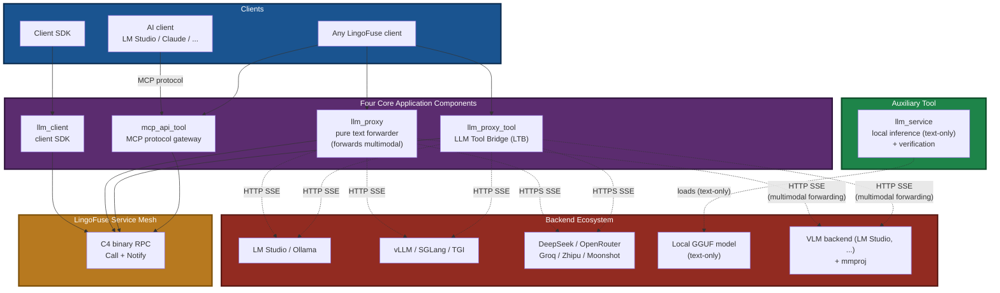

### 1.3 Diagram 2 — Full call path

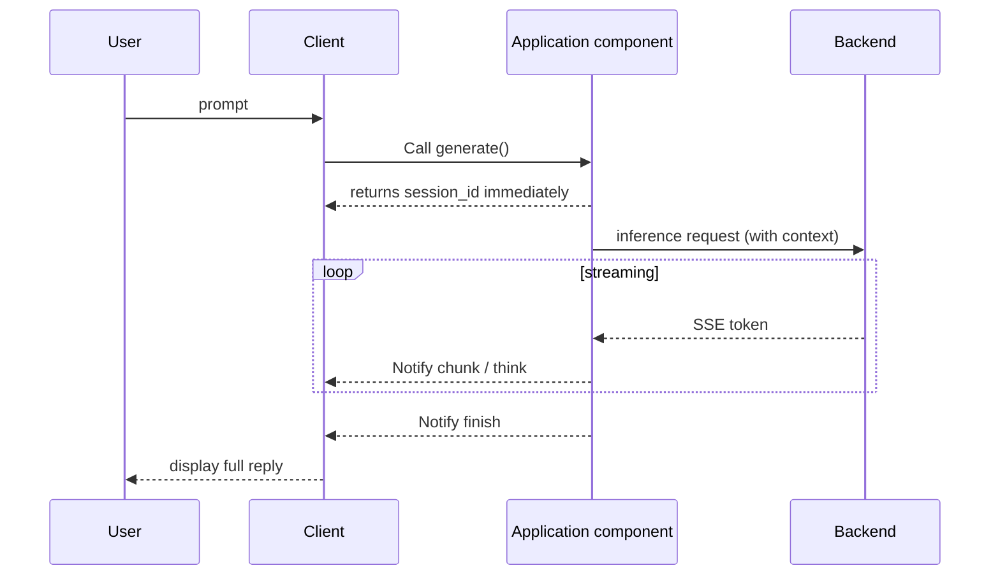

---

## 2. Four Core Application Components

The four application-layer components map to four typical integration scenarios. Together they close the loop of "an AI calls your tools".

### 2.1 Diagram 3 — Component map

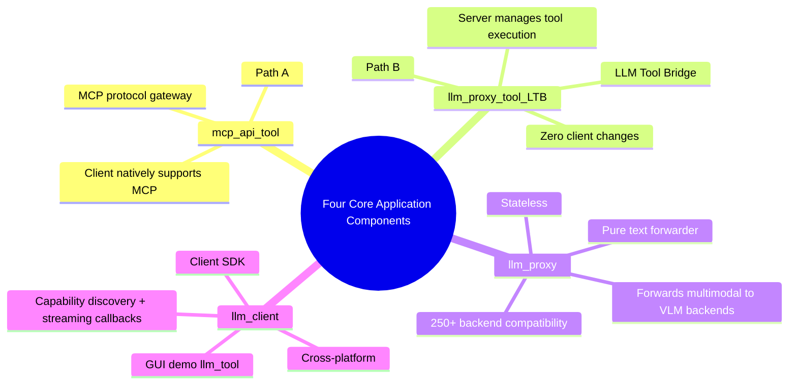

### 2.2 `mcp_api_tool` — MCP protocol gateway (Path A)

| Attribute | Description |
|---|---|
| **Role** | Translate backend tools into MCP protocol, expose to MCP-aware clients |
| **Tool execution location** | **Client side** — the AI client decides which tool to call and issues the call |
| **Target clients** | LM Studio / Claude Desktop / Continue.dev / Jan / DeepSeek |
| **Transport** | stdio (default) / http (recommended) / sse (deprecated) |
| **Key dependencies** | `fastmcp`, `language_middleware`, beacon |

**Core traits**:
- The client **must support MCP**
- The tool list is pulled dynamically from the beacon by `mcp_api_tool`
- Can run **concurrently** with `llm_proxy_tool` (different `reg_agent` names)

### 2.3 `llm_proxy_tool` (LTB) — LLM Tool Bridge (Path B, recommended)

| Attribute | Description |
|---|---|
| **Role** | Server manages the full tool-calling loop; client only sends `generate` |
| **Tool execution location** | **Server side** — LTB drives multi-round tool_calls internally |
| **Target clients** | **Any** LingoFuse client (no MCP support required) |
| **Key dependencies** | `language_middleware`, beacon, OpenAI-compatible backend |
| **Coexistence** | With `mcp_api_tool` **allowed**; with `llm_proxy` / `llm_service` **default endpoint shared**, need `--endpoint` + `--app-name` to coexist |
| **Multimodal** | Forwards image attachments **verbatim** to the backend |

**Core traits**:
- **Zero client changes** — client only knows `generate` / `create_session` / `close_session` and other base APIs
- Tool invocation, result feedback, and multi-round loops all happen inside LTB
- **Four-layer protection**: rounds / total calls / single-result length / total-result length
- **Automatic downgrade** to pure text proxy if tools are unavailable
- The backend must support `tool_calls` (Function Calling) for tool capability

### 2.4 `llm_proxy` — Pure text forwarder

| Attribute | Description |
|---|---|
| **Role** | Stateless forwarder; translates LingoFuse RPC into OpenAI-compatible HTTP |
| **Use case** | Chat only, **no tools** |
| **Backend compatibility** | **250+ OpenAI-compatible backends** |
| **`set_system_message`** | **Explicitly rejected** (cannot be implemented under stateless semantics) |
| **Multimodal** | Forwards image attachments **verbatim** to the backend (support depends on the backend) |

**Core traits**:
- Rebuilds the messages array on every request; the server holds **no KV cache**
- Supports **250+ backends** (LM Studio / Ollama / vLLM / DeepSeek / OpenRouter / Groq / Zhipu / Moonshot / ...)
- Zero client code change; switching backends requires only `--backend-url`

### 2.5 `llm_client` — Client SDK

| Attribute | Description |
|---|---|
| **Role** | Client SDK that talks directly to LingoFuse LLM services |
| **GUI demo** | A complete runnable multi-session client |
| **Compiler compatibility** | Cross-platform; no compiler-specific dependency |
| **Language bindings** | The SDK pattern applies to every language with a LingoFuse binding |

**Core traits**:
- Event-driven: `OnChunk` / `OnThink` / `OnFinish` / `OnError` / `OnClosed`
- Capability discovery: `get_api_capabilities` lets the client query the server's capabilities at runtime
- Session filtering: `FActiveSessionId` prevents cross-session contamination
- Resource safety: `CleanupPartialConnect` guarantees release even on failure paths

---

## 3. Auxiliary Tool: `llm_service`

`llm_service` is **not** one of the core servers. It is an **auxiliary verification tool**.

### 3.1 Positioning

| Attribute | Description |
|---|---|
| **Role** | Local inference server + model verification tool |
| **Core value** | **Can be used independently**, outside the agent ecosystem, as a "local LLM utility" in your project |
| **Capability boundary** | **Text-only** — multimodal not supported (local VLM path not implemented) |
| **Use cases** | Offline environments / privacy-sensitive / quick model validation / deep embedding |

### 3.2 Distinctiveness

**Embeddable**: You can bring only `llm_service` + `llm_client` into your own project and get a fully offline "AI assistant" module — no beacon, no tool provider, no MCP required.

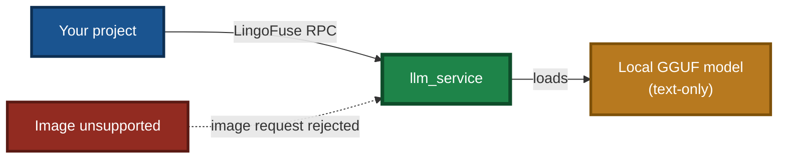

### 3.3 Typical uses

| Scenario | Description |
|---|---|
| **Offline environment** | Intranet, industrial sites without internet access |
| **Privacy-sensitive** | Data cannot leave the local machine; must run fully offline |
| **Quick validation** | Check whether a GGUF model fits your task |
| **Embedding into your project** | Bring only `llm_service` + `llm_client` as an "AI assistant" module |
| **Text-only chat** | Everyday Q&A, text processing, code generation |

### 3.4 Explicitly unsupported features

| Feature | Status | Alternative |
|---|---|---|
| Image Q&A | Unsupported | Use `llm_proxy` / `llm_proxy_tool` to forward to a VLM backend |
| Speech in / out | Unsupported | Use an external compliant ASR / TTS service |
| Server-side tool execution | Unsupported | Use `llm_proxy_tool` (LTB) |

> **Production recommendation**: use `llm_proxy` / `llm_proxy_tool` to forward to a mature backend such as LM Studio. `llm_service` is the first choice for **verification and embedding** scenarios.

---

## 4. Two Tool Execution Paths

The ecosystem supports "AI calls tools" via **two paths**. They can coexist and serve different client types.

### 4.1 Diagram 4 — Path comparison

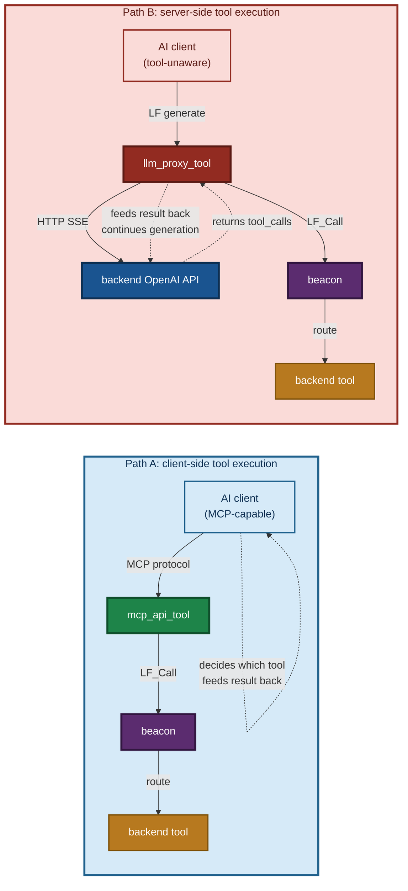

### 4.2 Path selection

| Your situation | Path | Component |
|---|---|---|
| Client **supports MCP** (LM Studio / Claude Desktop) | Path A | `mcp_api_tool` |
| Client **does not support MCP** (in-house front-ends, non-MCP GUIs) | **Path B (recommended)** | `llm_proxy_tool` |
| Chat only, no tools | — | `llm_proxy` |

### 4.3 Key design of Path B

**Server-side tool execution** — the client is completely **unaware** of the tool system:

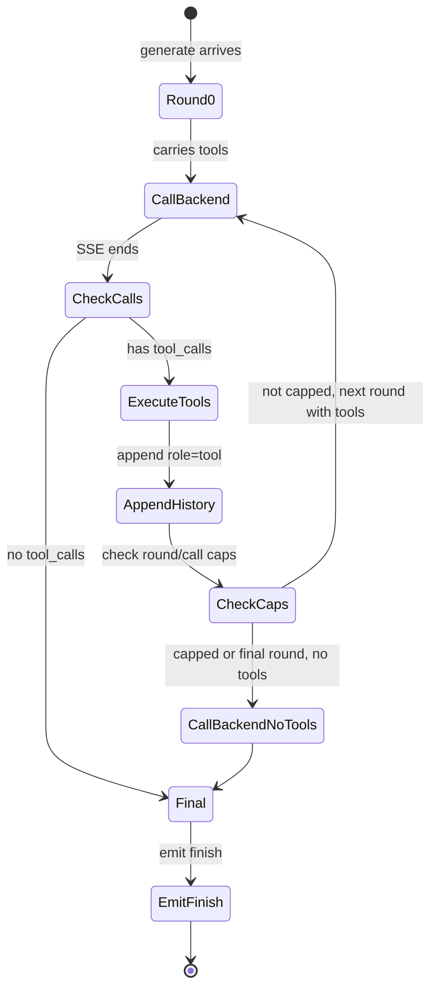

**Four-layer protection**:

| Cap | Default | Purpose |
|---|---|---|
| `--max-tool-rounds` | 100 | Max round trips inside one `generate` |
| `--max-total-tool-calls` | 50 | Max tool executions inside one `generate` |
| `--max-tool-result-chars` | 8000 | Max characters per tool result |
| `--max-total-tool-result-chars` | 200000 | Max total characters of all tool results |

**The final round is forced to omit tools** — guarantees loop termination.

> **Multimodal + tool loop combination**: images are sent in full only on the **first round**; subsequent tool-calling rounds use **history placeholders** (e.g. `[image: chart.png]`) to avoid token explosion. See Chapter 5.

### 4.4 Coexistence of the two paths

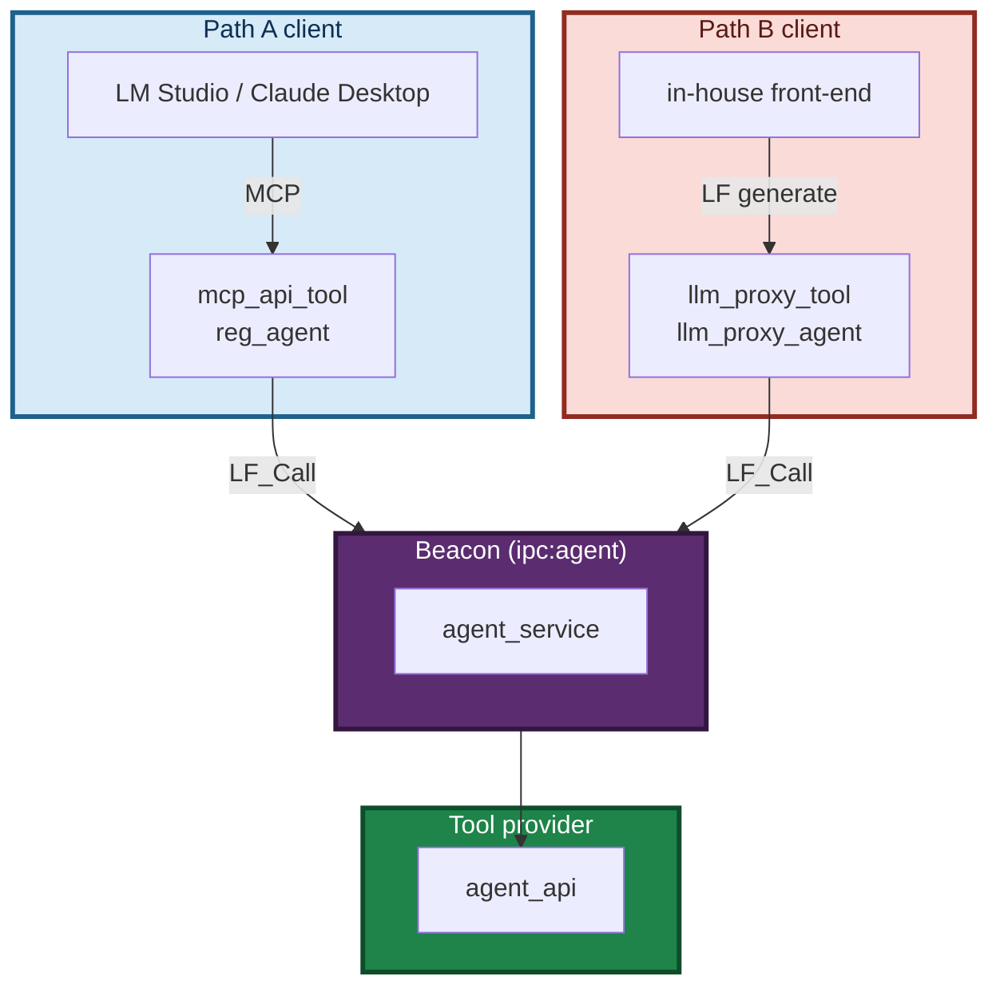

**Coexistence key**: `mcp_api_tool` uses `reg_agent`, `llm_proxy_tool` uses `llm_proxy_agent` — **different registration names**, so both can run simultaneously against the same beacon.

---

## 5. Multimodal Capability

**Multimodal is a core capability of the current generation.** It lets the LingoFuse LLM ecosystem handle **multiple input modalities** — text and image — not just text.

> **Important boundary**: multimodal capability is **decided by the backend**. `llm_proxy` / LTB only **forward image attachments verbatim**; `llm_service` **does not support multimodal at all**.

### 5.1 What multimodal means

A traditional LLM service handles text only. The multimodal architecture lets clients send:

| Modality | Description |
|---|---|
| **Text** | User prompt, system prompt, multi-turn history |
| **Image** | Charts, screenshots, photos, scans |

### 5.2 Capability-level statement (core boundary table)

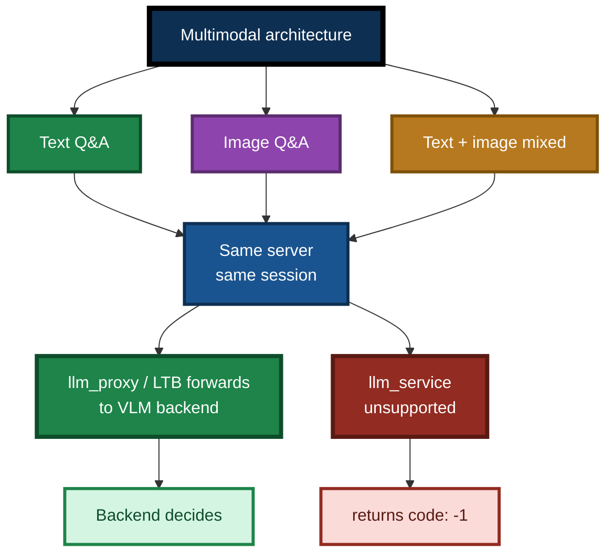

### 5.3 Client perspective

The client carries multimodal content in a `generate` request. Support varies by client:

| Client | Multimodal support | Notes |
|---|---|---|
| Client SDK | Yes — carried via API parameters | `GenerateWithAttachments` / `GenerateWithImageFile` |
| Any LingoFuse RPC client | Yes — carried via API parameters | Must follow the `attachments` array format |
| MCP client (Path A) | Depends on MCP protocol + client support | Varies by MCP client |
| Text-only client | No — text only | — |

### 5.4 Capability advertisement

Multimodal capability is advertised via the **capability matrix**. Clients can query at runtime which modalities the server supports via `get_api_capabilities`:

| Server | `vision` field | Notes |
|---|---|---|
| `llm_service` | **0** | Not supported (local VLM path not implemented) |
| `llm_proxy` | Backend-dependent (**fixed at 0**) | The server does not do vision itself; forwarding is decided by the backend |
| `llm_proxy_tool` | Backend-dependent (**fixed at 0**) | Same as above |

> **Key point**: `llm_proxy` / LTB's `vision` field is **fixed at 0** — because the proxy **does not parse images itself**; it is only a forwarder. Whether the image is understood is **decided by the backend** (a backend with a VLM will handle it; one without will ignore or error).

### 5.5 Combination with other capabilities

Multimodal is **orthogonal** to the tool execution paths:

- **Path A + multimodal**: MCP client carries images itself (if the client supports it and the backend supports it)
- **Path B + multimodal**: LTB forwards the multimodal request to the backend (backend must support it)
- **Local inference + multimodal**: Not supported — `llm_service` is a text-only service

---

## 6. API Capability Discovery

### 6.1 Purpose

The ecosystem has **multiple application components** with different feature sets:

- `llm_proxy` / `llm_proxy_tool` do **not** support `set_system_message`
- `llm_service` **does** support `set_system_message`
- Only `llm_service` provides "in-process local inference"
- **Multimodal capability does not belong to the server** — it is decided by the backend

Clients need a mechanism to **discover what the running server supports**, avoiding invalid requests.

### 6.2 Capability matrix

Returned by the `get_api_capabilities` API:

```json
{
  "code": 0,
  "server_kind": "service" | "proxy",
  "capabilities": {
    "generate": 1,
    "create_session": 1,
    "close_session": 1,
    "cancel_session": 1,
    "list_sessions": 1,
    "set_system_message": 0,
    "health": 1,
    "llm_stream": 1,
    "attachments": 1,
    "vision": 0
  }
}
```

**Value semantics**: `1` = supported, `0` = not supported. Missing entries are treated as `0`.

> **Note**: `attachments=1` means **the server accepts the attachment field** (it will not reject the request), **not** that the server can understand images. Whether an image is understood is decided by the **backend**.
>
> `vision=0` is **fixed at 0** on all LingoFuse LLM servers — because the server only forwards, it does not do vision itself.

### 6.3 Differences between the three server kinds

| API | `llm_service` | `llm_proxy` | `llm_proxy_tool` |
|---|:---:|:---:|:---:|
| `generate` | 1 | 1 | 1 |
| `create_session` | 1 | 1 | 1 |
| `close_session` | 1 | 1 | 1 |
| `cancel_session` | 1 | 1 | 1 |
| `list_sessions` | 1 | 1 | 1 |
| **`set_system_message`** | **1** | **0** | **0** |
| `health` | 1 | 1 | 1 |
| `llm_stream` | 1 | 1 | 1 |
| `attachments` | 1 | 1 | 1 |
| **`vision`** | **0** | **0** | **0** |
| **`tools`** | — | — | **1** |
| **`tool_calls`** | — | — | **1** |
| **`tool_results`** | — | — | **1** |
| `server_kind` | `service` | `proxy` | `proxy` |

> **Key points**:
> - `vision=0` holds for **all** servers — it expresses "the server itself does not do vision", not "the entire pipeline does not support multimodal".
> - `llm_proxy` and `llm_proxy_tool` **both** report `server_kind = "proxy"`. To distinguish them, read the LTB-specific fields such as `tools` / `tool_calls`.
> - `llm_service`'s `set_system_message=1` is its **only functional difference** from the two proxies.

### 6.4 Client fallback behavior

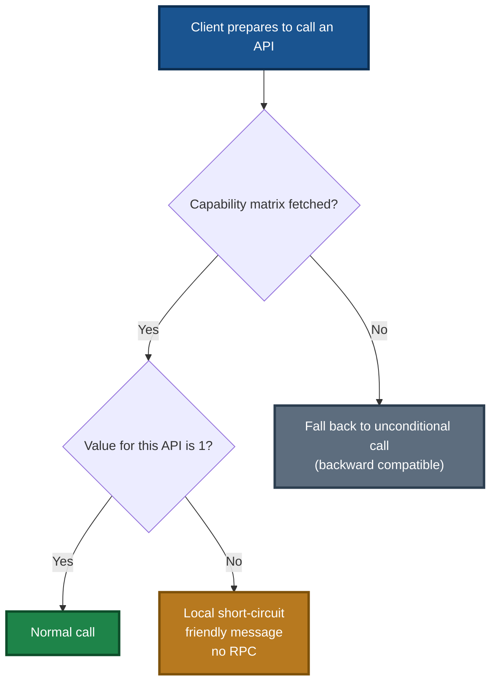

**Backward compatibility**: when an old server does not expose `get_api_capabilities`, the client cache stays empty; related commands are treated as "unknown" and fall back to unconditional calls.

---

## 7. Streaming Protocol

### 7.1 Message types

All servers push streamed messages using a **unified structured JSON protocol**:

| Type | Fields | Meaning |
|---|---|---|
| `chunk` | `session_id`, `text` | Body stream |
| `think` | `session_id`, `text` | Reasoning stream (reasoning models only) |
| `finish` | `session_id`, `reason` | Generation ended |
| `error` | `session_id`, `message` | Server error |
| `closed` | `session_id`, `reason` | Session closed |

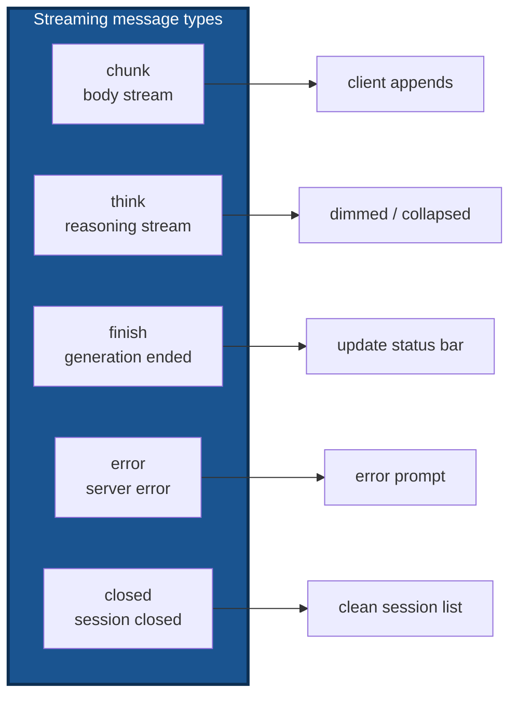

### 7.2 Protocol evolution

| Version | Protocol | Characteristic |
|:---:|---|---|
| **v1.0** | magic string | `{"chunk": "__FINISH__"}` — detected via `startswith` |
| **v3.0+** | structured JSON | `{"type": "finish", "reason": "stop"}` — read the `type` field |

**Clients only read the `type` field and do not parse any "magic string".**

### 7.3 Thinking stream handling

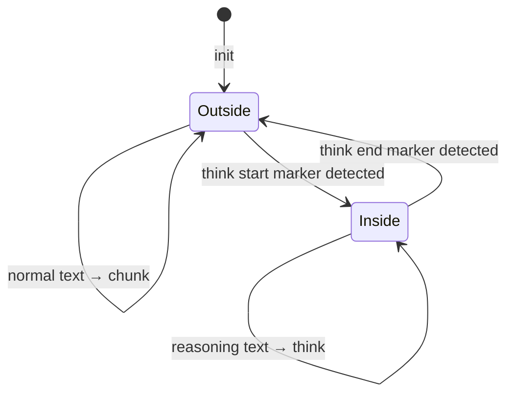

**Three paths**:

- **`llm_service`**: template preset markers or model-emitted markers, split by a state machine
- **`llm_proxy`**: the backend SSE already separates `reasoning_content` and `content`; the proxy forwards **without policy**
- **`llm_proxy_tool`**: same as `llm_proxy` — `reasoning_content` is forwarded directly as `think`

---

## 8. Typical Use Cases

### 8.1 Scenario 1: Path A — MCP-aware client

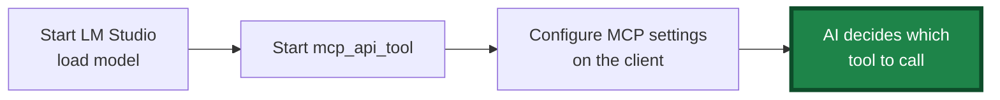

Steps:

1. Start the beacon `agent_service`
2. Start the tool provider `agent_api` (or your own tools)
3. Start `mcp_api_tool`
4. Fill in the MCP settings on your client
5. Ask a question → the AI calls tools automatically

### 8.2 Scenario 2: Path B — generic GUI client + LM Studio (recommended)

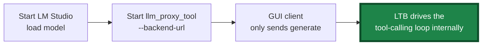

Steps:

1. Start the beacon
2. Start the tool provider
3. Start `llm_proxy_tool --backend-url http://127.0.0.1:1234/v1`
4. GUI client does `Connect` + `Generate`
5. LTB drives the tool loop internally; the client receives the full answer

### 8.3 Scenario 3: Chat only

```
llm_proxy --backend-url http://127.0.0.1:1234/v1
```

### 8.4 Scenario 4: Local model validation (text-only)

```
llm_service --model-path <model.gguf>
```

> **Note**: `llm_service` does **not support multimodal**. After loading an Omni main model it can still do **text-only** inference; for image Q&A, switch to LTB + VLM backend.

### 8.5 Scenario 5: Multimodal image Q&A (new in this generation)

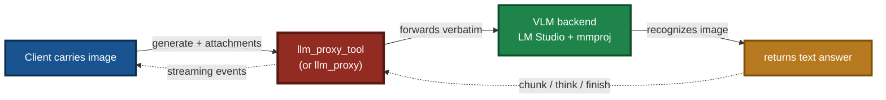

Steps:

1. Load a **VLM** (e.g. Qwen2-VL / Nemotron Omni + mmproj) in LM Studio
2. Start `llm_proxy_tool --backend-url http://127.0.0.1:1234/v1 --backend-model "<vlm-id>" --vision`
3. Client sends an image via `GenerateWithImageFile`
4. LTB forwards to the VLM and returns the result

**Key point**: **do not send images to `llm_service`** — it will return `code: -1`.

### 8.6 Scenario 6: Path A and Path B coexist

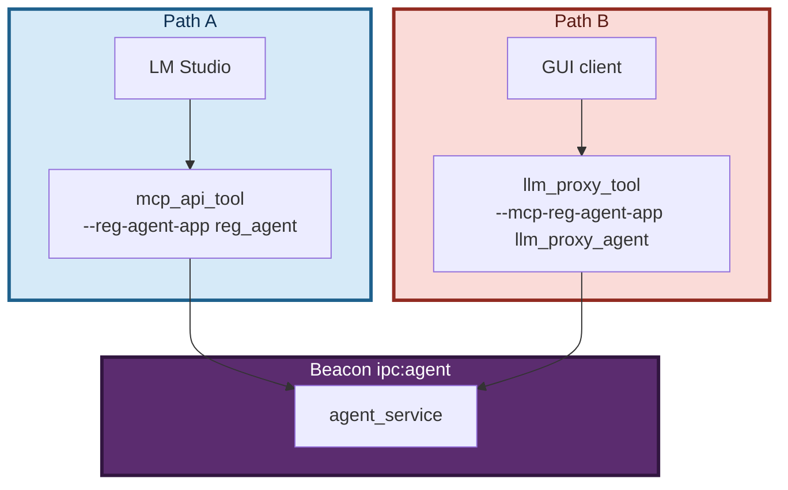

**Point**: the two use different `reg_agent` names and can run simultaneously against the same beacon.

### 8.7 Scenario 7: Three LLM servers coexisting

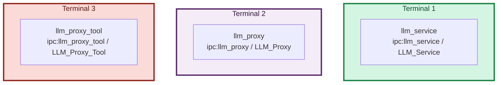

**Point**: they **must** use different `--endpoint` and `--app-name`.

---

## 9. Troubleshooting

### 9.1 Symptom quick-reference

| Symptom | Possible cause | Where to look |
|---|---|---|
| Server spams `no found app` | `client_name` is not a real registered App name | Core-layer guide, `LF-APP-003` |
| Client waits several seconds for the first token | SSE buffering | Check backend gzip / reverse proxy |
| Server exits immediately after startup | `main()` lacks a blocking loop | Check the launch command |
| Thinking stage produces no output, then everything appears at once | `reasoning_content` is dropped | Check backend SSE frame format |
| `set_system_message` returns `unsupported` | Currently connected to `llm_proxy` or `llm_proxy_tool` | Pass `system_message` through `create_session` |
| Multi-session output gets mixed up | Client does not filter by `session_id` | Client SDK session filtering |
| Chinese characters garbled | Not using byte streams end-to-end | Core-layer guide, `LF-XLANG-002` |
| Crash on window close | Shutdown called directly from window close | Core-layer guide, `LF-CLEAN-001` |
| New system prompt has no effect | Did not go through `CreateSession` path | Use `CreateSession(system_message)` |
| **LTB started but tools do not execute** | `--enable-tools` off / middleware unreachable / beacon down | LTB manual Q1 |
| **LTB and mcp_api_tool conflict on startup** | Same `reg_agent` name | LTB manual Q3 |
| **LTB reports `LF_PrepareDone returned 0`** | middleware and Server.start race | LTB manual Q2 |
| **LTB receives empty `tool_calls` arguments** | SSE fragments not concatenated by `index` | LTB manual Q4 |
| **Client sends image but backend does not recognize it** | Backend is not a VLM / `--backend-model` not pointed at the VLM | LTB manual Q11 |
| **Client sends image to `llm_service`** | `llm_service` does not support multimodal | Service manual Q14 |

### 9.2 Path selection troubleshooting

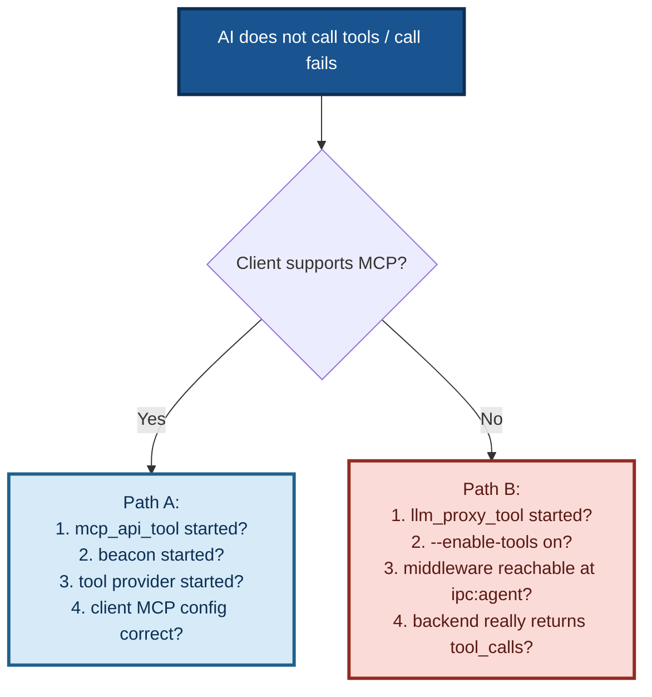

### 9.3 Multimodal troubleshooting

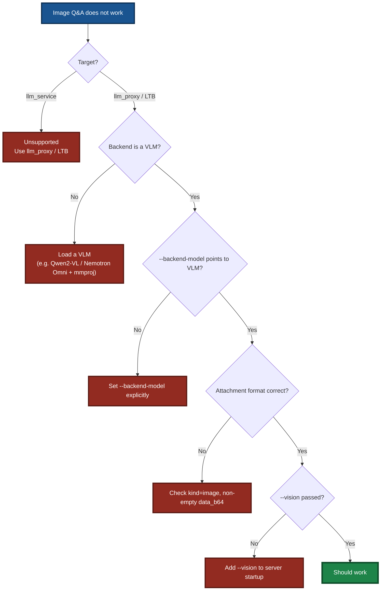

---

## 10. Three Iron Rules

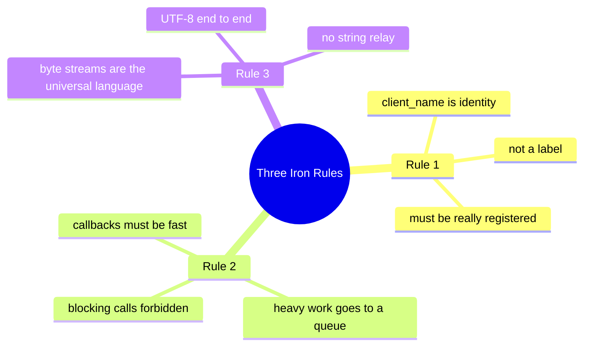

1. **`client_name` is the LingoFuse network routing identity** — it must be the value returned by `generate_app_name()`.
2. **A callback only does "read input + enqueue + return immediately"**. Heavy work goes to a worker thread.
3. **Cross-language JSON travels as byte streams** — UTF-8 end to end.

---

## 11. Document Index

Related documents in the same directory:

| Document | Description |
|---|---|
| LLM Proxy Tool CLI Guide | LTB command-line manual (Path B core) |
| LLM Proxy CLI Guide | Pure forwarder proxy manual (includes multimodal forwarding) |
| LLM Proxy Compatibility Guide | 250+ backend compatibility list (also applies to LTB) |
| LLM Service CLI Guide | Local inference service manual (text-only) |
| Client SDK Guide | Client SDK documentation |
| Structured Output Learning Guide | Structured Output complete learning guide |
| Agent API JSON Reference | `agent_main` / `register_agent` JSON structure details |
| Bridge User Guide | HTTP bridge gateway user guide |
| Core Layer Complete Guide | Core layer complete guide (includes pitfall knowledge base) |
| Quick Start LLM Stack | LLM stack quick start |
| Recommended Model Notes | Recommended model download and deployment |

Root directory related documents:

| Document | Description |
|---|---|
| README | Project overview and the four core application components |
| Integration Guide | Developer onboarding guide |
| Build Guide | Build guide |

### Code Generator

The MCP-API code generation tool is maintained as a **dedicated repository**:

**LingoFuse-Tools** — one declaration → API bindings for dozens of target languages. The declaration spec, user manual, generator source, and prebuilt packages all live in that repository.

---

## 12. Key Takeaways

> Five sentences to remember this document:

1. **Four core application components** — `mcp_api_tool` (Path A) / `llm_proxy_tool` (LTB, Path B) / `llm_proxy` (pure forwarder) / `llm_client` (client SDK); `llm_service` is the **auxiliary verification tool** (text-only).
2. **Two tool execution paths** — Path A (client-side MCP) / Path B (server-managed, **zero client changes**); the two can coexist.
3. **Multimodal is decided by the backend** — `llm_proxy` / LTB forward image attachments **verbatim**; `llm_service` **does not support multimodal**. `vision=0` is **fixed on all servers** (it expresses "the server itself does not do vision").
4. **Capability discovery mechanism** — `get_api_capabilities` lets clients learn at runtime what the server supports (`set_system_message` / `tools` / `attachments`); unsupported capabilities short-circuit locally, avoiding invalid RPCs.
5. **Streaming protocol is structured** — `chunk` / `think` / `finish` / `error` / `closed`; clients only read the `type` field.

> **One sentence to rule them all**:
>
> **The current generation's core is "four application components + two tool execution paths + multimodal forwarding". `llm_service` is a text-only auxiliary tool — for image Q&A, use `llm_proxy` / LTB to forward to a VLM backend.**

---

**Document version**: v5.3 (language-neutral rewrite — removed all language-specific references; LLM ecosystem is an interface middle layer and is language-agnostic; removed all document links)
**Maintainer**: LingoFuse Team