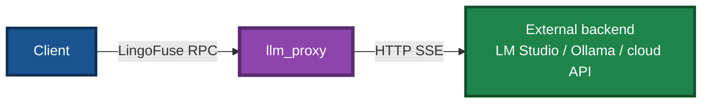
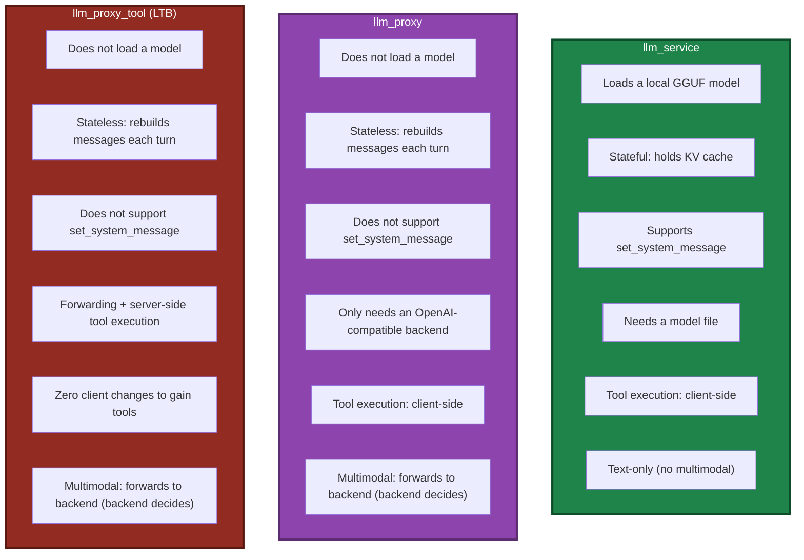
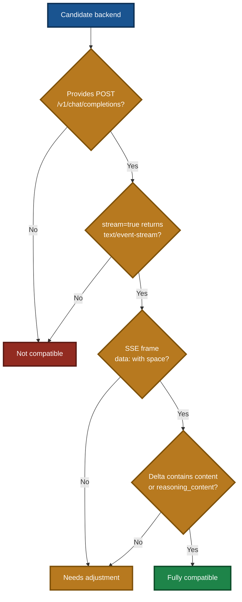
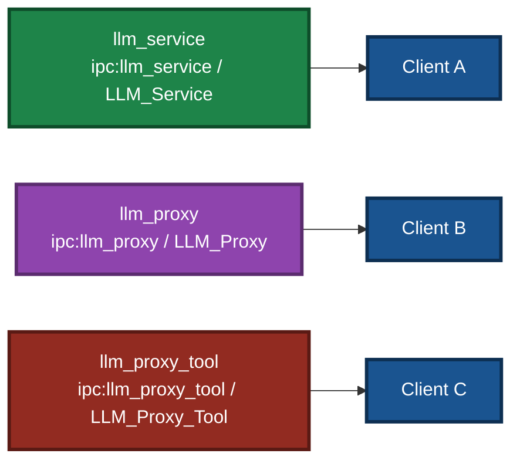

# LingoFuse LLM Proxy — CLI Guide

> **Applies to**: `llm_proxy.exe` (Windows) / `llm_proxy` (Linux)
> **Document version**: v4.3 (language-neutral rewrite)
> **Last updated**: 2026-09-26

---

## 1. Positioning

`llm_proxy` is a **LingoFuse server**, but internally it is completely different from `llm_service`: **it does not load a model; it only translates protocols**.

It translates LingoFuse binary RPC into OpenAI-compatible HTTP requests and forwards them to any backend that supports `/v1/chat/completions` with SSE streaming (LM Studio, Ollama, vLLM, DeepSeek, OpenRouter, and more), then translates the streamed response back into LingoFuse Notify events.

It is the alternative to `llm_service` in the agent loop. When you do not want to load a large model locally, or you already have LM Studio or a cloud API deployed, `llm_proxy` gives AI clients a "brain" without local model loading.

### Relationship with LTB (`llm_proxy_tool`)

`llm_proxy_tool` (**LTB**, LLM Tool Bridge) is a **superset** of `llm_proxy`:

- **`llm_proxy`** — pure text forwarding. Tool execution is the **client's** responsibility (the client must support MCP).
- **`llm_proxy_tool`** — forwarding plus **server-side tool execution**. The client **does not need** MCP support; it only needs to call `generate` to obtain tool capability.

Both share the same SSE client implementation. Therefore, everything in this manual about **backend connectivity** (`--backend-url` / `--backend-model` / `--backend-key` / auth headers / SSE stream parsing) **also applies to LTB**.

LTB-specific options (`--mcp-*`, `--max-tool-*`, `--enable-tools`, and so on) are documented separately.

### Diagram 1 — Where `llm_proxy` sits in the ecosystem



**Runtime**: Windows / Linux.
**Dependencies**: `LingoFuse64.dll` / `liblingofuse.so` (on the system PATH or next to the executable).

---

## 2. Sibling Relationship with the Other Servers

The three LLM servers are siblings. They share the same Call API surface but **cannot run simultaneously** by default, because they use the same endpoint and app name.

### Diagram 2 — Three servers side by side



**Capability matrix comparison**:

| API | `llm_service` | `llm_proxy` | `llm_proxy_tool` (LTB) |
|---|:---:|:---:|:---:|
| `generate` | 1 | 1 | 1 |
| `create_session` | 1 | 1 | 1 |
| `close_session` | 1 | 1 | 1 |
| `cancel_session` | 1 | 1 | 1 |
| `list_sessions` | 1 | 1 | 1 |
| **`set_system_message`** | **1** | **0** | **0** |
| `health` | 1 | 1 | 1 |
| `llm_stream` | 1 | 1 | 1 |
| `attachments` | 1 | 1 | 1 |
| **`vision`** | **0** | **0** | **0** |
| **`tools`** | — | — | **1** |
| **`tool_calls`** | — | — | **1** |
| **`tool_results`** | — | — | **1** |
| **`server_kind`** | `service` | `proxy` | `proxy` |

> **On `vision=0`**: all three servers report `vision` as **0**. This expresses "the server itself does not do vision processing", not "the pipeline does not support multimodal". `llm_proxy` / LTB are only forwarders; whether an image is understood is decided by the **backend**.
>
> **On `server_kind`**: `llm_proxy` and `llm_proxy_tool` both report `"proxy"`. To distinguish them, read the LTB-specific fields such as `tools` / `tool_calls`.
>
> **Coexistence rule**: to run all three, you **must** give each a distinct `--endpoint` and `--app-name`. See Scenario 8.

---

## 3. Quick Start

### 3.1 Minimal startup

**Windows (PowerShell)**:

```powershell
# Uses the default endpoint ipc:llm_service and default backend http://127.0.0.1:12345/v1
.\llm_proxy.exe
```

**Linux (Shell)**:

```bash
# Uses the default endpoint ipc:llm_service and default backend http://127.0.0.1:12345/v1
./llm_proxy
```

### 3.2 Connect to a local LM Studio server

**Windows (PowerShell)**:

```powershell
.\llm_proxy.exe --backend-url http://127.0.0.1:1234/v1
```

**Linux (Shell)**:

```bash
./llm_proxy --backend-url http://127.0.0.1:1234/v1
```

### 3.3 Connect to the DeepSeek cloud API

**Windows (PowerShell)**:

```powershell
.\llm_proxy.exe `
  --backend-url https://api.deepseek.com/v1 `
  --backend-key sk-xxxxxxxxxxxxxxxx `
  --backend-model deepseek-chat
```

**Linux (Shell)**:

```bash
./llm_proxy \
  --backend-url https://api.deepseek.com/v1 \
  --backend-key sk-xxxxxxxxxxxxxxxx \
  --backend-model deepseek-chat
```

### Diagram 3 — Startup banner

After a successful start, a status banner is printed, and the process enters listening state:

```
======================================================================
 LINGOFUSE LLM PROXY
======================================================================
  Service kind            : proxy
  Service endpoint        : ipc:llm_service
  Service app name        : LLM_Service
  Notify API name         : llm_stream
  Backend URL             : http://127.0.0.1:1234/v1
  Backend model           : (auto-discover)
  Backend auth            : Authorization: Bearer <redacted, 9 chars>
  Backend extra headers   : (none)
  Backend timeout (s)     : 300
  Backend transport       : http.client
  Max history per session : 512
  Max sessions            : 1024
  Session idle timeout(s) : 1800
  set_system_message      : unsupported (llm_service-only)
  Attachments             : enabled (text always, image when --vision)
  Vision                  : disabled
  Log level               : INFO
----------------------------------------------------------------------
  Supported APIs          : generate, create_session, close_session, ...
  Unsupported APIs        : set_system_message
======================================================================
[INFO] LLM Proxy service 'LLM_Service' running on ipc:llm_service
[INFO] Press Ctrl+C to stop...
```

> **Notes**:
> - The `Attachments` line means "the server **accepts** the attachment field" (the request is not rejected merely because attachments are present).
> - The `Vision` line means "whether the server **itself** enables vision processing". `llm_proxy` reports `disabled` because it is only a forwarder. Whether an image is understood is decided by the **backend** (see §5.5).
> - With `--vision` enabled, the `Vision` line reports `enabled`, and image attachments are forwarded to the backend instead of being rejected.

---

## 4. Online API Integration Rules

The core mechanism `llm_proxy` uses to talk to online APIs is **OpenAI-compatible protocol + SSE streaming**. Any online service that satisfies all the conditions below can be integrated via `--backend-url` without further work.

### 4.1 Mandatory conditions

| # | Condition | Notes |
|:-:|---|---|
| 1 | Provides a `POST /v1/chat/completions` endpoint | Path is hard-coded; not customizable |
| 2 | Supports `stream=true` and returns `text/event-stream` | SSE streaming |
| 3 | SSE frame format is `data: {...}\n\n` (a space follows `data:`) | Missing space causes dropped frames |
| 4 | Delta contains `choices[0].delta.content` or `reasoning_content` | Otherwise the parse result is empty |
| 5 | Does not force gzip compression | The proxy already sets `Accept-Encoding: identity` |

> **Important**: these five criteria also apply to **LTB**. LTB's `OpenAIStreamClient` is identical to `llm_proxy`'s. The only difference is that LTB additionally injects a `tools` field (from the MCP tool list) into the request and requires the backend to return `tool_calls`.

### Diagram 4 — Integration verification flow



### 4.2 Authentication rules

| Parameter | Purpose | Typical values |
|---|---|---|
| `--backend-key` | API key | `sk-xxx`, `gsk_xxx`, `Bearer xxx` |
| `--backend-key-file` | Read the key from a file (overrides `--backend-key`) | A path |
| `--backend-auth-header` | Header name carrying the token | `Authorization` (default), `api-key` (Azure) |
| `--backend-auth-scheme` | Auth prefix | `Bearer` (default), empty string (raw token) |
| `--backend-extra-headers` | Extra HTTP headers (JSON) | `{"HTTP-Referer":"..."}` |

### 4.3 Base URL concatenation rule

`--backend-url` must be the **base path without `/chat/completions`**. The proxy appends `/chat/completions` automatically:

| Passed to `--backend-url` | Actual request URL |
|---|---|
| `https://api.deepseek.com/v1` | `https://api.deepseek.com/v1/chat/completions` |
| `http://127.0.0.1:1234/v1` | `http://127.0.0.1:1234/v1/chat/completions` |
| `https://api.groq.com/openai/v1` | `https://api.groq.com/openai/v1/chat/completions` |

**Exception**: Azure OpenAI uses a different path format that requires deployment and api-version to be assembled manually. See Scenario 5.

### 4.4 Common online API integration recipes

#### DeepSeek

```powershell
.\llm_proxy.exe --backend-url https://api.deepseek.com/v1 --backend-key sk-xxx --backend-model deepseek-chat
```

#### SiliconFlow

```powershell
.\llm_proxy.exe --backend-url https://api.siliconflow.cn/v1 --backend-key sk-xxx --backend-model deepseek-ai/DeepSeek-V3
```

#### Groq

```powershell
.\llm_proxy.exe --backend-url https://api.groq.com/openai/v1 --backend-key gsk_xxx --backend-model llama-3.3-70b-versatile
```

#### OpenRouter

```powershell
.\llm_proxy.exe `
  --backend-url https://openrouter.ai/api/v1 `
  --backend-key sk-or-xxx `
  --backend-extra-headers '{\"HTTP-Referer\":\"https://example.com\"}'
```

#### Together AI

```powershell
.\llm_proxy.exe --backend-url https://api.together.xyz/v1 --backend-key xxx --backend-model meta-llama/Llama-3.3-70B-Instruct-Turbo
```

#### Zhipu GLM

```powershell
.\llm_proxy.exe --backend-url https://open.bigmodel.cn/api/paas/v4 --backend-key xxx --backend-model glm-4-plus
```

#### Moonshot (Kimi)

```powershell
.\llm_proxy.exe --backend-url https://api.moonshot.cn/v1 --backend-key sk-xxx --backend-model moonshot-v1-8k
```

#### Fireworks AI

```powershell
.\llm_proxy.exe --backend-url https://api.fireworks.ai/inference/v1 --backend-key xxx --backend-model accounts/fireworks/models/llama-v3p3-70b-instruct
```

#### Mistral

```powershell
.\llm_proxy.exe --backend-url https://api.mistral.ai/v1 --backend-key xxx --backend-model mistral-large-latest
```

#### xAI Grok

```powershell
.\llm_proxy.exe --backend-url https://api.x.ai/v1 --backend-key xai-xxx --backend-model grok-2-latest
```

> **Full list**: see the dedicated compatibility guide for the 250+ OpenAI-compatible backends.

### 4.5 Key security recommendations

Prefer `--backend-key-file` so the key does not appear in shell history or the process list.

**Windows (PowerShell)**:

```powershell
# Save the key to a file
"sk-xxxxxxxxxxxxxxxx" | Out-File -Encoding utf8 api_key.txt

# Launch the proxy reading from the file
.\llm_proxy.exe `
  --backend-url https://api.deepseek.com/v1 `
  --backend-key-file ./api_key.txt `
  --backend-model deepseek-chat
```

**Linux (Shell)**:

```bash
# Save the key to a file and restrict permissions
echo "sk-xxxxxxxxxxxxxxxx" > api_key.txt
chmod 600 api_key.txt

# Launch the proxy reading from the file
./llm_proxy \
  --backend-url https://api.deepseek.com/v1 \
  --backend-key-file ./api_key.txt \
  --backend-model deepseek-chat
```

---

## 5. Parameter Reference

### 5.1 LingoFuse service parameters

#### `--endpoint ADDRESS`

- **Purpose**: LingoFuse service endpoint. IPC is for same-host communication; TCP is for cross-host communication.
- **Default**: `ipc:llm_service`
- **Environment variable**: `LLM_PROXY_ENDPOINT`

**Windows (PowerShell)**:

```powershell
# Same-host IPC (default)
.\llm_proxy.exe --endpoint ipc:llm_service

# Cross-host TCP (listen on all interfaces)
.\llm_proxy.exe --endpoint 0.0.0.0:9898

# Use a different IPC name (avoids clashing with llm_service)
.\llm_proxy.exe --endpoint ipc:llm_proxy
```

**Linux (Shell)**:

```bash
# Same-host IPC (default)
./llm_proxy --endpoint ipc:llm_service

# Cross-host TCP (listen on all interfaces)
./llm_proxy --endpoint 0.0.0.0:9898

# Use a different IPC name (avoids clashing with llm_service)
./llm_proxy --endpoint ipc:llm_proxy
```

#### `--app-name NAME`

- **Purpose**: LingoFuse application name. Clients look up the service by this name.
- **Default**: `LLM_Service`
- **Environment variable**: `LLM_PROXY_APP_NAME`
- **Note**: to coexist on the same host with `llm_service`, you **must** change both `--endpoint` and `--app-name`.

**Windows (PowerShell)**:

```powershell
.\llm_proxy.exe --app-name LLM_Proxy --endpoint ipc:llm_proxy
```

**Linux (Shell)**:

```bash
./llm_proxy --app-name LLM_Proxy --endpoint ipc:llm_proxy
```

#### `--notify-api NAME`

- **Purpose**: Notify API name used for streamed token delivery.
- **Default**: `llm_stream`
- **Environment variable**: `LLM_PROXY_NOTIFY_API`
- **Note**: clients must register their Notify callback under the same name to receive the stream. Do not change this unless you have a specific need.

### 5.2 Backend connection parameters

#### `--backend-url URL`

- **Purpose**: base URL of the OpenAI-compatible backend. The proxy appends `/chat/completions` automatically.
- **Default**: `http://127.0.0.1:12345/v1`
- **Environment variable**: `LLM_PROXY_BACKEND_URL`
- **Note**: the trailing `/v1` is required. A trailing slash is stripped automatically.

**Windows (PowerShell)**:

```powershell
# Local LM Studio
.\llm_proxy.exe --backend-url http://127.0.0.1:1234/v1

# Local Ollama
.\llm_proxy.exe --backend-url http://127.0.0.1:11434/v1

# Cloud API
.\llm_proxy.exe --backend-url https://api.deepseek.com/v1
```

**Linux (Shell)**:

```bash
# Local LM Studio
./llm_proxy --backend-url http://127.0.0.1:1234/v1

# Local Ollama
./llm_proxy --backend-url http://127.0.0.1:11434/v1

# Cloud API
./llm_proxy --backend-url https://api.deepseek.com/v1
```

#### `--backend-model ID`

- **Purpose**: model identifier sent to the backend.
- **Default**: (empty) — auto-discover the first model from `/v1/models`.
- **Environment variable**: `LLM_PROXY_BACKEND_MODEL`
- **Note**: the model ID must match the value returned by `/v1/models` exactly, including `@`, spaces, and casing.

**Windows (PowerShell)**:

```powershell
# Explicit model
.\llm_proxy.exe `
  --backend-url http://127.0.0.1:1234/v1 `
  --backend-model "nvidia-nemotron-3-nano-omni-30b-a3b-reasoning"

# Empty = auto-discover
.\llm_proxy.exe --backend-url http://127.0.0.1:1234/v1
```

**Linux (Shell)**:

```bash
# Explicit model
./llm_proxy \
  --backend-url http://127.0.0.1:1234/v1 \
  --backend-model "nvidia-nemotron-3-nano-omni-30b-a3b-reasoning"

# Empty = auto-discover
./llm_proxy --backend-url http://127.0.0.1:1234/v1
```

#### `--backend-key KEY`

- **Purpose**: backend API key / token.
- **Default**: `lm-studio`
- **Environment variable**: `LLM_PROXY_BACKEND_KEY`
- **Note**: local LM Studio and Ollama do not validate the key, so `lm-studio` works. Cloud APIs require a real key.

**Windows (PowerShell)**:

```powershell
.\llm_proxy.exe --backend-key sk-xxxxxxxxxxxx
```

**Linux (Shell)**:

```bash
./llm_proxy --backend-key sk-xxxxxxxxxxxx
```

#### `--backend-key-file PATH`

- **Purpose**: read the API key from a file, overriding `--backend-key`.
- **Default**: (empty)
- **Environment variable**: `LLM_PROXY_BACKEND_KEY_FILE`
- **Security advice**: prefer this in production so the key does not appear in shell history or the process list.

**Windows (PowerShell)**:

```powershell
"sk-xxxxxxxxxxxx" | Out-File -Encoding utf8 api_key.txt
.\llm_proxy.exe --backend-key-file ./api_key.txt
```

**Linux (Shell)**:

```bash
echo "sk-xxxxxxxxxxxx" > api_key.txt
chmod 600 api_key.txt
./llm_proxy --backend-key-file ./api_key.txt
```

#### `--backend-auth-header NAME`

- **Purpose**: name of the HTTP header carrying the token.
- **Default**: `Authorization`
- **Environment variable**: `LLM_PROXY_BACKEND_AUTH_HEADER`

**Windows (PowerShell)**:

```powershell
# Azure OpenAI uses the api-key header
.\llm_proxy.exe --backend-auth-header api-key
```

**Linux (Shell)**:

```bash
# Azure OpenAI uses the api-key header
./llm_proxy --backend-auth-header api-key
```

#### `--backend-auth-scheme PREFIX`

- **Purpose**: token prefix (scheme).
- **Default**: `Bearer`
- **Environment variable**: `LLM_PROXY_BACKEND_AUTH_SCHEME`

**Windows (PowerShell)**:

```powershell
# Standard Bearer (default)
.\llm_proxy.exe --backend-auth-scheme "Bearer"

# Azure requires a raw token with no prefix
.\llm_proxy.exe --backend-auth-header api-key --backend-auth-scheme ""
```

**Linux (Shell)**:

```bash
# Standard Bearer (default)
./llm_proxy --backend-auth-scheme "Bearer"

# Azure requires a raw token with no prefix
./llm_proxy --backend-auth-header api-key --backend-auth-scheme ""
```

#### `--backend-extra-headers JSON`

- **Purpose**: additional HTTP headers, passed as a JSON object.
- **Default**: (empty)
- **Environment variable**: `LLM_PROXY_BACKEND_EXTRA_HEADERS`

**Windows (PowerShell)**:

```powershell
# OpenRouter requires the HTTP-Referer header
.\llm_proxy.exe `
  --backend-extra-headers '{\"HTTP-Referer\":\"https://example.com\",\"X-Title\":\"MyApp\"}'
```

**Linux (Shell)**:

```bash
# OpenRouter requires the HTTP-Referer header
./llm_proxy \
  --backend-extra-headers '{"HTTP-Referer":"https://example.com","X-Title":"MyApp"}'
```

#### `--backend-timeout SECONDS`

- **Purpose**: HTTP read timeout (seconds) for streaming from the backend.
- **Default**: `300`
- **Environment variable**: `LLM_PROXY_BACKEND_TIMEOUT`

**Windows (PowerShell)**:

```powershell
# For long reasoning, raise to 10 minutes
.\llm_proxy.exe --backend-timeout 600
```

**Linux (Shell)**:

```bash
# For long reasoning, raise to 10 minutes
./llm_proxy --backend-timeout 600
```

### 5.3 Session management parameters

#### `--max-history N`

- **Purpose**: maximum number of (user, assistant) message pairs retained per session. The oldest messages are dropped when exceeded.
- **Default**: `512`
- **Environment variable**: `LLM_PROXY_MAX_HISTORY`

**Windows (PowerShell)**:

```powershell
# Long conversations: raise the history size
.\llm_proxy.exe --max-history 1024

# Memory saving
.\llm_proxy.exe --max-history 128
```

**Linux (Shell)**:

```bash
# Long conversations: raise the history size
./llm_proxy --max-history 1024

# Memory saving
./llm_proxy --max-history 128
```

#### `--max-sessions N`

- **Purpose**: maximum number of concurrently active sessions. New sessions are rejected once the cap is reached.
- **Default**: `1024`
- **Environment variable**: `LLM_PROXY_MAX_SESSIONS`

**Windows (PowerShell)**:

```powershell
# Rate-limit a single host
.\llm_proxy.exe --max-sessions 64
```

**Linux (Shell)**:

```bash
# Rate-limit a single host
./llm_proxy --max-sessions 64
```

#### `--session-timeout SECONDS`

- **Purpose**: session idle timeout (seconds). Sessions idle past this threshold whose client is offline are reclaimed by the watchdog.
- **Default**: `1800` (30 minutes)
- **Environment variable**: `LLM_PROXY_SESSION_TIMEOUT`

**Windows (PowerShell)**:

```powershell
# Fast reclamation
.\llm_proxy.exe --session-timeout 300

# Long-lived sessions
.\llm_proxy.exe --session-timeout 7200
```

**Linux (Shell)**:

```bash
# Fast reclamation
./llm_proxy --session-timeout 300

# Long-lived sessions
./llm_proxy --session-timeout 7200
```

> **Note**: `llm_proxy`'s session reclamation is **single-condition** (idle timeout only), unlike `llm_service`'s **dual-condition** (idle timeout plus client offline). Reason: the proxy does not hold a model KV cache, and sessions only hold message history, so reclamation is cheap.

### 5.4 Logging parameters

#### `--log-level {DEBUG,INFO,WARNING,ERROR}`

- **Purpose**: log verbosity.
- **Default**: `INFO`
- **Environment variable**: `LLM_PROXY_LOG_LEVEL`

**Windows (PowerShell)**:

```powershell
# Debug: log every backend request, SSE frame, and dropped options key
.\llm_proxy.exe --log-level DEBUG

# Production: log warnings and errors only
.\llm_proxy.exe --log-level WARNING
```

**Linux (Shell)**:

```bash
# Debug: log every backend request, SSE frame, and dropped options key
./llm_proxy --log-level DEBUG

# Production: log warnings and errors only
./llm_proxy --log-level WARNING
```

### 5.5 Multimodal forwarding

`llm_proxy` **does not parse image content** — it is a **pure forwarder**. Whether multimodal works is decided by the **backend**.

| Stage | Behavior |
|---|---|
| **Client** | Sends an `attachments` array with the `generate` request |
| **`llm_proxy`** | Forwards `attachments` to the backend verbatim (no parsing) |
| **Backend** | Must be a **VLM that supports multimodal** (e.g. LM Studio with Qwen2-VL loaded) |

#### The role of the `--vision` option

`llm_proxy` uses `--vision` to control **whether image attachments may be forwarded**:

| `--vision` | Image attachment behavior |
|:---:|---|
| **Disabled** (default) | Requests carrying image attachments are **rejected** (`code: -1`) |
| **Enabled** | Image attachments are **forwarded verbatim** to the backend (the backend decides whether to understand them) |

> **Common misconception**: `--vision` does **not** mean "`llm_proxy` can understand images". It only means "forwarding images is permitted". The actual vision processing happens on the **backend**.

#### Correct usage

```powershell
.\llm_proxy.exe `
  --backend-url http://127.0.0.1:1234/v1 `
  --backend-model "qwen2-vl-7b-instruct" `
  --vision
```

Key points:

- **`--vision` must be passed explicitly**, otherwise image attachments are rejected.
- **`--backend-model` must point to a VLM**; if it is empty, `llm_proxy` grabs the first model from `/v1/models`, which may not be a VLM.
- **The backend decides whether multimodal works**; `llm_proxy` is only a forwarder.
- **Behavior is identical to LTB**: LTB also forwards image attachments verbatim.
- **Different from `llm_service`**: `llm_service` does not support multimodal.

### 5.6 Environment variables

Every command-line parameter has an equivalent environment variable, suitable for launch scripts and system services.

| Environment variable | Corresponding option | Example value |
|---|---|---|
| `LLM_PROXY_ENDPOINT` | `--endpoint` | `ipc:llm_service` |
| `LLM_PROXY_APP_NAME` | `--app-name` | `LLM_Service` |
| `LLM_PROXY_NOTIFY_API` | `--notify-api` | `llm_stream` |
| `LLM_PROXY_BACKEND_URL` | `--backend-url` | `http://127.0.0.1:1234/v1` |
| `LLM_PROXY_BACKEND_MODEL` | `--backend-model` | `qwen2.5-7b-instruct` |
| `LLM_PROXY_BACKEND_KEY` | `--backend-key` | `sk-xxx` |
| `LLM_PROXY_BACKEND_KEY_FILE` | `--backend-key-file` | `./api_key.txt` |
| `LLM_PROXY_BACKEND_AUTH_HEADER` | `--backend-auth-header` | `Authorization` |
| `LLM_PROXY_BACKEND_AUTH_SCHEME` | `--backend-auth-scheme` | `Bearer` |
| `LLM_PROXY_BACKEND_EXTRA_HEADERS` | `--backend-extra-headers` | `{"X-Title":"App"}` |
| `LLM_PROXY_BACKEND_TIMEOUT` | `--backend-timeout` | `300` |
| `LLM_PROXY_MAX_HISTORY` | `--max-history` | `512` |
| `LLM_PROXY_MAX_SESSIONS` | `--max-sessions` | `1024` |
| `LLM_PROXY_SESSION_TIMEOUT` | `--session-timeout` | `1800` |
| **`LLM_PROXY_VISION`** | **`--vision` / `--no-vision`** | **`1` / `0`** |
| `LLM_PROXY_LOG_LEVEL` | `--log-level` | `INFO` |

**Windows (PowerShell)**:

```powershell
$env:LLM_PROXY_BACKEND_URL   = "https://api.deepseek.com/v1"
$env:LLM_PROXY_BACKEND_KEY   = "sk-xxxxxxxxxxxx"
$env:LLM_PROXY_BACKEND_MODEL = "deepseek-chat"
.\llm_proxy.exe
```

**Linux (Shell)**:

```bash
export LLM_PROXY_BACKEND_URL="https://api.deepseek.com/v1"
export LLM_PROXY_BACKEND_KEY="sk-xxxxxxxxxxxx"
export LLM_PROXY_BACKEND_MODEL="deepseek-chat"
./llm_proxy
```

**Precedence**: command-line argument > environment variable > built-in default.

---

## 6. Complete Scenarios

### Scenario 1 — Connect to LM Studio

**Windows (PowerShell)**:

```powershell
.\llm_proxy.exe `
  --backend-url http://127.0.0.1:1234/v1 `
  --backend-model "nvidia-nemotron-3-nano-omni-30b-a3b-reasoning" `
  --backend-key lm-studio `
  --endpoint ipc:llm_service `
  --app-name LLM_Service `
  --log-level INFO
```

**Linux (Shell)**:

```bash
./llm_proxy \
  --backend-url http://127.0.0.1:1234/v1 \
  --backend-model "nvidia-nemotron-3-nano-omni-30b-a3b-reasoning" \
  --backend-key lm-studio \
  --endpoint ipc:llm_service \
  --app-name LLM_Service \
  --log-level INFO
```

Key points:

- The local LM Studio server listens on port `1234` by default.
- `--backend-model` must match the model identifier in LM Studio.
- Local servers do not validate the key; `lm-studio` is fine.

### Scenario 2 — Connect to Ollama

**Windows (PowerShell)**:

```powershell
.\llm_proxy.exe `
  --backend-url http://127.0.0.1:11434/v1 `
  --backend-model qwen2.5:7b `
  --backend-key ollama
```

**Linux (Shell)**:

```bash
./llm_proxy \
  --backend-url http://127.0.0.1:11434/v1 \
  --backend-model qwen2.5:7b \
  --backend-key ollama
```

Key points:

- Ollama listens on port `11434` by default.
- The model name uses Ollama's `name:tag` format.

### Scenario 3 — Connect to the DeepSeek cloud API

**Windows (PowerShell)**:

```powershell
.\llm_proxy.exe `
  --backend-url https://api.deepseek.com/v1 `
  --backend-key sk-xxxxxxxxxxxxxxxx `
  --backend-model deepseek-chat `
  --log-level WARNING
```

**Linux (Shell)**:

```bash
./llm_proxy \
  --backend-url https://api.deepseek.com/v1 \
  --backend-key sk-xxxxxxxxxxxxxxxx \
  --backend-model deepseek-chat \
  --log-level WARNING
```

Key points:

- Cloud APIs require a real key.
- `--log-level WARNING` reduces production log volume.

### Scenario 4 — Connect to OpenRouter

**Windows (PowerShell)**:

```powershell
.\llm_proxy.exe `
  --backend-url https://openrouter.ai/api/v1 `
  --backend-key sk-or-xxxxxxxxxxxx `
  --backend-model "anthropic/claude-3.5-sonnet" `
  --backend-extra-headers '{\"HTTP-Referer\":\"https://your-site.com\",\"X-Title\":\"MyApp\"}'
```

**Linux (Shell)**:

```bash
./llm_proxy \
  --backend-url https://openrouter.ai/api/v1 \
  --backend-key sk-or-xxxxxxxxxxxx \
  --backend-model "anthropic/claude-3.5-sonnet" \
  --backend-extra-headers '{"HTTP-Referer":"https://your-site.com","X-Title":"MyApp"}'
```

Key points:

- OpenRouter requires the `HTTP-Referer` header.
- Model names use the `provider/model` format.
- On Windows, double quotes inside the JSON string must be escaped with backslashes; on Linux, they do not.

### Scenario 5 — Connect to Azure OpenAI

**Windows (PowerShell)**:

```powershell
.\llm_proxy.exe `
  --backend-url "https://my-resource.openai.azure.com/openai/deployments/gpt-4?api-version=2024-08-01-preview" `
  --backend-key xxxxxxxxxxxxxxxx `
  --backend-auth-header api-key `
  --backend-auth-scheme "" `
  --backend-model gpt-4
```

**Linux (Shell)**:

```bash
./llm_proxy \
  --backend-url "https://my-resource.openai.azure.com/openai/deployments/gpt-4?api-version=2024-08-01-preview" \
  --backend-key xxxxxxxxxxxxxxxx \
  --backend-auth-header api-key \
  --backend-auth-scheme "" \
  --backend-model gpt-4
```

Key points:

- The auth header is `api-key`, with no scheme prefix.
- Azure's path format is special; verify the final URL the proxy assembles.

> **Azure caveat**: the current proxy hard-codes appending `/chat/completions`. If the Azure deployment path and api-version concatenation do not match, consider using a reverse proxy or adjusting the source.

### Scenario 6 — Route through a LiteLLM gateway

**Windows (PowerShell)**:

```powershell
.\llm_proxy.exe `
  --backend-url http://127.0.0.1:4000/v1 `
  --backend-key any-value `
  --backend-model gpt-4o
```

**Linux (Shell)**:

```bash
./llm_proxy \
  --backend-url http://127.0.0.1:4000/v1 \
  --backend-key any-value \
  --backend-model gpt-4o
```

Key points:

- The LiteLLM gateway routes to multiple providers on the backend.
- Whether `--backend-key` is validated depends on the LiteLLM configuration.

### Scenario 7 — Cross-host deployment (GPU host + thin client)

**GPU host (server)**:

```powershell
.\llm_proxy.exe `
  --endpoint 0.0.0.0:9898 `
  --app-name LLM_Service `
  --backend-url http://127.0.0.1:1234/v1 `
  --backend-model "nvidia-nemotron-3-nano-omni-30b-a3b-reasoning"
```

**Thin client**:

```powershell
.\llm_test.exe --endpoint 192.168.1.100:9898 --server-app LLM_Service
```

Key points:

- `--endpoint` uses TCP and listens on all interfaces.
- The client specifies the remote IP via `--endpoint`.
- The firewall must allow port `9898`.

### Scenario 8 — Three servers coexisting on the same host

**Windows (PowerShell)**:

```powershell
# Terminal 1: llm_service keeps the default endpoint
.\llm_service.exe

# Terminal 2: llm_proxy uses a different endpoint
.\llm_proxy.exe `
  --endpoint ipc:llm_proxy `
  --app-name LLM_Proxy `
  --backend-url http://127.0.0.1:1234/v1

# Terminal 3: llm_proxy_tool uses yet another endpoint
.\llm_proxy_tool.exe `
  --endpoint ipc:llm_proxy_tool `
  --app-name LLM_Proxy_Tool `
  --backend-url http://127.0.0.1:1234/v1 `
  --mcp-reg-agent-app llm_proxy_agent
```

**Linux (Shell)**:

```bash
# Terminal 1: llm_service keeps the default endpoint
./llm_service

# Terminal 2: llm_proxy uses a different endpoint
./llm_proxy \
  --endpoint ipc:llm_proxy \
  --app-name LLM_Proxy \
  --backend-url http://127.0.0.1:1234/v1

# Terminal 3: llm_proxy_tool uses yet another endpoint
./llm_proxy_tool \
  --endpoint ipc:llm_proxy_tool \
  --app-name LLM_Proxy_Tool \
  --backend-url http://127.0.0.1:1234/v1 \
  --mcp-reg-agent-app llm_proxy_agent
```

Key points:

- All three **must** use different `--endpoint` and `--app-name`.
- Clients must adjust `--endpoint` and `--server-app` accordingly.

### Diagram 5 — Three servers coexisting on one host



### Scenario 9 — Debug mode

**Windows (PowerShell)**:

```powershell
.\llm_proxy.exe `
  --backend-url http://127.0.0.1:1234/v1 `
  --log-level DEBUG
```

**Linux (Shell)**:

```bash
./llm_proxy \
  --backend-url http://127.0.0.1:1234/v1 \
  --log-level DEBUG
```

Key points:

- `DEBUG` logs every backend request, SSE frame, and dropped options key.
- Useful for diagnosing "client receives no stream" or "empty response" problems.

### Scenario 10 — Using a key file

**Windows (PowerShell)**:

```powershell
# Save the key
New-Item -ItemType Directory -Force -Path ./secrets | Out-Null
"sk-xxxxxxxxxxxxxxxx" | Out-File -Encoding utf8 ./secrets/deepseek.key

# Launch
.\llm_proxy.exe `
  --backend-url https://api.deepseek.com/v1 `
  --backend-key-file ./secrets/deepseek.key `
  --backend-model deepseek-chat
```

**Linux (Shell)**:

```bash
# Save the key and restrict permissions
mkdir -p ./secrets
echo "sk-xxxxxxxxxxxxxxxx" > ./secrets/deepseek.key
chmod 600 ./secrets/deepseek.key

# Launch
./llm_proxy \
  --backend-url https://api.deepseek.com/v1 \
  --backend-key-file ./secrets/deepseek.key \
  --backend-model deepseek-chat
```

Key points:

- Avoids exposing the key in shell history.
- On Linux, set file permissions to `600`.

### Scenario 11 — Multimodal image Q&A (backend is a VLM)

**Goal**: the client sends a `generate` request with an image; `llm_proxy` forwards it to the LM Studio VLM.

**Prerequisite**: load a multimodal model in LM Studio (e.g. Qwen2-VL / Nemotron Omni + mmproj).

**Startup (Windows / PowerShell)**:

```powershell
# --vision must be passed explicitly, otherwise image attachments are rejected
.\llm_proxy.exe `
  --backend-url http://127.0.0.1:1234/v1 `
  --backend-model "qwen2-vl-7b-instruct" `
  --vision
```

**Startup (Linux / Shell)**:

```bash
# --vision must be passed explicitly
./llm_proxy \
  --backend-url http://127.0.0.1:1234/v1 \
  --backend-model "qwen2-vl-7b-instruct" \
  --vision
```

Key points:

- **`--vision` must be passed**; otherwise image attachments are rejected (`code: -1`).
- **`--backend-model` must point to a VLM**; if empty, `llm_proxy` grabs the first model from `/v1/models`, which may not be a VLM.
- **The backend must be a VLM**; `llm_proxy` is only a forwarder and does not parse images.
- **The client** carries the image via the `attachments` array in the `generate` request.

---

## 7. Troubleshooting

### Q1 — Startup reports `--backend-extra-headers is not valid JSON`

**Cause**: malformed JSON, or shell escaping issues.

**Windows (PowerShell)**:

```powershell
# Wrap in single quotes and escape inner double quotes with backslashes
.\llm_proxy.exe --backend-extra-headers '{\"X-Title\":\"App\"}'
```

**Linux (Shell)**:

```bash
# Wrap in single quotes; inner quotes need no escaping
./llm_proxy --backend-extra-headers '{"X-Title":"App"}'
```

**Recommendation**: pass via environment variable to avoid shell escaping.

**Windows (PowerShell)**:

```powershell
$env:LLM_PROXY_BACKEND_EXTRA_HEADERS = '{"X-Title":"App"}'
.\llm_proxy.exe
```

**Linux (Shell)**:

```bash
export LLM_PROXY_BACKEND_EXTRA_HEADERS='{"X-Title":"App"}'
./llm_proxy
```

### Q2 — Log shows `Could not auto-discover backend model`

**Cause**: `--backend-model` is empty and the backend's `/v1/models` is unreachable.

**Diagnosis**:

```powershell
# Explicit model
.\llm_proxy.exe --backend-model "your-model-id"

# Verify /v1/models
curl.exe http://127.0.0.1:1234/v1/models
```

### Q3 — Client receives a stream but no characters appear

**Cause**: SSE frame format mismatch (`data:{...}` without a space) or the backend is not really streaming.

**Diagnosis**:

```powershell
curl.exe -N -X POST http://127.0.0.1:1234/v1/chat/completions `
  -H "Content-Type: application/json" `
  -d '{\"model\":\"<id>\",\"messages\":[{\"role\":\"user\",\"content\":\"hi\"}],\"stream\":true}'
```

**Criterion**: the output should be line-by-line and real-time, and each line should start with `data: ` (with a space).

### Q4 — Client's `/sys` command fails

**Cause**: `llm_proxy` / `llm_proxy_tool` do not support `set_system_message`.

**Fix**: use the "new session" path and pass the system message through `create_session`'s `system_message` field. The underlying reason is the stateless forwarding semantics.

### Q5 — Startup reports `Queue "llm_service0" is already occupied`

**Cause**: an `llm_service` or another `llm_proxy` / `llm_proxy_tool` is already listening on `ipc:llm_service`.

**Fix**:

**Windows (PowerShell)**:

```powershell
.\llm_proxy.exe --endpoint ipc:llm_proxy --app-name LLM_Proxy
```

**Linux (Shell)**:

```bash
./llm_proxy --endpoint ipc:llm_proxy --app-name LLM_Proxy
```

### Q6 — Backend returns 401 / 403

**Cause**: wrong key, or mismatched auth header configuration.

**Diagnosis**:

```powershell
curl.exe -X POST https://api.deepseek.com/v1/chat/completions `
  -H "Authorization: Bearer sk-xxx" `
  -H "Content-Type: application/json" `
  -d '{\"model\":\"deepseek-chat\",\"messages\":[{\"role\":\"user\",\"content\":\"hi\"}]}'
```

**Corresponding parameters**:

- 401: check `--backend-key`
- 403: check `--backend-auth-header` and `--backend-auth-scheme`

### Q7 — Backend unreachable; log shows `Backend auth: disabled (no token)`

**Cause**: `--backend-key` is empty.

**Fix**:

```powershell
.\llm_proxy.exe --backend-key "your-key"
```

### Q8 — Streaming output is delayed by several seconds before the first token

**Cause**: SSE buffering. `llm_proxy` already switched to `http.client` to avoid it. If the issue persists:

1. Check whether the backend forces gzip (the proxy already sets `Accept-Encoding: identity`).
2. Check whether an nginx reverse proxy is in front; some reverse proxies buffer SSE.
3. Use `--log-level DEBUG` to observe when SSE frames arrive.

### Q9 — Client sends an image but the backend does not recognize it

**Symptom**: the client carries an image attachment, but the backend replies "I do not see an image".

**Diagnosis order**:

1. **Was `--vision` passed?** If not, `llm_proxy` rejects the image attachment directly (`code: -1`); it never reaches the backend.
2. **Is a VLM loaded on the backend?** A text-only model will not recognize images.
3. **Does `--backend-model` point to the VLM?** If empty, `llm_proxy` grabs the first model from `/v1/models`, which may not be a VLM.
4. **Is the client assembling `attachments` correctly?** Check that `kind` is `"image"` and `data_b64` is non-empty.

### Q10 — I need tool calling. What do I do?

**Clear answer**: `llm_proxy` **does not support tool calling**. It is a pure text forwarder.

**Alternatives**:

- **Server-side tool execution** → use `llm_proxy_tool` (LTB).
- **Client-side tool execution** → the client must support MCP, together with `mcp_api_tool`.

### Q11 — `--vision` is passed but the image is still "not visible"

**Diagnosis**:

1. **Confirm the backend is really a VLM** — send an image via the LM Studio GUI to test.
2. **Confirm `--backend-model` matches the VLM model ID** — it must be **exactly identical** to the name shown in LM Studio.
3. **Inspect LM Studio's `/v1/models`**:
   ```bash
   curl http://127.0.0.1:1234/v1/models
   ```
   The returned ID is the value that should be passed to `--backend-model`.
4. **Check `llm_proxy`'s DEBUG log** — confirm the forwarded payload contains an `image_url` part.

---

## 8. Startup Parameter Cheat Sheet

```
llm_proxy.exe [OPTIONS]          # Windows
./llm_proxy [OPTIONS]            # Linux

LingoFuse service
  --endpoint ADDRESS      Service endpoint (default: ipc:llm_service)
  --app-name NAME         Application name (default: LLM_Service)
  --notify-api NAME       Streaming notify API name (default: llm_stream)

Backend connection
  --backend-url URL       Backend base URL (default: http://127.0.0.1:12345/v1)
  --backend-model ID      Backend model ID (empty = auto-discover)
  --backend-key KEY       API key (default: lm-studio)
  --backend-key-file PATH Read key from file
  --backend-auth-header   Auth header name (default: Authorization)
  --backend-auth-scheme   Auth scheme prefix (default: Bearer)
  --backend-extra-headers Extra HTTP headers (JSON)
  --backend-timeout SEC   HTTP timeout seconds (default: 300)

Session management
  --max-history N         Max message pairs per session (default: 512)
  --max-sessions N        Max concurrent sessions (default: 1024)
  --session-timeout SEC   Session idle timeout seconds (default: 1800)

Multimodal
  --vision                Enable image attachment forwarding (default: disabled)
  --no-vision             Explicitly disable (default behavior)

Logging
  --log-level LEVEL       DEBUG / INFO / WARNING / ERROR (default: INFO)

Environment variables map one-to-one to options (prefix LLM_PROXY_*)

llm_proxy does not support tool calling. Use llm_proxy_tool (LTB) for tools.
Multimodal: llm_proxy forwards image attachments verbatim. --vision must be
passed explicitly; whether images are understood depends on the backend.
llm_proxy's vision field is fixed at 0 (the server itself does no vision).
```

---

## 9. Related Topics

| Topic | Notes |
|---|---|
| Ecosystem overview | Four core application components and two paths |
| `llm_proxy_tool` (LTB) CLI guide | Server-side tool execution bridge |
| `llm_service` CLI guide | Local inference service (text-only) |
| Backend compatibility list | 250+ OpenAI-compatible backends |
| Core layer complete guide | Includes the pitfall knowledge base |
| Client SDK guide | Event-driven LLM client SDK |
| Structured Output guide | Complete learning guide for Structured Output |

### Code Generator

The MCP-API code generation tool is maintained as a **dedicated repository**:

**LingoFuse-Tools** — one declaration, API bindings for dozens of target languages. The declaration spec, user manual, generator source, and prebuilt packages all live in that repository.

---

**Document version**: v4.3 (language-neutral rewrite — removed all language-specific references; the LLM ecosystem is an interface middle layer and is language-agnostic; removed all document links)
**Maintainer**: LingoFuse Team