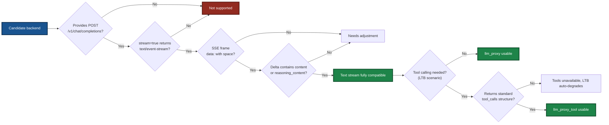
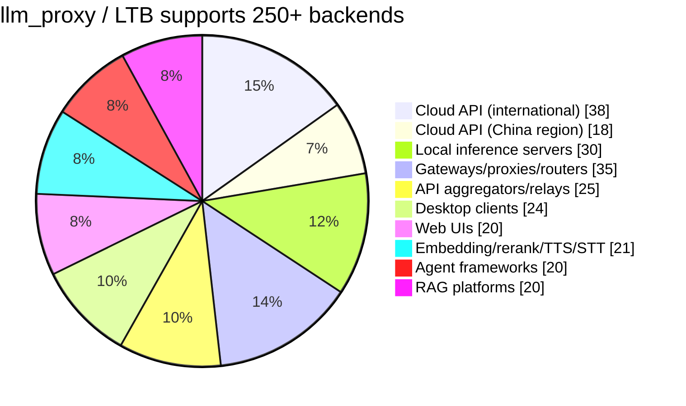

# LingoFuse LLM Proxy — Compatibility Guide

> **Applies to**: `llm_proxy`, `llm_proxy_tool` (LTB)
> **Document version**: v4.3 (language-neutral rewrite)
> **Last updated**: 2026-09-26

---

## 1. Core Compatibility Logic

`llm_proxy` uses a **single compatibility criterion**: it only recognizes one endpoint pattern — `POST /v1/chat/completions` with `stream=true` returning `text/event-stream`. Any service matching this protocol — cloud API, local server, gateway, or desktop application — can be integrated seamlessly via `--backend-url`.

`llm_proxy_tool` (**LTB**) adds one **extra requirement** on top of this criterion: when a request carries a `tools` field, the backend must be able to return a **standard OpenAI-format `tool_calls`**. The **base integration rules are identical** for both, so everything in this document about **backend compatibility** applies equally to LTB.

### Diagram 1 — Compatibility decision flow



**Why only one base criterion?** Because `llm_proxy` only does three things: parse the URL path to extract `app` and `api`, forward the request body verbatim to the backend, and parse the backend's SSE stream line by line into LingoFuse Notify events. It does not parse business data, does not validate `Content-Type`, and does not care about the backend's specific implementation. Therefore, **as long as the backend is OpenAI-compatible at the protocol level, `llm_proxy` can pass it through**.

**Key matching points**:

| Matching point | llm_proxy / LTB implementation | Notes |
|---|---|---|
| `POST /v1/chat/completions` | `OpenAIStreamClient.stream_chat()` | Hard-coded path, not customizable |
| `Authorization: Bearer <key>` | `_build_headers()` | Custom header name and scheme supported |
| `stream=true` → `text/event-stream` | `Accept-Encoding: identity` + `http.client` | Forces no compression, disables Nagle |
| `data: {...}\n\n` SSE frame | `for raw_line in resp:` | Only recognizes the `data: ` (with space) prefix |
| `choices[0].delta.content` | `_extract_delta()` | Mapped to `chunk` events |
| `choices[0].delta.reasoning_content` | `_extract_delta()` | Mapped to `think` events |
| `data: [DONE]` | `stream_chat()`'s `return` | End-of-stream marker |
| `choices[0].delta.tool_calls` (LTB only) | `stream_chat()`'s accumulator | Concatenates `arguments` strings by `index` |
| `image_url` content parts (multimodal) | `stream_chat()` forwards verbatim | **Requires `--vision`**; see section 11 |

---

## 2. Cloud API Providers (International) — 38+

### 2.1 Mainstream cloud APIs

| Platform | Base URL | Path | Multimodal |
|---|---|:---:|:---:|
| OpenAI official | `https://api.openai.com` | `/v1/chat/completions` | Yes |
| Azure OpenAI | `<resource>.openai.azure.com` | `/openai/deployments/<name>/chat/completions` | Yes |
| Anthropic Claude | `https://api.anthropic.com` | via compatibility layer | Yes |
| Google Vertex AI | `https://<region>-aiplatform.googleapis.com` | via compatibility layer | Yes |
| Mistral AI | `https://api.mistral.ai` | `/v1/chat/completions` | No |
| Groq | `https://api.groq.com` | `/openai/v1/chat/completions` | No |
| Together AI | `https://api.together.xyz` | `/v1/chat/completions` | Yes |
| DeepInfra | `https://api.deepinfra.com` | `/v1/openai/chat/completions` | Yes |
| Cerebras | `https://api.cerebras.ai` | `/v1/chat/completions` | No |
| Fireworks AI | `https://api.fireworks.ai` | `/inference/v1/chat/completions` | Yes |
| Baseten | `https://inference.baseten.co` | `/v1/chat/completions` | No |
| Cohere | `https://api.cohere.ai` | `/compatibility/v1/chat/completions` | No |
| xAI (Grok) | `https://api.x.ai` | `/v1/chat/completions` | Yes |
| Nebius Token Factory | OpenAI-compatible endpoint | `/v1/chat/completions` | No |
| DigitalOcean Serverless Inference | OpenAI-compatible endpoint | `/v1/chat/completions` | No |
| Perplexity | `https://api.perplexity.ai` | `/chat/completions` | No |
| Hugging Face Inference | `https://router.huggingface.co` | `/v1/chat/completions` | Yes |
| OpenRouter | `https://openrouter.ai` | `/api/v1/chat/completions` | Yes |
| Cloudflare Workers AI | `https://api.cloudflare.com/client/v4/accounts/<id>/ai/v1` | `/chat/completions` | Yes |
| GitHub Models | `https://models.inference.ai.azure.com` | `/chat/completions` | Yes |
| SambaNova | OpenAI-compatible endpoint | `/v1/chat/completions` | No |
| Hyperbolic | OpenAI-compatible endpoint | `/v1/chat/completions` | No |
| Novita AI | OpenAI-compatible endpoint | `/v1/chat/completions` | Yes |
| Anyscale Endpoints | OpenAI-compatible endpoint | `/v1/chat/completions` | No |
| Replicate | OpenAI-compatible endpoint | `/v1/chat/completions` | Yes |
| AI21 Labs | OpenAI-compatible endpoint | `/v1/chat/completions` | No |
| Writer | OpenAI-compatible endpoint | `/v1/chat/completions` | No |
| GMI Cloud | `https://api.gmi-serving.com/v1` | `/chat/completions` | No |
| LLM7.io | `https://api.llm7.io/v1` | `/chat/completions` | No |
| DeepSeek | `https://api.deepseek.com` | `/v1/chat/completions` | No |
| Moonshot (Kimi) | `https://api.moonshot.cn/v1` | `/chat/completions` | No |
| Voyage AI | Embedding-focused | `/v1/embeddings` | — |
| Jina AI | Embedding-focused | `/v1/embeddings` | — |
| Mixedbread AI | Embedding / rerank | `/v1/embeddings` | — |
| Nomic AI | Embedding-focused | `/v1/embeddings` | — |
| Cohere (embeddings) | `https://api.cohere.ai` | `/v1/embed` | — |
| Voyage AI (rerank) | Rerank-focused | `/v1/rerank` | — |
| Jina AI (rerank) | Rerank-focused | `/v1/rerank` | — |

### 2.2 Cloud API Providers (China Region) — 18+

| Platform | Base URL | Path |
|---|---|---|
| DeepSeek | `https://api.deepseek.com` | `/v1/chat/completions` |
| SiliconFlow | `https://api.siliconflow.cn` | `/v1/chat/completions` |
| Alibaba DashScope (Bailian) | `https://dashscope.aliyuncs.com/compatible-mode` | `/v1/chat/completions` |
| Volcengine (Doubao) | `https://ark.cn-beijing.volces.com/api/v3` | `/chat/completions` |
| Zhipu (GLM) | `https://open.bigmodel.cn/api/paas/v4` | `/chat/completions` |
| MiniMax | `https://api.minimax.chat/v1` | `/chat/completions` |
| Moonshot | `https://api.moonshot.cn/v1` | `/chat/completions` |
| 01.AI (Yi) | `https://api.lingyiwanwu.com/v1` | `/chat/completions` |
| Baichuan | `https://api.baichuan-ai.com/v1` | `/chat/completions` |
| Tencent Hunyuan | `https://api.hunyuan.cloud.tencent.com/v1` | `/chat/completions` |
| Baidu Wenxin | `https://qianfan.baidubce.com/v2` | `/chat/completions` |
| iFlytek Spark | `https://spark-api-open.xf-yun.com/v1` | `/chat/completions` |
| StepFun | `https://api.stepfun.com/v1` | `/chat/completions` |
| SenseTime SenseNova | OpenAI-compatible endpoint | `/v1/chat/completions` |
| Kunlun Tiangong | OpenAI-compatible endpoint | `/v1/chat/completions` |
| UCloud AstraFlow | OpenAI-compatible endpoint | `/v1/chat/completions` |
| TokenRhythm | OpenRouter-alike | `/v1/chat/completions` |
| Tencent Cloud third-party LLMs | `https://api.cloud.tencent.com` | `/v1/chat/completions` |

---

## 3. Local Inference Servers — 30+

| Server | Default endpoint | Multimodal |
|---|---|:---:|
| **LM Studio** | `http://localhost:1234/v1/chat/completions` | Yes |
| **llama.cpp (llama-server)** | `http://localhost:8080/v1/chat/completions` | Yes |
| **vLLM** | `http://localhost:8000/v1/chat/completions` | Yes |
| **Ollama** | `http://localhost:11434/v1/chat/completions` | Yes |
| **LocalAI** | `http://localhost:8080/v1/chat/completions` | Yes |
| **TGI (Text Generation Inference)** | `http://localhost:8080/v1/chat/completions` | Yes |
| **SGLang** | `http://localhost:30000/v1/chat/completions` | Yes |
| **TabbyAPI** | OpenAI-compatible endpoint | No |
| **KoboldCPP** | OpenAI-compatible endpoint | No |
| **text-generation-webui** | OpenAI-compatible extension | No |
| **MLX Omni Server** | Apple Silicon only | No |
| **Kronk** | Based on llama.cpp | Yes |
| **Shimmy** | Pure Rust WebGPU | No |
| **Lemonade Server** | `http://localhost:13305/api/v1` | Yes |
| **OpenLLM (BentoML)** | One-click deploy | No |
| **MLC LLM** | OpenAI-compatible endpoint | Yes |
| **LitGPT** | OpenAI-compatible endpoint | No |
| **xinfer** | Pure Rust inference | No |
| **paddock** | NVIDIA GPU native Rust | No |
| **Kolosal Server** | OpenAI-compatible endpoint | No |
| **HybridInfer** | Local OpenAI-compatible | No |
| **Rapid-MLX** | Apple Silicon only | No |
| **Dify local deployment** | OpenAI-compatible endpoint | Yes |
| **LLM-Proxy (Nayjest)** | OpenAI-compatible endpoint | No |
| **Fake OpenAI Server** | Embedding / rerank | — |
| **Furiosa-LLM** | OpenAI-compatible endpoint | No |
| **Xinference** | OpenAI-compatible endpoint | Yes |
| **MLX-VLM** | Apple Silicon multimodal | Yes |
| **Candle** | Rust inference framework | No |
| **llamafile** | Single-file inference | Yes |

---

## 4. Gateways / Proxies / Routers — 35+

| Gateway | Language |
|---|---|
| **LiteLLM** | Python |
| **Portkey Gateway** | TypeScript |
| **Helicone AI Gateway** | Rust |
| **OmniRoute** | TypeScript |
| **New API** | Go |
| **One API** | Go |
| **GoModel** | Go |
| **Bifrost** | Go |
| **Vercel AI Gateway** | Cloud service |
| **Cloudflare AI Gateway** | Cloud service |
| **Braintrust** | Cloud service |
| **AISIX** | Cloud service |
| **Higress** | Go |
| **LLM0 Gateway** | — |
| **freellmapi-proxy** | — |
| **ProxyGateLLM** | — |
| **neurogate** | — |
| **Brick** | — |
| **venagate** | TypeScript |
| **CLIProxyAPI** | — |
| **gptoss-proxy** | JavaScript |
| **Kong AI Gateway** | Lua |
| **APIClaw** | — |
| **A3M Router** | Node.js |
| **LateDev Router** | Node.js |
| **OrcaRouter** | Cloud service |
| **FreeRouter Gateway** | Node.js |
| **EURouter** | — |
| **JAiRouter** | Java |
| **freeport** | Node.js |
| **ai-api-gateway** | Node.js |
| **Tetrate Agent Router** | Cloud service |
| **TokenMix** | Aggregator |
| **Apiário** | Aggregator |
| **RouteLLM** | Python |

---

## 5. API Aggregators / Relays — 25+

| Platform | Notes |
|---|---|
| **OpenRouter** | 500+ model aggregation |
| **Ollama Cloud** | 400+ models, cloud GPU |
| **Kluster AI** | Free tier available |
| **Free-The-Ai** | 50+ models, free |
| **FreeLLMAPI** | Aggregates free tiers from 14 platforms |
| **proaiapi.tech** | Enterprise-grade |
| **n1n.ai** | Enterprise-grade dedicated line |
| **PoloAPI** | Long-standing, aggressive discounts |
| **Starlink 4SAPI** | Edge-optimized |
| **Yunwu API** | China-region relay |
| **XuanShu API** | China-region relay |
| **TeamoRouter** | OpenAI / Anthropic / Gemini compatible |
| **CometAPI** | Multi-model routing |
| **OfoxAI** | 100+ LLM unified gateway |
| **Eden AI** | Multimodal aggregation |
| **RouterBase** | 200+ frontier models |
| **Apiário** | Brazilian developer aggregation |
| **TokenMix** | 171 models, 14 providers |
| **TokenRhythm** | OpenRouter for China |
| **AI/ML API** | 300+ model aggregation |
| **Nano-GPT** | Multi-model aggregation |
| **Requesty** | LLM routing aggregation |
| **Unify AI** | Intelligent routing aggregation |
| **Martian** | Model routing aggregation |
| **Not Diamond** | Intelligent model routing |

---

## 6. Desktop Clients (with an OpenAI-Compatible Server) — 24+

| Tool | Platform | Multimodal |
|---|---|:---:|
| **LM Studio** | Windows / macOS / Linux | Yes |
| **GPT4All** | Windows / Linux / macOS | No |
| **Jan** | Windows / macOS / Linux | No |
| **Ollama** | Windows / macOS / Linux | Yes |
| **Lobe Chat** | Windows / macOS / Linux | Yes |
| **PyGPT** | Windows / Linux / macOS | Yes |
| **OOLIS** | Desktop | No |
| **Msty** | macOS / Windows / Linux | No |
| **Elvean** | macOS | No |
| **LLM FX** | Desktop client | No |
| **TurboLLM** | Desktop | No |
| **RWKV Runner** | Desktop | No |
| **ChatQT** | Linux (Flatpak) | No |
| **Sigma Oasis** | macOS / Windows / Linux | No |
| **local-chat** | Cross-platform | Yes |
| **Delta** | Offline-first | No |
| **AI Server Studio** | Desktop | Yes |
| **Atomic Chat** | Cross-platform | Yes |
| **openchat-llm** | Windows preview | No |
| **AQBot** | Cross-platform | Yes |
| **Fello** | macOS / Windows / Linux | No |
| **Chatbox** | Windows / macOS / Linux | Yes |
| **Cherry Studio** | Windows / macOS / Linux | Yes |
| **NextChat** | Windows / macOS / Linux (also a web UI; see section 7) | Yes |

> **Note**: `NextChat` (formerly `ChatGPT-Next-Web`) is both a desktop client and a web UI, so it appears in both section 6 and section 7.

---

## 7. Web UI (OpenAI-Compatible Front-Ends) — 20+

| Web UI | Notes |
|---|---|
| **Open WebUI** | Best HomeLab interface |
| **NextChat** | Lightweight and responsive (also has desktop build; see section 6) |
| **Lobe Chat** | Modern AI chat interface |
| **ChuanhuChatGPT** | Light and pleasant |
| **ChatGPT-web** | Single-page minimal interface |
| **Chatbot UI** | Open-source chat interface |
| **LibreChat** | Multi-provider chat |
| **Hollama** | Lightweight Ollama front-end |
| **Lite WebUI** | Runs in the browser |
| **llampart** | For llama-server |
| **AuraPro UI** | Extensible offline platform |
| **Chat UI** | TypeScript / SvelteKit |
| **BetterChatGPT** | Enhanced ChatGPT |
| **TypingMind** | Commercial-grade chat UI |
| **ChatALL** | Ask multiple AIs at once |
| **Big-AGI** | Agent web UI |
| **Dify** | LLMOps platform |
| **FastGPT** | Knowledge base Q&A platform |
| **AnythingLLM** | Full-stack RAG application |
| **Open WebUI Lite** | Lightweight version |

---

## 8. Embedding / Rerank / TTS / STT (Partial Support) — 21+

The following services expose OpenAI-compatible endpoints, but `llm_proxy` (and LTB) **only forward `/v1/chat/completions`**. For these capabilities, the client must connect directly.

### 8.1 Embedding / rerank

| Server | Endpoint |
|---|---|
| **Hugging Face TEI** | `/v1/embeddings` |
| **docker-embeddings** | `/v1/embeddings` + `/rerank` |
| **Superlinked Inference Engine** | `/v1/embeddings` |
| **Qwen3 Retrieval Server** | `/v1/embeddings` + `/v1/rerank` |
| **Xinference** | `/v1/embeddings` + `/v1/rerank` |
| **Furiosa-LLM** | `/v1/embeddings` + `/v1/rerank` |
| **vLLM (embedding / rerank)** | `/v1/embeddings` + `/v1/rerank` |
| **api-embedding** | `/v1/embeddings` |
| **jina-embeddings-v4 server** | `/v1/embeddings` |

### 8.2 TTS / STT

| Server | Endpoint |
|---|---|
| **Speaches** | `/v1/audio/transcriptions` + `/v1/audio/speech` |
| **VoiceStudio** | `/v1/audio/*` |
| **kokoro-fastapi** | `/v1/audio/speech` |
| **tts-server** | `/v1/audio/speech` |
| **omnivoice-server** | `/v1/audio/speech` |
| **supertonic-server** | `/v1/audio/speech` |
| **ChatTTS-OpenAI-API** | `/v1/audio/speech` |
| **bootlegger-voice** | `/v1/audio/*` |
| **OpenMusicx** | Realtime WebSocket |
| **faster-whisper** | `/v1/audio/transcriptions` |
| **Whisper.cpp** | `/v1/audio/transcriptions` |
| **museq** | 23 modalities |

---

## 9. Agent Frameworks (OpenAI-Compatible) — 20+

| Framework | Language |
|---|---|
| **LightAgent** | Python |
| **loong-agent** | Python |
| **paean-ai/agents** | TypeScript |
| **openai-agents-rust** | Rust |
| **OGX** | Python |
| **Nekora AI** | TypeScript |
| **agentknit** | Python |
| **nagents** | Python |
| **LangChain** | Python / JS |
| **LlamaIndex** | Python / TS |
| **CrewAI** | Python |
| **AutoGen** | Python |
| **Semantic Kernel** | C# / Python |
| **Haystack** | Python |
| **DSPy** | Python |
| **PromptFlow** | Python |
| **Flowise** | TypeScript |
| **n8n** | TypeScript |
| **OpenSquilla** | Multi-platform |
| **MCP Gateway** | Docker |

---

## 10. RAG Platforms (OpenAI-Compatible) — 20+

| Platform | Notes |
|---|---|
| **rwiki** | SQLite RAG |
| **rag.computer** | Self-hosted RAG |
| **Ragworks** | Low-code RAG workbench |
| **OpenRAG** | Multi-tenant RAG |
| **RAGLight** | Modular Python RAG |
| **Pi Coding Agent** | Qdrant / pgvector RAG |
| **Dify** | LLMOps + RAG |
| **FastGPT** | Knowledge base Q&A |
| **AnythingLLM** | Full-stack RAG |
| **RAGFlow** | Deep document understanding RAG |
| **Quivr** | Personal knowledge base |
| **Verba** | Weaviate RAG |
| **PrivateGPT** | Local document Q&A |
| **LocalGPT** | Local GPT document Q&A |
| **Khoj** | Personal AI knowledge base |
| **Morphik** | Multimodal RAG |
| **RAGatouille** | Lightweight RAG library |
| **Canopy** | Pinecone RAG |
| **Chroma** | Vector DB + RAG |
| **Qdrant** | Vector DB + RAG |

---

## 11. Integration Verification

Before integrating any backend with `llm_proxy` (or LTB), verify with:

```bash
curl -N -X POST http://127.0.0.1:1234/v1/chat/completions \
  -H "Content-Type: application/json" \
  -d '{"model":"<model id>","messages":[{"role":"user","content":"hi"}],"stream":true}'
```

| Check | Pass condition | Action if failing |
|---|---|---|
| HTTP status | `200 OK` | Check `--backend-url` and `--backend-model` |
| Content-Type | `text/event-stream` | Backend did not enable streaming |
| Frame prefix | `data: ` (with trailing space) | If `data:{...}`, needs extension |
| Output cadence | Line-by-line token-by-token real time | If all at once, check gzip |
| Delta field | Contains `content` or `reasoning_content` | If not, extend `_extract_delta` |
| End marker | `data: [DONE]` | If missing, backend has incomplete SSE |

### 11.1 LTB extra verification (when tool calling is needed)

```bash
curl -N -X POST http://127.0.0.1:1234/v1/chat/completions \
  -H "Content-Type: application/json" \
  -d '{
    "model":"<model id>",
    "messages":[{"role":"user","content":"what is 5+7?"}],
    "stream":true,
    "tools":[{
      "type":"function",
      "function":{
        "name":"add",
        "description":"Add two integers",
        "parameters":{
          "type":"object",
          "properties":{
            "a":{"type":"integer"},
            "b":{"type":"integer"}
          },
          "required":["a","b"]
        }
      }
    }]
  }'
```

**Criteria**:

- A `delta.tool_calls` field should appear in the SSE stream.
- All fragments' `arguments` should concatenate by `index` into valid JSON (e.g. `{"a":5,"b":7}`).
- If the backend **always returns plain text without triggering `tool_calls`**, the model does not support Function Calling, or `tool_choice` is misconfigured.

### 11.2 Multimodal verification (when image Q&A is needed)

```bash
curl -N -X POST http://127.0.0.1:1234/v1/chat/completions \
  -H "Content-Type: application/json" \
  -d '{
    "model":"<VLM model id>",
    "messages":[{
      "role":"user",
      "content":[
        {"type":"text","text":"describe this image"},
        {"type":"image_url","image_url":{"url":"data:image/png;base64,iVBORw0KGgoAAAANSUhEUg..."}}
      ]
    }],
    "stream":true
  }'
```

**Criteria**:

- The backend's text description should **mention the image content** (colors, objects, scenes).
- If the backend replies "I do not see an image" or ignores it, then:
  - The backend has not loaded a VLM (it loaded a text-only model).
  - Or the backend does not support the OpenAI multimodal `image_url` format.
- **LingoFuse-side extra step**: when integrating with `llm_proxy` / LTB, **`--vision` must be passed explicitly** — otherwise image attachments are **rejected** by the server (`code: -1`) and never reach the backend.

---

## 12. Known Limitations

| Limitation | Notes |
|---|---|
| **`llm_proxy` does not support Function Calling** | Pure text passthrough; `_extract_delta` only recognizes `content` / `reasoning_content`. **For Function Calling, use `llm_proxy_tool` (LTB)**, which manages tool calling on the server side. |
| **LTB requires backends to return standard OpenAI `tool_calls`** | Each `tool_call` must contain `index` / `id` / `type: "function"` / `function.name` / `function.arguments` (as a string). Non-standard structures require adapting `OpenAIStreamClient.stream_chat`. |
| `set_system_message` not supported | The proxy is a stateless forwarder; the system prompt cannot be switched mid-session. Same for LTB. |
| Only recognizes `/v1/chat/completions` | Does not support `/completions`, `/responses`, `/embeddings`, `/audio/*` |
| Options whitelist | Only forwards 5 fields (`max_tokens` / `temperature` / `top_p` / `top_k` / `repeat_penalty`). `seed` / `stop` / `response_format` etc. are silently dropped. LTB additionally forwards `tools` / `tool_choice`. |
| Azure OpenAI | Path includes deployment + api-version; must be manually assembled into `--backend-url` |
| Non-standard SSE frames | `data:{...}` without a space causes dropped frames; reverse proxies must preserve the original format |
| No Content-Type validation | A non-SSE backend response ends silently; the client receives an empty `finish` |
| No concurrent tool execution | LTB executes `tool_calls` sequentially, not concurrently. In a single-round multi-tool scenario, serial waiting can add latency. |
| LTB tool list has no runtime refresh | Fetched once at startup; backend tool changes are not noticed during runtime. LTB must be restarted to pick up changes. |
| **Multimodal requires explicit `--vision`** | `llm_proxy` / LTB **forward image attachments verbatim** to the backend; **`--vision` must be passed to enable it** (otherwise image attachments are rejected with `code: -1`). **Whether it works depends on the backend.** `llm_service` does not support multimodal. |
| **LTB multimodal + tool loop** | Images are sent in full only on the **first round**; subsequent tool-calling rounds use **history placeholders** (e.g. `[image: chart.png]`). This avoids token explosion, but the backend cannot see the original image in later rounds. |
| **LTB `--no-tools` + `--vision`** | `--no-tools` disables all tool behavior and degrades to a pure text proxy. Multimodal forwarding **still works** in this mode (if `--vision` is passed), but tool capability is gone. |
| **LTB `--vision` not passed + tool calling** | Image requests are rejected (`code: -1`), and tool calling does not happen either. Pass `--vision` (if images are needed) and keep `--enable-tools` (on by default). |

---

## 13. Support Statistics

### Diagram 2 — Backend distribution



| Category | Count |
|---|:---:|
| Cloud API providers (international) | **38+** |
| Cloud API providers (China region) | **18+** |
| Local inference servers | **30+** |
| Gateways / proxies / routers | **35+** |
| API aggregators / relays | **25+** |
| Desktop clients (with server) | **24+** |
| Web UIs (OpenAI-compatible front-ends) | **20+** |
| Embedding / rerank / TTS / STT (partial) | **21+** |
| Agent frameworks | **20+** |
| RAG platforms | **20+** |
| **Total** | **250+** |

> **Note**: this list applies to **both `llm_proxy` (pure text proxy) and `llm_proxy_tool` (LTB, server-side tool execution)**. LTB's only core difference is that it injects a `tools` field into the request and requires the backend to return a standard `tool_calls` structure when needed. The base SSE client is identical. Multimodal forwarding also applies — **`--vision` must be passed explicitly**.

---

## 14. Related Topics

| Topic | Notes |
|---|---|
| Ecosystem overview | Four core application components and two paths |
| `llm_proxy` CLI guide | Pure text forwarder proxy manual |
| `llm_proxy_tool` (LTB) CLI guide | Server-side tool execution proxy manual |
| `llm_service` CLI guide | Local inference service manual |
| Core layer complete guide | Includes the pitfall knowledge base |
| Client SDK guide | Event-driven LLM client SDK |

### Code Generator

The MCP-API code generation tool is maintained as a **dedicated repository**:

**LingoFuse-Tools** — one declaration, API bindings for dozens of target languages. The declaration spec, user manual, generator source, and prebuilt packages all live in that repository.

---

**Document version**: v4.3 (language-neutral rewrite — removed all language-specific references; the LLM ecosystem is an interface middle layer and is language-agnostic; removed all document links)
**Maintainer**: LingoFuse Team