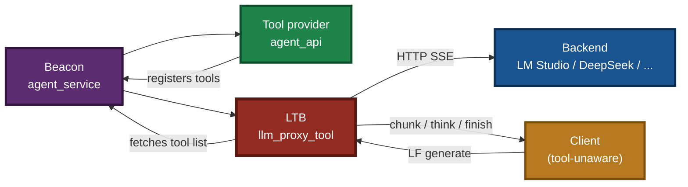
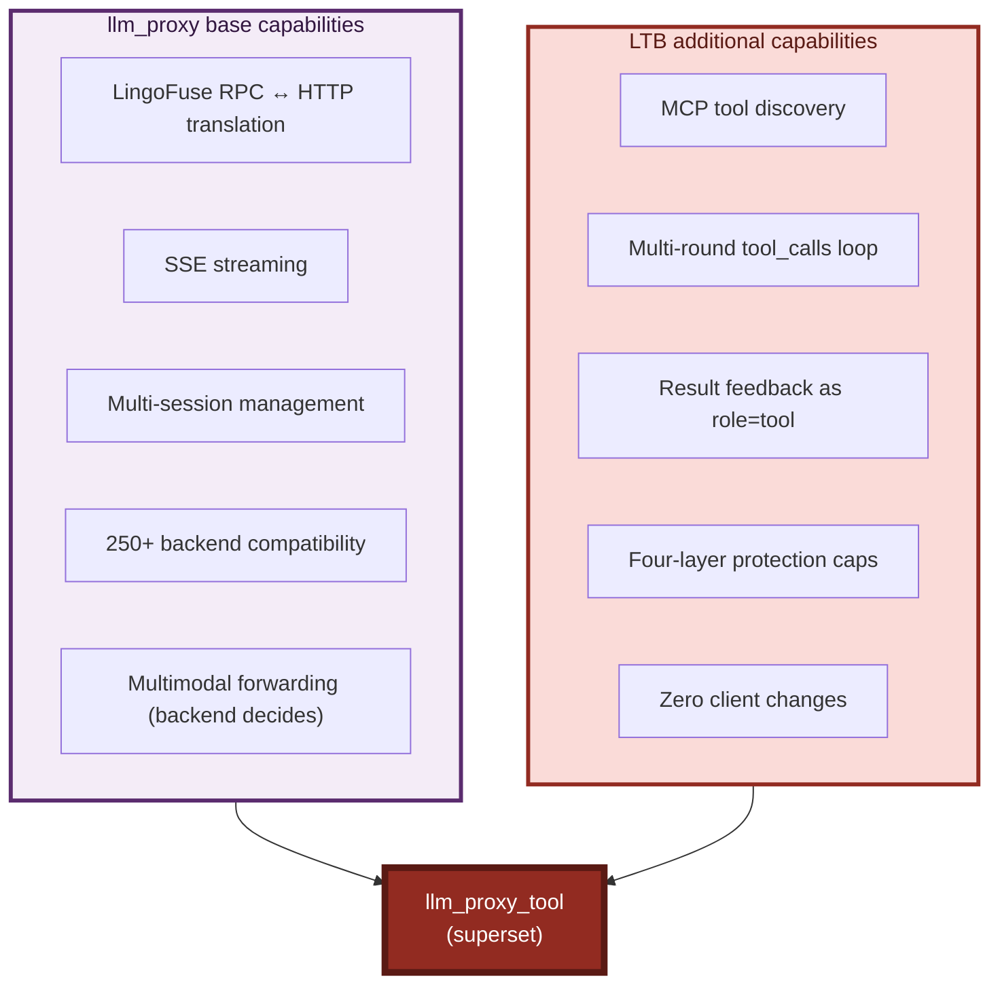
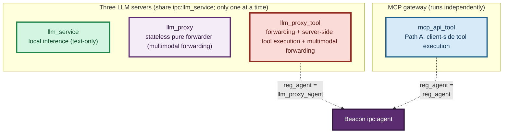
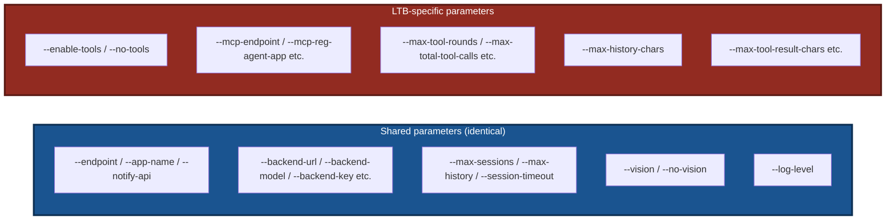
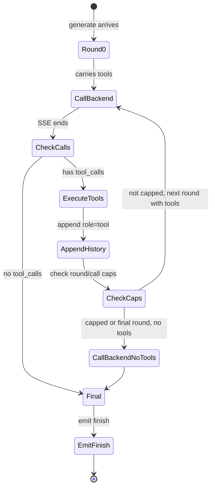
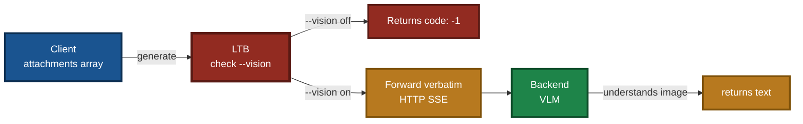

# LingoFuse LLM Tool Bridge (LTB) — CLI Guide

> **Applies to**: `llm_proxy_tool.exe` (Windows) / `llm_proxy_tool` (Linux)
> **Document version**: v3.3 (language-neutral rewrite)
> **Last updated**: 2026-09-26

---

## 1. Positioning

`llm_proxy_tool` (internal codename **LTB**, LLM Tool Bridge) is a **superset** of `llm_proxy`. On top of pure text forwarding, it adds **server-side tool execution**:

- **`llm_proxy`** — pure text forwarding. Tool execution is the **client's** responsibility (the client must support MCP).
- **`llm_proxy_tool`** — forwarding plus **server-side tool execution**. The client **does not need** MCP support; it only needs to call `generate` to obtain tool capability.

Typical use cases for LTB:

- A **general-purpose GUI client** (no MCP support) that needs to call backend tools
- An **in-house front-end** (only sends `generate`) that needs an AI to call backend tools on its behalf
- A deployment that wants to **centralize the tool-calling loop on the server**, keeping clients simple

### Diagram 1 — Where LTB sits in the ecosystem



**Runtime**: Windows / Linux.
**Dependencies**: `LingoFuse64.dll` / `liblingofuse.so` (on the system PATH or next to the executable).
**Optional dependency**: `language_middleware.py`. If missing, LTB automatically downgrades to a pure text proxy, behaviorally equivalent to `llm_proxy`.

### Diagram 2 — What LTB adds over `llm_proxy`



---

## 2. Relationship with the Sibling Components

LTB relates to `llm_service`, `llm_proxy`, and `mcp_api_tool` as follows.

### Diagram 3 — Four components side by side



**Capability matrix comparison**:

| API | `llm_service` | `llm_proxy` | `llm_proxy_tool` (LTB) |
|---|:---:|:---:|:---:|
| `generate` | 1 | 1 | 1 |
| `create_session` | 1 | 1 | 1 |
| `close_session` | 1 | 1 | 1 |
| `cancel_session` | 1 | 1 | 1 |
| `list_sessions` | 1 | 1 | 1 |
| **`set_system_message`** | **1** | **0** | **0** |
| `health` | 1 | 1 | 1 |
| `llm_stream` | 1 | 1 | 1 |
| `attachments` | 1 | 1 | 1 |
| **`vision`** | **0** | **0** | **0** |
| **`tools`** / **`tool_calls`** / **`tool_results`** | — | — | **1** |
| **`server_kind`** | `service` | `proxy` | `proxy` |

> **On `vision=0`**: all three servers report `vision` as **0**. This expresses "the server itself does not do vision processing", not "the pipeline does not support multimodal". `llm_proxy` / LTB are only forwarders; whether an image is understood is decided by the **backend**.
>
> **On `server_kind`**: `llm_proxy` and `llm_proxy_tool` both report `"proxy"`. To distinguish them, read the LTB-specific fields such as `tools` / `tool_calls`.

**Coexistence rules**:

| Combination | Can run simultaneously? | Notes |
|---|:---:|---|
| `llm_proxy_tool` + `mcp_api_tool` | Yes | Different `reg_agent` names (`llm_proxy_agent` vs `reg_agent`), shared beacon |
| `llm_proxy_tool` + `llm_proxy` | No | Shared default endpoint `ipc:llm_service` |
| `llm_proxy_tool` + `llm_service` | No | Shared default endpoint `ipc:llm_service` |
| `llm_proxy_tool` + `llm_service` (endpoint changed) | Yes | Give LTB `--endpoint ipc:llm_proxy_tool --app-name LLM_Proxy_Tool` |

### Diagram 4 — Parameter differences vs `llm_proxy`



---

## 3. Quick Start

### 3.1 Prerequisites

1. **Beacon running**: `agent_service` listening on `ipc:agent`.
2. **Tool provider running**: `agent_api` (or your own tool provider) registered with the beacon.
3. **Backend running**: LM Studio / Ollama / DeepSeek etc., with `tool_calls` support.
4. **Dynamic library loadable**: `LingoFuse64.dll` on the PATH or next to the executable.

### 3.2 Minimal startup

**Windows (PowerShell)**:

```powershell
.\llm_proxy_tool.exe --backend-url http://127.0.0.1:1234/v1
```

**Linux (Shell)**:

```bash
./llm_proxy_tool --backend-url http://127.0.0.1:1234/v1
```

### 3.3 Connect to LM Studio with tools enabled

**Windows (PowerShell)**:

```powershell
.\llm_proxy_tool.exe `
  --backend-url http://127.0.0.1:1234/v1 `
  --backend-model "nvidia-nemotron-3-nano-omni-30b-a3b-reasoning" `
  --mcp-reg-agent-app llm_proxy_agent `
  --mcp-tool-provider-app agent_main_app
```

**Linux (Shell)**:

```bash
./llm_proxy_tool \
  --backend-url http://127.0.0.1:1234/v1 \
  --backend-model "nvidia-nemotron-3-nano-omni-30b-a3b-reasoning" \
  --mcp-reg-agent-app llm_proxy_agent \
  --mcp-tool-provider-app agent_main_app
```

### Diagram 5 — Startup banner

```text
======================================================================
 LINGOFUSE LLM PROXY TOOL BRIDGE (LTB)
======================================================================
  Service kind            : proxy
  Service endpoint        : ipc:llm_service
  Service app name        : LLM_Service
  Notify API name         : llm_stream
  Backend URL             : http://127.0.0.1:1234/v1
  Backend model           : (auto-discover)
  Backend auth            : Authorization: Bearer <redacted, 9 chars>
  Backend extra headers   : (none)
  Backend timeout (s)     : 300
  Backend transport       : http.client
  Max history per session : 512 messages / 200000 chars
  Max sessions            : 1024
  Session idle timeout(s) : 1800
  set_system_message      : unsupported (llm_service-only)
  Attachments             : enabled (text always, image when --vision)
  Vision                  : disabled
  Log level               : INFO
----------------------------------------------------------------------
  Tools enabled           : True
  Tool execution mode     : server-side (client-transparent)
  MCP endpoint            : ipc:agent
  MCP reg agent app       : llm_proxy_agent
  MCP tool provider app   : agent_main_app
  Max tool rounds         : 100
  Max total tool calls    : 50
  Max tools per round     : 10
  Max tool result chars   : 8000
  Max total tool-result   : 200000 chars
----------------------------------------------------------------------
  Supported APIs          : generate, create_session, close_session, ...
  Unsupported APIs        : set_system_message
======================================================================
[INFO] LLM Tool Bridge service 'LLM_Service' running on ipc:llm_service
[INFO] Press Ctrl+C to stop...
```

> **Notes**:
> - The `Attachments` line means "the server **accepts** the attachment field".
> - The `Vision` line means "whether the server **itself** enables vision forwarding". Default is `disabled`; with `--vision`, it reports `enabled` and image attachments are **forwarded to the backend** (instead of being rejected).
> - `Vision` does **not** mean "LTB can understand images" — the actual vision processing happens on the **backend**.

---

## 4. Parameter Reference

### 4.1 LingoFuse service parameters

#### `--endpoint ADDRESS`

- **Purpose**: LingoFuse service endpoint. IPC for same-host, TCP for cross-host.
- **Default**: `ipc:llm_service`
- **Environment variable**: `LLM_PROXY_ENDPOINT`

**Windows (PowerShell)**:

```powershell
# Same-host IPC (default)
.\llm_proxy_tool.exe --endpoint ipc:llm_service

# Cross-host TCP (listen on all interfaces)
.\llm_proxy_tool.exe --endpoint 0.0.0.0:9898

# Use a different endpoint to coexist with llm_service
.\llm_proxy_tool.exe `
  --endpoint ipc:llm_proxy_tool `
  --app-name LLM_Proxy_Tool
```

**Linux (Shell)**:

```bash
# Same-host IPC (default)
./llm_proxy_tool --endpoint ipc:llm_service

# Cross-host TCP (listen on all interfaces)
./llm_proxy_tool --endpoint 0.0.0.0:9898

# Use a different endpoint to coexist with llm_service
./llm_proxy_tool \
  --endpoint ipc:llm_proxy_tool \
  --app-name LLM_Proxy_Tool
```

#### `--app-name NAME`

- **Purpose**: LingoFuse application name. Clients look up the service by this name.
- **Default**: `LLM_Service`
- **Environment variable**: `LLM_PROXY_APP_NAME`

**Windows (PowerShell)**:

```powershell
.\llm_proxy_tool.exe --app-name LLM_Proxy_Tool --endpoint ipc:llm_proxy_tool
```

**Linux (Shell)**:

```bash
./llm_proxy_tool --app-name LLM_Proxy_Tool --endpoint ipc:llm_proxy_tool
```

#### `--notify-api NAME`

- **Purpose**: Notify API name used for streamed token delivery.
- **Default**: `llm_stream`
- **Environment variable**: `LLM_PROXY_NOTIFY_API`
- **Note**: clients must register their Notify callback under the same name to receive the stream. Do not change unless you have a specific need.

### 4.2 Backend connection parameters

> **These parameters are identical to `llm_proxy`.** LTB uses the same SSE client implementation, so all backend integration rules apply equally.

#### `--backend-url URL`

- **Purpose**: base URL of the OpenAI-compatible backend. LTB appends `/chat/completions` automatically.
- **Default**: `http://127.0.0.1:12345/v1`
- **Environment variable**: `LLM_PROXY_BACKEND_URL`

**Windows (PowerShell)**:

```powershell
# Local LM Studio
.\llm_proxy_tool.exe --backend-url http://127.0.0.1:1234/v1

# Local Ollama
.\llm_proxy_tool.exe --backend-url http://127.0.0.1:11434/v1

# Cloud API
.\llm_proxy_tool.exe --backend-url https://api.deepseek.com/v1
```

**Linux (Shell)**:

```bash
# Local LM Studio
./llm_proxy_tool --backend-url http://127.0.0.1:1234/v1

# Local Ollama
./llm_proxy_tool --backend-url http://127.0.0.1:11434/v1

# Cloud API
./llm_proxy_tool --backend-url https://api.deepseek.com/v1
```

#### `--backend-model ID`

- **Purpose**: model identifier sent to the backend. Empty = auto-discover the first model from `/v1/models`.
- **Default**: (empty)
- **Environment variable**: `LLM_PROXY_BACKEND_MODEL`

**Windows (PowerShell)**:

```powershell
.\llm_proxy_tool.exe `
  --backend-url http://127.0.0.1:1234/v1 `
  --backend-model "nvidia-nemotron-3-nano-omni-30b-a3b-reasoning"
```

**Linux (Shell)**:

```bash
./llm_proxy_tool \
  --backend-url http://127.0.0.1:1234/v1 \
  --backend-model "nvidia-nemotron-3-nano-omni-30b-a3b-reasoning"
```

> **Note**: the model ID must support **Function Calling / Tool Calls** for LTB to trigger tool execution. Models that natively support `tools` are recommended.

#### `--backend-key KEY`

- **Purpose**: backend API key / token.
- **Default**: `lm-studio`
- **Environment variable**: `LLM_PROXY_BACKEND_KEY`

**Windows (PowerShell)**:

```powershell
.\llm_proxy_tool.exe --backend-key sk-xxxxxxxxxxxx
```

**Linux (Shell)**:

```bash
./llm_proxy_tool --backend-key sk-xxxxxxxxxxxx
```

#### `--backend-key-file PATH`

- **Purpose**: read the API key from a file, overriding `--backend-key`.
- **Environment variable**: `LLM_PROXY_BACKEND_KEY_FILE`

**Windows (PowerShell)**:

```powershell
"sk-xxxxxxxxxxxx" | Out-File -Encoding utf8 api_key.txt
.\llm_proxy_tool.exe --backend-key-file ./api_key.txt
```

**Linux (Shell)**:

```bash
echo "sk-xxxxxxxxxxxx" > api_key.txt
chmod 600 api_key.txt
./llm_proxy_tool --backend-key-file ./api_key.txt
```

#### `--backend-auth-header NAME`

- **Purpose**: name of the HTTP header carrying the token.
- **Default**: `Authorization`
- **Environment variable**: `LLM_PROXY_BACKEND_AUTH_HEADER`

**Windows (PowerShell)**:

```powershell
# Azure OpenAI uses the api-key header
.\llm_proxy_tool.exe --backend-auth-header api-key
```

**Linux (Shell)**:

```bash
# Azure OpenAI uses the api-key header
./llm_proxy_tool --backend-auth-header api-key
```

#### `--backend-auth-scheme PREFIX`

- **Purpose**: token prefix (scheme). Empty string means raw token.
- **Default**: `Bearer`
- **Environment variable**: `LLM_PROXY_BACKEND_AUTH_SCHEME`

**Windows (PowerShell)**:

```powershell
# Standard Bearer (default)
.\llm_proxy_tool.exe --backend-auth-scheme "Bearer"

# Azure needs a raw token
.\llm_proxy_tool.exe --backend-auth-header api-key --backend-auth-scheme ""
```

**Linux (Shell)**:

```bash
# Standard Bearer (default)
./llm_proxy_tool --backend-auth-scheme "Bearer"

# Azure needs a raw token
./llm_proxy_tool --backend-auth-header api-key --backend-auth-scheme ""
```

#### `--backend-extra-headers JSON`

- **Purpose**: additional HTTP headers, passed as a JSON object.
- **Environment variable**: `LLM_PROXY_BACKEND_EXTRA_HEADERS`

**Windows (PowerShell)**:

```powershell
.\llm_proxy_tool.exe `
  --backend-extra-headers '{\"HTTP-Referer\":\"https://example.com\",\"X-Title\":\"MyApp\"}'
```

**Linux (Shell)**:

```bash
./llm_proxy_tool \
  --backend-extra-headers '{"HTTP-Referer":"https://example.com","X-Title":"MyApp"}'
```

#### `--backend-timeout SECONDS`

- **Purpose**: HTTP timeout (seconds) for streaming from the backend.
- **Default**: `300`
- **Environment variable**: `LLM_PROXY_BACKEND_TIMEOUT`

**Windows (PowerShell)**:

```powershell
# Long reasoning: raise to 10 minutes
.\llm_proxy_tool.exe --backend-timeout 600
```

**Linux (Shell)**:

```bash
# Long reasoning: raise to 10 minutes
./llm_proxy_tool --backend-timeout 600
```

### 4.3 Session management parameters

> **These parameters are mostly shared with `llm_proxy`.** LTB adds `--max-history-chars` (see below).

#### `--max-sessions N`

- **Purpose**: maximum number of concurrently active sessions.
- **Default**: `1024`
- **Environment variable**: `LLM_PROXY_MAX_SESSIONS`

**Windows (PowerShell)**:

```powershell
.\llm_proxy_tool.exe --max-sessions 64
```

**Linux (Shell)**:

```bash
./llm_proxy_tool --max-sessions 64
```

#### `--max-history N`

- **Purpose**: maximum number of messages retained per session (including user / assistant / tool messages).
- **Default**: `512`
- **Environment variable**: `LLM_PROXY_MAX_HISTORY`

**Windows (PowerShell)**:

```powershell
.\llm_proxy_tool.exe --max-history 1024
```

**Linux (Shell)**:

```bash
./llm_proxy_tool --max-history 1024
```

> **LTB-specific behavior**: trimming guarantees that an `assistant.tool_calls` message is **never split** from its matching `role=tool` replies. If the oldest message is a `role=tool`, its preceding `assistant.tool_calls` is dropped together with it.

#### `--max-history-chars N`

- **Purpose**: **total character budget** for a single session's message history. The oldest messages are dropped when exceeded.
- **Default**: `200000`
- **Environment variable**: `LLM_PROXY_MAX_HISTORY_CHARS`

**Windows (PowerShell)**:

```powershell
# Long tool chains: raise the character budget
.\llm_proxy_tool.exe --max-history-chars 500000
```

**Linux (Shell)**:

```bash
# Long tool chains: raise the character budget
./llm_proxy_tool --max-history-chars 500000
```

> **Why this parameter exists**: tool execution results can be very long (e.g. reading a large file). Accumulated results can blow up the message history. `--max-history-chars` provides a character-based hard cap to prevent unbounded memory growth.

#### `--session-timeout SECONDS`

- **Purpose**: session idle timeout (seconds). Sessions idle past this threshold are reclaimed by the watchdog.
- **Default**: `1800` (30 minutes)
- **Environment variable**: `LLM_PROXY_SESSION_TIMEOUT`

**Windows (PowerShell)**:

```powershell
.\llm_proxy_tool.exe --session-timeout 300
```

**Linux (Shell)**:

```bash
./llm_proxy_tool --session-timeout 300
```

> **Note**: LTB's session reclamation is **single-condition** (idle timeout only), unlike `llm_service`'s **dual-condition** (idle timeout plus client offline). Reason: LTB does not hold a model KV cache, and sessions only hold message history, so reclamation is cheap.

### 4.4 Tool (MCP) parameters

> **These parameters are LTB-specific.** `llm_proxy` does not have them.

#### `--enable-tools` / `--no-tools`

- **Purpose**: whether to enable tool-related behavior.
  - `--enable-tools` (default): enable tool discovery and tool execution.
  - `--no-tools`: disable all tool behavior. LTB degrades to a pure text proxy, identical to `llm_proxy`.
- **Environment variable**: `LLM_PROXY_ENABLE_TOOLS` (`1` / `true` / `yes` enables)

**Windows (PowerShell)**:

```powershell
# Explicitly disable tools (degrade to pure text proxy)
.\llm_proxy_tool.exe --backend-url http://127.0.0.1:1234/v1 --no-tools
```

**Linux (Shell)**:

```bash
# Explicitly disable tools (degrade to pure text proxy)
./llm_proxy_tool --backend-url http://127.0.0.1:1234/v1 --no-tools
```

#### `--mcp-endpoint ADDRESS`

- **Purpose**: LingoFuse endpoint of the beacon (tool registry).
- **Default**: `ipc:agent`
- **Environment variable**: `LLM_PROXY_MCP_ENDPOINT`

**Windows (PowerShell)**:

```powershell
.\llm_proxy_tool.exe --mcp-endpoint ipc:agent
```

**Linux (Shell)**:

```bash
./llm_proxy_tool --mcp-endpoint ipc:agent
```

#### `--mcp-timeout MS`

- **Purpose**: timeout (milliseconds) for MCP tool discovery and tool invocation. **Unit is milliseconds.**
- **Default**: `5000`
- **Environment variable**: `LLM_PROXY_MCP_TIMEOUT`

**Windows (PowerShell)**:

```powershell
.\llm_proxy_tool.exe --mcp-timeout 10000
```

**Linux (Shell)**:

```bash
./llm_proxy_tool --mcp-timeout 10000
```

#### `--mcp-reg-agent-app NAME`

- **Purpose**: the "registration agent application name" LTB registers with the beacon.
- **Default**: `llm_proxy_agent`
- **Environment variable**: `LLM_PROXY_MCP_REG_AGENT_APP`

> **Critical constraint**: `--mcp-reg-agent-app` **must** be different from `mcp_api_tool`'s `--reg-agent-app` (default `reg_agent`). If they are the same, the beacon cannot distinguish the two clients and tool fetching becomes confused. **Keep the default value.**

**Windows (PowerShell)**:

```powershell
# Keep default to coexist with mcp_api_tool
.\llm_proxy_tool.exe --mcp-reg-agent-app llm_proxy_agent
```

**Linux (Shell)**:

```bash
# Keep default to coexist with mcp_api_tool
./llm_proxy_tool --mcp-reg-agent-app llm_proxy_agent
```

#### `--mcp-tool-provider-app NAME`

- **Purpose**: LingoFuse application name of the tool provider. LTB requests the tool list from this App.
- **Default**: `agent_main_app`
- **Environment variable**: `LLM_PROXY_MCP_TOOL_PROVIDER_APP`

**Windows (PowerShell)**:

```powershell
.\llm_proxy_tool.exe --mcp-tool-provider-app agent_main_app
```

**Linux (Shell)**:

```bash
./llm_proxy_tool --mcp-tool-provider-app agent_main_app
```

#### `--max-tool-rounds N`

- **Purpose**: **maximum round trips** inside a single `generate` (model → tool_calls → tool_result → model → ...).
- **Default**: `100`
- **Environment variable**: `LLM_PROXY_MAX_TOOL_ROUNDS`
- **Note**: the **final round is forced to omit `tools`**, guaranteeing loop termination.

**Windows (PowerShell)**:

```powershell
# Relax (long tool chains)
.\llm_proxy_tool.exe --max-tool-rounds 200

# Tighten (protect against a runaway model)
.\llm_proxy_tool.exe --max-tool-rounds 20
```

**Linux (Shell)**:

```bash
# Relax (long tool chains)
./llm_proxy_tool --max-tool-rounds 200

# Tighten (protect against a runaway model)
./llm_proxy_tool --max-tool-rounds 20
```

#### `--max-total-tool-calls N`

- **Purpose**: **maximum number of tool executions** inside a single `generate`, across all rounds.
- **Default**: `50`
- **Environment variable**: `LLM_PROXY_MAX_TOOL_CALLS`
- **Note**: once this cap is reached, LTB immediately switches to a "final text round" (no tools) and forces the model to produce text.

**Windows (PowerShell)**:

```powershell
.\llm_proxy_tool.exe --max-total-tool-calls 100
```

**Linux (Shell)**:

```bash
./llm_proxy_tool --max-total-tool-calls 100
```

#### `--max-tools-per-round N`

- **Purpose**: **maximum number of `tool_calls` processed in one round**. OpenAI permits a single response to return multiple `tool_calls` (batch invocation); this parameter limits how many are processed in one round.
- **Default**: `10`
- **Environment variable**: `LLM_PROXY_MAX_TOOLS_PER_ROUND`

**Windows (PowerShell)**:

```powershell
.\llm_proxy_tool.exe --max-tools-per-round 20
```

**Linux (Shell)**:

```bash
./llm_proxy_tool --max-tools-per-round 20
```

#### `--max-tool-result-chars N`

- **Purpose**: **maximum characters for a single tool result**. Exceeding results are truncated with a `...(truncated)` suffix.
- **Default**: `8000`
- **Environment variable**: `LLM_PROXY_MAX_TOOL_RESULT_CHARS`

**Windows (PowerShell)**:

```powershell
# Raise when tools return large text (e.g. logs)
.\llm_proxy_tool.exe --max-tool-result-chars 32000
```

**Linux (Shell)**:

```bash
# Raise when tools return large text (e.g. logs)
./llm_proxy_tool --max-tool-result-chars 32000
```

#### `--max-total-tool-result-chars N`

- **Purpose**: **total character cap across all tool results** in a single `generate`. New results are truncated once exceeded.
- **Default**: `200000`
- **Environment variable**: `LLM_PROXY_MAX_TOTAL_TOOL_RESULT_CHARS`

**Windows (PowerShell)**:

```powershell
.\llm_proxy_tool.exe --max-total-tool-result-chars 500000
```

**Linux (Shell)**:

```bash
./llm_proxy_tool --max-total-tool-result-chars 500000
```

### 4.5 Multimodal support

LTB **does not parse image content** — it is a **pure forwarder**. Whether multimodal works is decided by the **backend**.

| Stage | Behavior |
|---|---|
| **Client** | Carries an `attachments` array in the `generate` request |
| **LTB** | Forwards `attachments` to the backend verbatim (no parsing) |
| **Backend** | Must be a **VLM that supports multimodal** (e.g. LM Studio with Qwen2-VL loaded) |
| **Tool loop** | Multimodal content only affects the **first round**; subsequent tool rounds use history (images as placeholders) |

#### The role of the `--vision` option

LTB uses `--vision` to control **whether image attachments may be forwarded**:

| `--vision` | Image attachment behavior |
|:---:|---|
| **Disabled** (default) | Requests carrying image attachments are **rejected** (`code: -1`) |
| **Enabled** | Image attachments are **forwarded verbatim** to the backend (backend decides whether to understand them) |

> **Common misconception**: `--vision` does **not** mean "LTB can understand images". It only means "forwarding images is permitted". The actual vision processing happens on the **backend**.

#### Correct usage

```powershell
# --vision must be passed explicitly
.\llm_proxy_tool.exe `
  --backend-url http://127.0.0.1:1234/v1 `
  --backend-model "qwen2-vl-7b-instruct" `
  --mcp-reg-agent-app llm_proxy_agent `
  --vision
```

Key points:

- **`--vision` must be passed explicitly**, otherwise image attachments are rejected.
- **`--backend-model` must point to a VLM**; if empty, LTB grabs the first model from `/v1/models`, which may not be a VLM.
- **The backend decides whether multimodal works**; LTB is only a forwarder.
- **In the tool chain loop, images are sent only once** — subsequent rounds use placeholders from history (e.g. `[image: chart.png]`), avoiding token explosion.
- **The client does not need to be multimodal-aware** — the protocol stays consistent.

> **Different from `llm_service`**: `llm_service` does not support multimodal (the local inference path is not implemented). LTB bypasses this limitation through **forwarding** — as long as the backend supports it, LTB can pass it through.

### 4.6 Logging parameters

#### `--log-level LEVEL`

- **Purpose**: log verbosity.
  - `DEBUG`: log every backend request, SSE frame, per-round tool call details, per-round message counts.
  - `INFO` (default): log startup, shutdown, session lifecycle, errors only.
  - `WARNING`: log warnings and errors only.
  - `ERROR`: log errors only.
- **Default**: `INFO`
- **Environment variable**: `LLM_PROXY_LOG_LEVEL`

**Windows (PowerShell)**:

```powershell
# Debug: see per-round tool call details
.\llm_proxy_tool.exe --log-level DEBUG

# Production: reduce log volume
.\llm_proxy_tool.exe --log-level WARNING
```

**Linux (Shell)**:

```bash
# Debug: see per-round tool call details
./llm_proxy_tool --log-level DEBUG

# Production: reduce log volume
./llm_proxy_tool --log-level WARNING
```

---

## 5. Environment Variables

Every command-line parameter has an equivalent environment variable, suitable for launch scripts and system services.

### 5.1 Shared environment variables (same as `llm_proxy`)

| Environment variable | Corresponding option | Example value |
|---|---|---|
| `LLM_PROXY_ENDPOINT` | `--endpoint` | `ipc:llm_service` |
| `LLM_PROXY_APP_NAME` | `--app-name` | `LLM_Service` |
| `LLM_PROXY_NOTIFY_API` | `--notify-api` | `llm_stream` |
| `LLM_PROXY_BACKEND_URL` | `--backend-url` | `http://127.0.0.1:1234/v1` |
| `LLM_PROXY_BACKEND_MODEL` | `--backend-model` | `qwen2.5-7b-instruct` |
| `LLM_PROXY_BACKEND_KEY` | `--backend-key` | `sk-xxx` |
| `LLM_PROXY_BACKEND_KEY_FILE` | `--backend-key-file` | `./api_key.txt` |
| `LLM_PROXY_BACKEND_AUTH_HEADER` | `--backend-auth-header` | `Authorization` |
| `LLM_PROXY_BACKEND_AUTH_SCHEME` | `--backend-auth-scheme` | `Bearer` |
| `LLM_PROXY_BACKEND_EXTRA_HEADERS` | `--backend-extra-headers` | `{"X-Title":"App"}` |
| `LLM_PROXY_BACKEND_TIMEOUT` | `--backend-timeout` | `300` |
| `LLM_PROXY_MAX_HISTORY` | `--max-history` | `512` |
| `LLM_PROXY_MAX_HISTORY_CHARS` | `--max-history-chars` | `200000` |
| `LLM_PROXY_MAX_SESSIONS` | `--max-sessions` | `1024` |
| `LLM_PROXY_SESSION_TIMEOUT` | `--session-timeout` | `1800` |
| **`LLM_PROXY_VISION`** | **`--vision` / `--no-vision`** | **`1` / `0`** |
| `LLM_PROXY_LOG_LEVEL` | `--log-level` | `INFO` |

### 5.2 LTB-specific environment variables

| Environment variable | Corresponding option | Example value |
|---|---|---|
| `LLM_PROXY_ENABLE_TOOLS` | `--enable-tools` / `--no-tools` | `1` / `0` |
| `LLM_PROXY_MCP_ENDPOINT` | `--mcp-endpoint` | `ipc:agent` |
| `LLM_PROXY_MCP_TIMEOUT` | `--mcp-timeout` | `5000` |
| `LLM_PROXY_MCP_REG_AGENT_APP` | `--mcp-reg-agent-app` | `llm_proxy_agent` |
| `LLM_PROXY_MCP_TOOL_PROVIDER_APP` | `--mcp-tool-provider-app` | `agent_main_app` |
| `LLM_PROXY_MAX_TOOL_ROUNDS` | `--max-tool-rounds` | `100` |
| `LLM_PROXY_MAX_TOTAL_TOOL_CALLS` | `--max-total-tool-calls` | `50` |
| `LLM_PROXY_MAX_TOOLS_PER_ROUND` | `--max-tools-per-round` | `10` |
| `LLM_PROXY_MAX_TOOL_RESULT_CHARS` | `--max-tool-result-chars` | `8000` |
| `LLM_PROXY_MAX_TOTAL_TOOL_RESULT_CHARS` | `--max-total-tool-result-chars` | `200000` |

### 5.3 Usage examples

**Windows (PowerShell)**:

```powershell
$env:LLM_PROXY_BACKEND_URL = "http://127.0.0.1:1234/v1"
$env:LLM_PROXY_BACKEND_MODEL = "nvidia-nemotron-3-nano-omni-30b-a3b-reasoning"
$env:LLM_PROXY_MCP_REG_AGENT_APP = "llm_proxy_agent"
$env:LLM_PROXY_MAX_TOOL_ROUNDS = "200"
.\llm_proxy_tool.exe
```

**Linux (Shell)**:

```bash
export LLM_PROXY_BACKEND_URL="http://127.0.0.1:1234/v1"
export LLM_PROXY_BACKEND_MODEL="nvidia-nemotron-3-nano-omni-30b-a3b-reasoning"
export LLM_PROXY_MCP_REG_AGENT_APP="llm_proxy_agent"
export LLM_PROXY_MAX_TOOL_ROUNDS="200"
./llm_proxy_tool
```

**Precedence**: command-line argument > environment variable > built-in default.

---

## 6. Complete Scenarios

### Scenario 1 — General GUI client + LM Studio backend

**Goal**: a general GUI client (no MCP support) calls backend tools through LTB.

**Prerequisites**:

1. Start the beacon: `agent_service`
2. Start the tool provider: `agent_api`
3. Start LM Studio, load a model, and enable the local server (port 1234)

**Start LTB (Windows / PowerShell)**:

```powershell
.\llm_proxy_tool.exe `
  --backend-url http://127.0.0.1:1234/v1 `
  --backend-model "nvidia-nemotron-3-nano-omni-30b-a3b-reasoning" `
  --mcp-reg-agent-app llm_proxy_agent `
  --mcp-tool-provider-app agent_main_app `
  --log-level INFO
```

**Start LTB (Linux / Shell)**:

```bash
./llm_proxy_tool \
  --backend-url http://127.0.0.1:1234/v1 \
  --backend-model "nvidia-nemotron-3-nano-omni-30b-a3b-reasoning" \
  --mcp-reg-agent-app llm_proxy_agent \
  --mcp-tool-provider-app agent_main_app \
  --log-level INFO
```

**Client behavior**: the client only calls `generate(content, client_name)` and is completely unaware of the tool system. LTB drives the tool-calling loop internally.

**Expected log**:

```text
[INFO] MCP middleware ready: 8 tool(s) cached
[DEBUG] Task xxx round 0/100: msgs=2 tools=yes
[DEBUG] Task xxx round 0: executing 1 of 1 tool call(s)
[DEBUG]   -> add({"a":5,"b":7})
[DEBUG]   <- {"result": 12}
[DEBUG] Task xxx round 1/100: msgs=4 tools=yes
[DEBUG] Task xxx round 1: final answer (5 chars)
```

### Scenario 2 — Connect to the DeepSeek cloud API

**Start LTB (Windows / PowerShell)**:

```powershell
.\llm_proxy_tool.exe `
  --backend-url https://api.deepseek.com/v1 `
  --backend-key sk-xxxxxxxxxxxxxxxx `
  --backend-model deepseek-chat `
  --mcp-reg-agent-app llm_proxy_agent `
  --log-level WARNING
```

**Start LTB (Linux / Shell)**:

```bash
./llm_proxy_tool \
  --backend-url https://api.deepseek.com/v1 \
  --backend-key sk-xxxxxxxxxxxxxxxx \
  --backend-model deepseek-chat \
  --mcp-reg-agent-app llm_proxy_agent \
  --log-level WARNING
```

Key points:

- `deepseek-chat` supports Function Calling.
- Cloud APIs require a real key.
- `--log-level WARNING` reduces production log volume.

### Scenario 3 — Coexist with `mcp_api_tool` (Path A + Path B)

**Goal**: LM Studio uses Path A (MCP), a general GUI client uses Path B (LTB), **sharing the same beacon**.

**Start order (Windows / PowerShell)**:

```powershell
# Terminal 1: beacon
.\agent_service.exe

# Terminal 2: tool provider
.\agent_api.exe

# Terminal 3: Path A gateway (default reg_agent)
.\mcp_api_tool.exe

# Terminal 4: Path B gateway (llm_proxy_agent)
.\llm_proxy_tool.exe `
  --backend-url http://127.0.0.1:1234/v1 `
  --mcp-reg-agent-app llm_proxy_agent `
  --mcp-tool-provider-app agent_main_app
```

**Start order (Linux / Shell)**:

```bash
# Terminal 1: beacon
./agent_service

# Terminal 2: tool provider
./agent_api

# Terminal 3: Path A gateway (default reg_agent)
./mcp_api_tool

# Terminal 4: Path B gateway (llm_proxy_agent)
./llm_proxy_tool \
  --backend-url http://127.0.0.1:1234/v1 \
  --mcp-reg-agent-app llm_proxy_agent \
  --mcp-tool-provider-app agent_main_app
```

Key points:

- The two gateways use different `reg_agent` names (`reg_agent` vs `llm_proxy_agent`) and can run simultaneously.
- They share the same beacon `ipc:agent`.
- They **cannot** run simultaneously with `llm_service` / `llm_proxy` (which share the default `ipc:llm_service`).

### Scenario 4 — Coexist with `llm_service` (endpoint changed)

**Goal**: local `llm_service` serves one client; LTB serves another (via Path B).

**Start order (Windows / PowerShell)**:

```powershell
# Terminal 1: llm_service with the default endpoint
.\llm_service.exe

# Terminal 2: LTB with a different endpoint
.\llm_proxy_tool.exe `
  --endpoint ipc:llm_proxy_tool `
  --app-name LLM_Proxy_Tool `
  --backend-url http://127.0.0.1:1234/v1 `
  --mcp-reg-agent-app llm_proxy_agent
```

**Start order (Linux / Shell)**:

```bash
# Terminal 1: llm_service with the default endpoint
./llm_service

# Terminal 2: LTB with a different endpoint
./llm_proxy_tool \
  --endpoint ipc:llm_proxy_tool \
  --app-name LLM_Proxy_Tool \
  --backend-url http://127.0.0.1:1234/v1 \
  --mcp-reg-agent-app llm_proxy_agent
```

**Client connection**:

- To `llm_service`: `--endpoint ipc:llm_service --server-app LLM_Service`
- To LTB: `--endpoint ipc:llm_proxy_tool --server-app LLM_Proxy_Tool`

### Scenario 5 — Multimodal image Q&A (backend is a VLM)

**Goal**: the client sends a `generate` request with an image; LTB forwards it to the LM Studio VLM.

**Prerequisites**:

1. Load a multimodal model in LM Studio (e.g. Qwen2-VL / Nemotron Omni + mmproj)
2. Beacon and tool provider started (note: the VLM backend may not support `tool_calls`; in that case LTB degrades to a pure forwarder)

**Start LTB (Windows / PowerShell)**:

```powershell
# --vision must be passed explicitly
.\llm_proxy_tool.exe `
  --backend-url http://127.0.0.1:1234/v1 `
  --backend-model "qwen2-vl-7b-instruct" `
  --mcp-reg-agent-app llm_proxy_agent `
  --vision
```

**Start LTB (Linux / Shell)**:

```bash
# --vision must be passed explicitly
./llm_proxy_tool \
  --backend-url http://127.0.0.1:1234/v1 \
  --backend-model "qwen2-vl-7b-instruct" \
  --mcp-reg-agent-app llm_proxy_agent \
  --vision
```

Key points:

- **`--vision` must be passed** — otherwise image attachments are rejected.
- **The backend must be a VLM**; LTB is only a forwarder and does not parse images.
- **Tool loop**: images only affect the first round; subsequent tool rounds use history placeholders.
- **Client**: carries the image via the `attachments` array in the `generate` request.

### Scenario 6 — Cross-host deployment (GPU host + thin client)

**GPU host (server, Windows / PowerShell)**:

```powershell
.\llm_proxy_tool.exe `
  --endpoint 0.0.0.0:9898 `
  --app-name LLM_Service `
  --backend-url http://127.0.0.1:1234/v1 `
  --mcp-reg-agent-app llm_proxy_agent `
  --mcp-tool-provider-app agent_main_app
```

**GPU host (server, Linux / Shell)**:

```bash
./llm_proxy_tool \
  --endpoint 0.0.0.0:9898 \
  --app-name LLM_Service \
  --backend-url http://127.0.0.1:1234/v1 \
  --mcp-reg-agent-app llm_proxy_agent \
  --mcp-tool-provider-app agent_main_app
```

**Thin client (Windows / PowerShell)**:

```powershell
.\llm_test.exe --endpoint 192.168.1.100:9898 --server-app LLM_Service
```

**Thin client (Linux / Shell)**:

```bash
./llm_test --endpoint 192.168.1.100:9898 --server-app LLM_Service
```

Key points:

- The firewall must allow port `9898`.
- The beacon and tool provider also need to run on the GPU host (in a cross-host deployment, clients only need to connect to LTB; they do not need to reach the beacon directly).

### Scenario 7 — Disable tools (degrade to pure text proxy)

**Goal**: temporarily verify that LTB's pure text forwarding behavior is normal, ruling out interference from the tool layer.

**Windows (PowerShell)**:

```powershell
.\llm_proxy_tool.exe `
  --backend-url http://127.0.0.1:1234/v1 `
  --no-tools
```

**Linux (Shell)**:

```bash
./llm_proxy_tool \
  --backend-url http://127.0.0.1:1234/v1 \
  --no-tools
```

Key points:

- LTB now behaves equivalently to `llm_proxy`.
- Client `generate` calls receive text replies only; no tools are involved.

### Scenario 8 — Debug mode (diagnose tools not executing)

**Goal**: view per-round tool call details to diagnose a "tools not executing" problem.

**Windows (PowerShell)**:

```powershell
.\llm_proxy_tool.exe `
  --backend-url http://127.0.0.1:1234/v1 `
  --mcp-reg-agent-app llm_proxy_agent `
  --log-level DEBUG
```

**Linux (Shell)**:

```bash
./llm_proxy_tool \
  --backend-url http://127.0.0.1:1234/v1 \
  --mcp-reg-agent-app llm_proxy_agent \
  --log-level DEBUG
```

Key things to observe:

- `MCP middleware ready: N tool(s) cached` — N should be > 0. If 0, the beacon or tool provider is not ready.
- `Task xxx round N/M: msgs=K tools=yes` — confirm whether each round carries tools.
- `Task xxx round N: executing X of Y tool call(s)` — confirm tools are actually being executed.
- `-> tool_name(args)` and `<- result` — confirm tool call inputs and outputs.

---

## 7. Troubleshooting

### Q1 — After startup, tools do not execute; the client receives text only

**Symptom**: the client calls `generate`, the AI replies "I will call a tool", but no `tool_calls` appear in the backend log.

**Diagnosis order**:

1. **Is there an `MCP middleware ready: N tool(s) cached` line in the log?** If the line is missing or N = 0, the tool environment is not ready:
   - Check whether the beacon `agent_service` is running.
   - Check whether the tool provider `agent_api` is running and registered with the beacon.
   - Check whether `--mcp-endpoint` is `ipc:agent` (the beacon's actual endpoint).
2. **Was `--no-tools` passed by mistake?** If the launch command contains `--no-tools`, LTB degrades to a pure text proxy.
3. **Does the backend model support Function Calling?** Some models (e.g. text-completion-only models) do not support the `tools` parameter. Switch to a model that supports Function Calling.

### Q2 — LTB reports `LF_PrepareDone returned 0` at startup

**Symptom**:

```text
[LanguageMiddleware] Connection failed: LF_PrepareDone failed
[WARNING] MCP middleware pre-connect did not yield any tools
```

**Cause**: `LF_PrepareDone()` returns 1 **only on the first call** in a given process. If `Server.start()` runs first and starts the main thread, `language_middleware._connect()`'s subsequent `LF_PrepareDone()` will fail permanently.

**Fix**: LTB's source already implements the correct order in `LLMProxyToolService.start()` (**first `_ensure_tools_ready()`, then `self.server.start()`**). **Do not change this order.**

### Q3 — LTB and `mcp_api_tool` conflict when started together

**Symptom**: only one of the two can fetch the tool list; the other always sees 0.

**Cause**: they share the same `reg_agent` name.

**Fix**:

- `mcp_api_tool` uses `--reg-agent-app reg_agent` (default).
- `llm_proxy_tool` uses `--mcp-reg-agent-app llm_proxy_agent` (default).
- **Keep the default values; do not modify them.**

### Q4 — Tools are callable but arguments arrive as empty `{}`

**Symptom**: LTB logs show `-> add({})`, and the backend tool raises on `args={}`.

**Cause**: the `tool_calls` fragments in the SSE stream were not accumulated by `index` for the `arguments` string.

**Fix**: LTB's `OpenAIStreamClient.stream_chat` already aggregates by `index`. **If you have modified this method, restore the index-based aggregation logic.**

### Q5 — LTB falls into an infinite loop; the client never receives `finish`

**Symptom**: the backend log scrolls rapidly, every round is `tool_calls`, and it never stops.

**Cause**: reasoning models may call tools dozens of times in a row without producing a final text answer. If LTB had no round cap, the loop would never terminate.

**Fix**: LTB already has multiple built-in caps:

- `--max-tool-rounds` (default 100)
- `--max-total-tool-calls` (default 50)
- `--max-tools-per-round` (default 10)
- **The final round is forced to omit tools**

If it still runs away, the model is the problem. **Tighten** the caps:

**Windows (PowerShell)**:

```powershell
.\llm_proxy_tool.exe `
  --max-tool-rounds 20 `
  --max-total-tool-calls 10
```

**Linux (Shell)**:

```bash
./llm_proxy_tool \
  --max-tool-rounds 20 \
  --max-total-tool-calls 10
```

### Q6 — The client's `/sys` command fails

**Cause**: LTB does not support `set_system_message` (same as `llm_proxy`).

**Fix**: use the "new session" path and pass the system message via `create_session`'s `system_message` field.

### Q7 — Startup reports `Queue "llm_service0" is already occupied`

**Cause**: an `llm_service` / `llm_proxy` / another `llm_proxy_tool` already occupies `ipc:llm_service`.

**Fix (Windows / PowerShell)**:

```powershell
.\llm_proxy_tool.exe `
  --endpoint ipc:llm_proxy_tool `
  --app-name LLM_Proxy_Tool `
  --backend-url http://127.0.0.1:1234/v1
```

**Fix (Linux / Shell)**:

```bash
./llm_proxy_tool \
  --endpoint ipc:llm_proxy_tool \
  --app-name LLM_Proxy_Tool \
  --backend-url http://127.0.0.1:1234/v1
```

### Q8 — Streaming output is delayed by several seconds before the first token

**Cause**: this is the SSE buffering problem. LTB already switched to `http.client` (same as `llm_proxy`).

**If it still occurs**:

1. Check whether the backend forces gzip (LTB already sets `Accept-Encoding: identity`).
2. Check whether an nginx reverse proxy is in front; some reverse proxies buffer SSE.
3. Use `--log-level DEBUG` to observe when SSE frames arrive.

### Q9 — Tool results are truncated

**Symptom**: complete tool output is replaced by `...(truncated)`.

**Cause**: LTB defaults to a single-result cap of `8000` characters and a total cap of `200000` characters.

**Fix**: raise the caps (Windows / PowerShell):

```powershell
.\llm_proxy_tool.exe `
  --max-tool-result-chars 32000 `
  --max-total-tool-result-chars 500000
```

**Linux (Shell)**:

```bash
./llm_proxy_tool \
  --max-tool-result-chars 32000 \
  --max-total-tool-result-chars 500000
```

### Q10 — After switching the tool provider, LTB does not notice

**Cause**: LTB **fetches the tool list once at startup** and does not refresh during runtime.

**Fix**: **restart LTB**. The current version does not support runtime tool list refresh.

### Q11 — Client sends an image but the backend does not recognize it

**Symptom**: the client carries an image attachment, but the backend replies "I do not see an image".

**Diagnosis order**:

1. **Was `--vision` passed?** If not, LTB rejects the image attachment directly (`code: -1`); it never reaches the backend.
2. **Is a VLM loaded on the backend?** A text-only model will not recognize images. Check whether the LM Studio model is Qwen2-VL / Llava etc.
3. **Does `--backend-model` point to the VLM?** If empty, LTB grabs the first model from `/v1/models`, which may not be a VLM.
4. **Is the client assembling `attachments` correctly?** Check that `kind` is `"image"` and `data_b64` is non-empty.
5. **Is the image being sent after a tool-call round?** LTB only passes images in the first round; subsequent rounds use history placeholders.

### Q12 — `--vision` is passed but the image is still "not visible"

**Diagnosis**:

1. **Confirm the backend is really a VLM** — send an image via the LM Studio GUI to test.
2. **Confirm `--backend-model` matches the VLM model ID** — it must be **exactly identical** to the name shown in LM Studio.
3. **Inspect LM Studio's `/v1/models`**:
   ```bash
   curl http://127.0.0.1:1234/v1/models
   ```
   The returned ID is the value that should be passed to `--backend-model`.
4. **Check LTB's DEBUG log** — confirm the forwarded payload contains an `image_url` part.

---

## 8. LTB-Specific Behaviors

### 8.1 Multi-round tool_calls loop



### 8.2 Client-visible protocol (tools fully transparent)

The client **only receives** `chunk` / `think` / `finish` / `error` / `closed` messages and **never sees any tool-calling process**:

```json
{"type":"think","session_id":"...","text":"The user wants the result of 5+7, I need to call the add tool."}
{"type":"chunk","session_id":"...","text":"5 + 7 = 12"}
{"type":"finish","session_id":"...","reason":"stop"}
```

There are **no** `tool_calls` / `tool_result` message types.

### 8.3 Automatic downgrade

When any of the following is not satisfied, LTB **automatically downgrades to a pure text proxy**, identical to `llm_proxy`:

- `--enable-tools` is turned off (i.e. `--no-tools` was passed)
- `language_middleware` cannot be imported (e.g. the source directory is not on PYTHONPATH)
- The beacon is unreachable
- The tool list is empty

**Downgrade is silent** (aside from a startup WARNING), and the client does not notice.

### 8.4 Session reclamation (single-condition)

LTB's session reclamation is **single-condition** (idle timeout only), unlike `llm_service`'s **dual-condition**. Reason: LTB does not hold a model KV cache, and sessions only hold message history, so reclamation is cheap.

| Server | Reclamation condition |
|---|---|
| `llm_service` | idle timeout **AND** client offline |
| `llm_proxy` | idle timeout |
| `llm_proxy_tool` | idle timeout |

### 8.5 `set_system_message` explicitly rejected

LTB, like `llm_proxy`, **explicitly rejects** `set_system_message`:

```json
{
  "code": -1,
  "status": "unsupported",
  "error": "set_system_message is not supported by llm_proxy_tool.\n..."
}
```

**Reason**: LTB is a stateless forwarder; the concept of "global default system message" does not exist under its semantics.

### 8.6 Multimodal forwarding (no parsing, requires `--vision`)

How LTB handles multimodal content:



Key points:

- LTB **does not parse image content**; it only passes `attachments` through to the backend verbatim.
- **`--vision` must be passed explicitly**, otherwise image attachments are rejected.
- Whether multimodal is supported **depends on the backend**.

### 8.7 History placeholder in the tool loop

LTB sends the full multimodal content on the **first round**; on **subsequent tool-calling rounds** it uses **history placeholders**:

- Round 0: full multimodal content including `image_url` parts.
- History: images replaced by a short placeholder such as `[image: chart.png]`.

**This avoids** token explosion from repeatedly sending the same image across multiple tool-calling rounds.

---

## 9. Startup Parameter Cheat Sheet

```
llm_proxy_tool.exe [OPTIONS]          # Windows
./llm_proxy_tool [OPTIONS]            # Linux

LingoFuse service
  --endpoint ADDRESS      Service endpoint (default: ipc:llm_service)
  --app-name NAME         Application name (default: LLM_Service)
  --notify-api NAME       Streaming notify API name (default: llm_stream)

Backend connection
  --backend-url URL       Backend base URL (default: http://127.0.0.1:12345/v1)
  --backend-model ID      Backend model ID (empty = auto-discover)
  --backend-key KEY       API key (default: lm-studio)
  --backend-key-file PATH Read key from file
  --backend-auth-header   Auth header name (default: Authorization)
  --backend-auth-scheme   Auth scheme prefix (default: Bearer)
  --backend-extra-headers Extra HTTP headers (JSON)
  --backend-timeout SEC   HTTP timeout seconds (default: 300)

Session management
  --max-history N         Max messages per session (default: 512)
  --max-history-chars N   Max characters per session (default: 200000)
  --max-sessions N        Max concurrent sessions (default: 1024)
  --session-timeout SEC   Session idle timeout seconds (default: 1800)

Tools (MCP) — LTB-specific
  --enable-tools          Enable tools (default)
  --no-tools              Disable tools (degrade to pure text proxy)
  --mcp-endpoint ADDRESS  Beacon endpoint (default: ipc:agent)
  --mcp-timeout MS        MCP call timeout milliseconds (default: 5000)
  --mcp-reg-agent-app NAME Registration app name (default: llm_proxy_agent)
  --mcp-tool-provider-app NAME Tool provider App name (default: agent_main_app)

Multi-round loop caps
  --max-tool-rounds N     Max round trips per generate (default: 100)
  --max-total-tool-calls N Max tool executions per generate (default: 50)
  --max-tools-per-round N Max tool_calls per round (default: 10)

Result truncation
  --max-tool-result-chars N Max characters per tool result (default: 8000)
  --max-total-tool-result-chars N Max total characters of all results (default: 200000)

Multimodal
  --vision                Enable image attachment forwarding (default: disabled)
  --no-vision             Explicitly disable (default behavior)

Logging
  --log-level LEVEL       DEBUG / INFO / WARNING / ERROR (default: INFO)

Environment variables map one-to-one to options (prefix LLM_PROXY_*)

Multimodal: LTB forwards image attachments verbatim. --vision must be passed
explicitly; whether images are understood depends on the backend.
LTB's vision field is fixed at 0 (the server itself does no vision).
```

---

## 10. Related Topics

| Topic | Notes |
|---|---|
| Ecosystem overview | Four core application components and two paths |
| `llm_proxy` CLI guide | Pure text forwarder proxy manual |
| `llm_service` CLI guide | Local inference service (text-only) |
| Backend compatibility list | 250+ OpenAI-compatible backends (also applies to LTB) |
| Client SDK guide | Event-driven LLM client SDK |
| Structured Output guide | Complete learning guide for Structured Output |
| Core layer complete guide | Includes the pitfall knowledge base |

### Code Generator

The MCP-API code generation tool is maintained as a **dedicated repository**:

**LingoFuse-Tools** — one declaration, API bindings for dozens of target languages. The declaration spec, user manual, generator source, and prebuilt packages all live in that repository.

---

**Document version**: v3.3 (language-neutral rewrite — removed all language-specific references; the LLM ecosystem is an interface middle layer and is language-agnostic; removed all document links)
**Maintainer**: LingoFuse Team