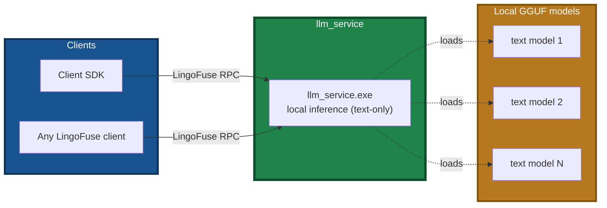
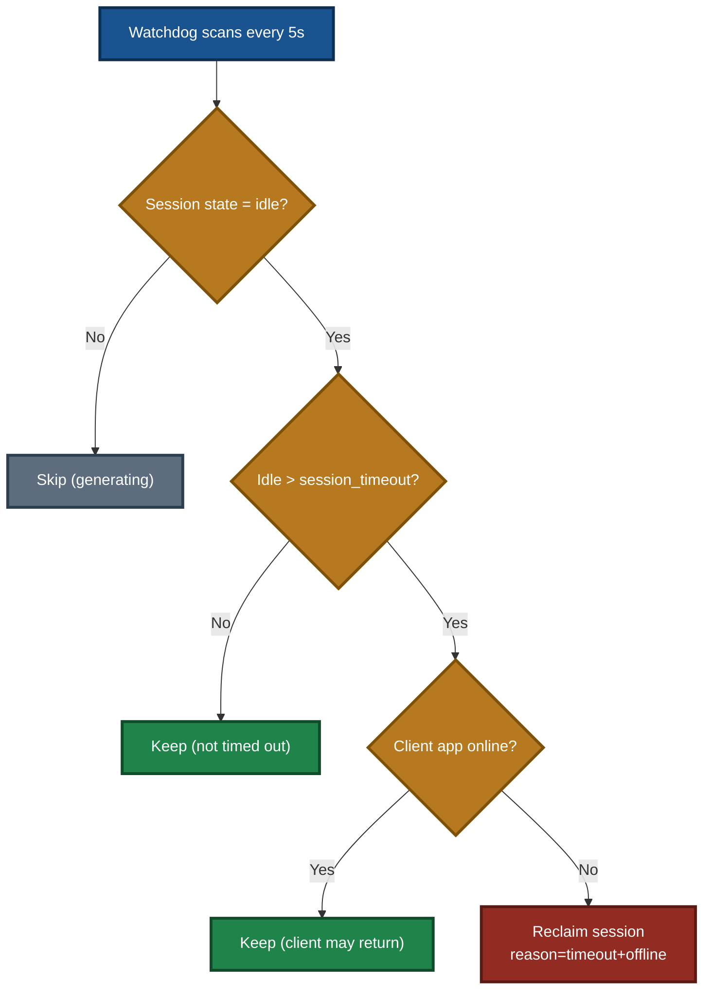
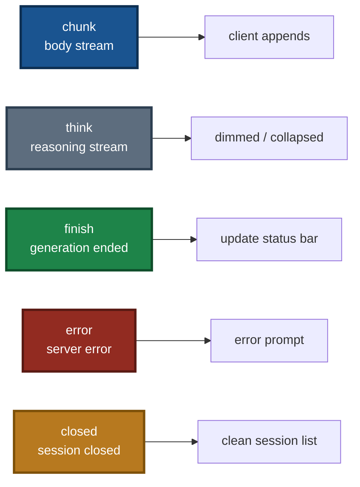

# LingoFuse LLM Service — CLI Guide

> **Applies to**: `llm_service.exe` (Windows) / `llm_service` (Linux)
> **Document version**: v3.3 (language-neutral rewrite)
> **Last updated**: 2026-09-26

---

## Read This First: Capability Boundaries

Before reading this document, understand three key facts:

| # | Fact | Notes |
|:-:|---|---|
| 1 | **`llm_service` is a text-only inference service** | The local inference path (llama.cpp) does **not support multimodal**. There is **no** `--mmproj` option. |
| 2 | **For multimodal, use `llm_proxy` / `llm_proxy_tool`** | A **VLM backend** (e.g. LM Studio) loads the multimodal model + mmproj; the proxy **forwards image attachments verbatim**. |
| 3 | **`llm_service` is the auxiliary verification tool** | It can still be used **independently** (no beacon, no tool provider, no MCP required), but it is no longer "one of the three core servers". |

> **Why doesn't `llm_service` support multimodal?** The local inference path's visual encoder loading is not implemented. This is a known boundary of the current generation. For image Q&A, use `llm_proxy` / LTB to forward to a VLM backend.

---

## 1. Positioning

`llm_service` is a **multi-session streaming local inference service built on the LingoFuse service mesh**. It loads a local GGUF model, exposes standard LingoFuse APIs, and serves clients or gateways.

### Role change in the current generation

`llm_service` is **no longer "one of three core servers"**. Its roles are now:

| Role | Notes |
|---|---|
| **Auxiliary verification tool** | Used to **verify whether a given GGUF model is suitable for your task** |
| **An embeddable utility** | Can be used **independently of the entire agent ecosystem**, as a "local LLM assistant" embedded in your project |

> **Production recommendation**: use `llm_proxy` / `llm_proxy_tool` to forward to a mature backend such as LM Studio.
> **`llm_service`'s value is**: fully offline operation, deep embedding, quick validation, and text-only tasks.

### Diagram 1 — Where `llm_service` sits in the ecosystem



### Relationship with the other LLM servers

`llm_service`, `llm_proxy`, and `llm_proxy_tool` are **sibling servers**, all registered by default on `ipc:llm_service` / `LLM_Service`.

> **Only one may run at a time.** To coexist, each must use a distinct `--endpoint` and `--app-name`.

**Runtime**: Windows / Linux.
**Dependencies**: `LingoFuse64.dll` / `liblingofuse.so` (on the system PATH or next to the executable).

---

## 2. Quick Start

### 2.1 Minimal startup

Prerequisite: a model file (`NVIDIA-Nemotron-3.5-Lightning-30B-A3B-UD-IQ4_NL.gguf`) exists in the current working directory, or is provided via `--model-path`.

**Windows (PowerShell)**:

```powershell
cd C:\Temp\temp2
.\llm_service.exe
```

**Linux (Shell)**:

```bash
cd /opt/llm
./llm_service
```

### 2.2 Alternative when VRAM / RAM is insufficient

If loading a ~20 GB model is not feasible, use `llm_proxy` to forward to LM Studio instead:

```powershell
.\llm_proxy.exe --backend-url http://127.0.0.1:1234/v1
```

In that case, neither `llm_service` nor a local model file is needed.

---

## 3. Runtime Prerequisites

### 3.1 Model file must be in place

The service loads a **fixed default path** from the **current working directory**:

```
NVIDIA-Nemotron-3.5-Lightning-30B-A3B-UD-IQ4_NL.gguf
```

**Requirements**:

- File name must match exactly, case-sensitive. Do not rename.
- The file must be in the same directory as `llm_service.exe` (or provide `--model-path`).
- The file must be complete; approximately **19.7 GB**.

If not found, the service exits with an error:

```
[ERROR] Model file not found: ./NVIDIA-Nemotron-3.5-Lightning-30B-A3B-UD-IQ4_NL.gguf
```

> **Notes**:
>
> - `llm_service` **does not scan the directory for other gguf files**. It loads only the fixed default name. For any other model, you **must** pass `--model-path` explicitly.
> - To use the **recommended multimodal Omni model** for **text-only** inference, you **must** pass `--model-path` explicitly.
> - **Model download**: refer to the model notes document in the same directory.

### 3.2 Dynamic library must be loadable

Startup first loads the LingoFuse dynamic library. On success:

```
[INFO] Successfully loaded from system PATH: LingoFuse64.dll
```

On failure, check:

- Whether `LingoFuse64.dll` / `liblingofuse.so` is on the system `PATH` or next to the executable.
- Whether the library's bitness matches the executable (64-bit vs 32-bit).
- Whether its dependency (`z_ipc_64.dll` or equivalent) is discoverable.
- Whether the **VC++ Redistributable (VS2022)** is installed (prebuilt DLLs require it).

### 3.3 Working directory recommendation

Open the terminal in the **directory containing the model and the executable** so the default path resolves correctly.

**Windows (PowerShell)**:

```powershell
cd C:\Temp\temp2
.\llm_service.exe
```

**Linux (Shell)**:

```bash
cd /opt/llm
./llm_service
```

---

## 4. Startup Flow

### Diagram 2 — Startup stages


### Diagram 3 — Request handling flow


After a successful start, the service prints a status banner:

```
======================================================================
 LINGOFUSE LLM SERVICE STATUS
======================================================================
  Server kind             : service
  Backend                 : llama_cpp
  Model path              : ./NVIDIA-Nemotron-3.5-Lightning-30B-A3B-UD-IQ4_NL.gguf
  Context size requested  : auto (model maximum)
  Context size actual     : 32768
  Default max tokens      : 4096
  CPU threads             : 6
  GPU layers offloaded    : -1
  Thinking (global)       : False
  Thinking (DEFAULT_)     : False
----------------------------------------------------------------------
  LingoFuse endpoint      : ipc:llm_service
  Service app name        : LLM_Service
  Notify API name         : llm_stream
  Session idle timeout(s) : 600
  Queue max size          : 256
  Max sessions            : 1024
  Max history per session : 512
  Log level               : 1
----------------------------------------------------------------------
  Chat template           : (none - create_chat_completion fallback)
  Reasoning budget msg    : "(empty)"
  Attachments             : text only (image requires VLM)
  Vision                  : disabled (local VLM path not implemented)
----------------------------------------------------------------------
  Watchdog policy         : reclaim only when idle past the timeout AND the
                            client app is offline
----------------------------------------------------------------------
  Supported APIs          : generate, create_session, close_session, ...
  Unsupported APIs        : (none)
======================================================================
[INFO] LLM Service is running on ipc:llm_service
[INFO] Press Ctrl+C to stop...
```

---

## 5. Parameter Reference

### 5.1 Model and inference parameters

#### `--model-path PATH`

- **Purpose**: path to the GGUF model file.
- **Default**: `./NVIDIA-Nemotron-3.5-Lightning-30B-A3B-UD-IQ4_NL.gguf`
- **Environment variable**: `LLM_MODEL_PATH`

**Windows (PowerShell)**:

```powershell
.\llm_service.exe --model-path D:\models\qwen2.5-7b.gguf
```

**Linux (Shell)**:

```bash
./llm_service --model-path /data/models/qwen2.5-7b.gguf
```

#### `--context-size N`

- **Purpose**: context window size (tokens).
- **Default**: `0` (use the model's maximum supported context)
- **Environment variable**: `LLM_CONTEXT_SIZE`

**Value semantics**:

- `0`: use the model's maximum context. The actual value is determined by the model metadata and displayed as `Context size actual` in the banner.
- Positive `N`: force an N-token context window. Reduces memory usage but limits conversation length.

**Windows (PowerShell)**:

```powershell
# Model maximum (default)
.\llm_service.exe --context-size 0

# Explicit 8192
.\llm_service.exe --context-size 8192
```

**Linux (Shell)**:

```bash
# Model maximum (default)
./llm_service --context-size 0

# Explicit 8192
./llm_service --context-size 8192
```

#### `--max-tokens N`

- **Purpose**: maximum tokens per generation (default cap; can be overridden by per-request `options.max_tokens`).
- **Default**: `4096`
- **Environment variable**: `LLM_MAX_TOKENS`

**Windows (PowerShell)**:

```powershell
.\llm_service.exe --max-tokens 2048
```

**Linux (Shell)**:

```bash
./llm_service --max-tokens 2048
```

#### `--threads N`

- **Purpose**: CPU inference thread count.
- **Default**: `6`
- **Environment variable**: `LLM_THREADS`
- **Recommendation**: set to **half the number of physical cores** (avoids thermal throttling).

**Windows (PowerShell)**:

```powershell
.\llm_service.exe --threads 8
```

**Linux (Shell)**:

```bash
./llm_service --threads 8
```

#### `--gpu-layers N`

- **Purpose**: number of model layers offloaded to GPU.
- **Default**: `-1` (offload all; fall back to CPU if GPU is unavailable)
- **Environment variable**: `LLM_GPU_LAYERS`
- **Values**:
  - `-1` = offload all layers to GPU (best performance on a discrete GPU)
  - `0` = pure CPU mode
  - `N > 0` = offload the first N layers (decrease step by step if VRAM is insufficient)

**Windows (PowerShell)**:

```powershell
# Pure CPU
.\llm_service.exe --gpu-layers 0

# Offload everything
.\llm_service.exe --gpu-layers -1

# Reduce when VRAM is short
.\llm_service.exe --gpu-layers 20
```

**Linux (Shell)**:

```bash
# Pure CPU
./llm_service --gpu-layers 0

# Offload everything
./llm_service --gpu-layers -1

# Reduce when VRAM is short
./llm_service --gpu-layers 20
```

#### `--system-message "MESSAGE"`

- **Purpose**: default system message for new sessions (can be updated at runtime via `set_system_message`).
- **Default**: `Before answering, briefly list your reasoning steps using numbered bullets. Then give the final answer. Do not use Markdown.`
- **Environment variable**: `LLM_SYSTEM_MESSAGE`

**Windows (PowerShell)**:

```powershell
.\llm_service.exe --system-message "You are a helpful assistant."
```

**Linux (Shell)**:

```bash
./llm_service --system-message "You are a helpful assistant."
```

### 5.2 Multimodal support status

> **`llm_service` does not currently support multimodal (image Q&A).**

**Reason**: multimodal requires a visual encoder (mmproj / vision tower), which the local inference path does not implement. `llm_service` has **no** `--mmproj` option.

**Alternatives**:

| Need | Recommended path |
|---|---|
| **Image Q&A** | Use `llm_proxy` / `llm_proxy_tool` to forward to a multimodal-capable backend (e.g. LM Studio with a VLM loaded) |
| **Offline text-only** | Continue using `llm_service` |

**Example**: forwarding to a multimodal model via LTB:

```powershell
.\llm_proxy_tool.exe `
  --backend-url http://127.0.0.1:1234/v1 `
  --backend-model "qwen2-vl-7b-instruct" `
  --vision
```

> **Client behavior**: if `llm_service` receives a request carrying an `attachments` array, only **text attachments** are accepted and merged into the user message. **Image attachments are explicitly rejected** with `code: -1` and an error stating that the local VLM path is not implemented.
>
> This differs from `llm_proxy` / LTB, which **forward images verbatim** and let the backend decide.

### 5.3 LingoFuse service parameters

#### `--endpoint ADDRESS`

- **Purpose**: LingoFuse service endpoint. IPC for same-host, TCP for cross-host.
- **Default**: `ipc:llm_service`
- **Environment variable**: `LINGOFUSE_ENDPOINT`

**Windows (PowerShell)**:

```powershell
# Same-host IPC (default)
.\llm_service.exe --endpoint ipc:llm_service

# Cross-host TCP (listen on all interfaces)
.\llm_service.exe --endpoint 0.0.0.0:9898
```

**Linux (Shell)**:

```bash
# Same-host IPC (default)
./llm_service --endpoint ipc:llm_service

# Cross-host TCP (listen on all interfaces)
./llm_service --endpoint 0.0.0.0:9898
```

#### `--app-name NAME`

- **Purpose**: LingoFuse application name (clients look up the service by this name).
- **Default**: `LLM_Service`
- **Environment variable**: `LINGOFUSE_APP_NAME`
- **Note**: to coexist on the same host with `llm_proxy` / `llm_proxy_tool`, you **must** change both `--endpoint` and `--app-name`.

**Windows (PowerShell)**:

```powershell
.\llm_service.exe --app-name LLM_Service --endpoint ipc:llm_service
```

**Linux (Shell)**:

```bash
./llm_service --app-name LLM_Service --endpoint ipc:llm_service
```

#### `--notify-api NAME`

- **Purpose**: Notify API name used for streamed token delivery.
- **Default**: `llm_stream`
- **Environment variable**: `LINGOFUSE_NOTIFY_API`
- **Note**: clients must register their Notify callback under the same name to receive the stream. Do not change unless you have a specific need.

#### `--timeout MS`

- **Purpose**: Call API timeout (milliseconds). **Does not affect streaming.**
- **Default**: `5000`
- **Environment variable**: `LINGOFUSE_TIMEOUT_MS`

**Windows (PowerShell)**:

```powershell
.\llm_service.exe --timeout 10000
```

**Linux (Shell)**:

```bash
./llm_service --timeout 10000
```

### 5.4 Service behavior parameters

#### `--session-timeout SECONDS`

- **Purpose**: session idle timeout (seconds). A session is reclaimed by the watchdog only when **both** conditions hold:
  1. Idle time exceeds this value.
  2. The session's owning client application is offline.
- **Default**: `600` (10 minutes)
- **Environment variable**: `LLM_SESSION_TIMEOUT`

**Windows (PowerShell)**:

```powershell
# Fast reclamation
.\llm_service.exe --session-timeout 300

# Long-lived sessions
.\llm_service.exe --session-timeout 3600
```

**Linux (Shell)**:

```bash
# Fast reclamation
./llm_service --session-timeout 300

# Long-lived sessions
./llm_service --session-timeout 3600
```

> **Why dual-condition reclamation?** Clients occasionally disconnect and reconnect (laptop sleep, network jitter, client restart). If reclamation relied on idle time alone, a client pausing beyond the threshold would lose the entire conversation history. Adding the "client offline" condition means that as long as the client remains online, the session is preserved. Only when the client is truly offline (process killed, machine shut down) and the idle timeout has expired is the session reclaimed.

### Diagram 4 — Dual-condition session reclamation



> **Comparison**: `llm_proxy` / `llm_proxy_tool` use **single-condition** reclamation (timeout only). Reason: proxies do not hold a model KV cache; sessions only hold message history, so reclamation is cheap.

#### `--queue-max-size N`

- **Purpose**: maximum number of queued generation tasks. New requests are rejected once the cap is reached.
- **Default**: `256`
- **Environment variable**: `LLM_QUEUE_MAX_SIZE`

**Windows (PowerShell)**:

```powershell
.\llm_service.exe --queue-max-size 512
```

**Linux (Shell)**:

```bash
./llm_service --queue-max-size 512
```

#### `--max-sessions N`

- **Purpose**: maximum number of concurrently active sessions. New sessions are rejected once the cap is reached.
- **Default**: `1024`
- **Environment variable**: `LLM_MAX_SESSIONS`

**Windows (PowerShell)**:

```powershell
# Rate-limit a single host
.\llm_service.exe --max-sessions 64
```

**Linux (Shell)**:

```bash
# Rate-limit a single host
./llm_service --max-sessions 64
```

#### `--max-history N`

- **Purpose**: maximum number of messages retained per session. The oldest messages are dropped when exceeded.
- **Default**: `512`
- **Environment variable**: `LLM_MAX_HISTORY`

**Windows (PowerShell)**:

```powershell
.\llm_service.exe --max-history 1024
```

**Linux (Shell)**:

```bash
./llm_service --max-history 1024
```

### 5.5 Chat template and reasoning parameters

#### `--chat-template PATH`

- **Purpose**: path to a Jinja2 chat template file.
- **Default**: (empty) — use the model's built-in template
- **Environment variable**: `LLM_CHAT_TEMPLATE`

**Behavior**:

1. If this option / environment variable is a **non-empty path**, the file is **loaded**. If the file does not exist, the service **exits with an error**.
2. If empty (default), **no template file is loaded**; the **model's built-in chat template** is used. **No automatic search is performed.**

> **Historical change**: early versions auto-searched for `chat_template.jinja` in the script directory, parent directory, and current working directory. **Automatic search has been removed**; only explicit paths are supported. This avoids confusion when a same-named file exists on disk but the user did not intend to use it.

**Windows (PowerShell)**:

```powershell
.\llm_service.exe --chat-template .\chat_template.jinja
```

**Linux (Shell)**:

```bash
./llm_service --chat-template ./chat_template.jinja
```

#### `--reasoning-budget-message "TEXT"`

- **Purpose**: leading text inserted at the start of the thinking section, used to steer the model to think in a specific language.
- **Default**: `""` (**empty string**)
- **Environment variable**: `LLM_REASONING_BUDGET_MESSAGE`
- **Template variable name**: `reasoning_budget_message`

> **Important**: this option only takes effect when a custom `--chat-template` is provided **and** the template references the `reasoning_budget_message` variable. With the model's built-in template, the option is ignored.
>
> The default is an **empty string**. To steer the model to think in a specific language, pass the option explicitly, for example:
>
> ```powershell
> .\llm_service.exe --chat-template .\chat_template.jinja --reasoning-budget-message "Alright, let me think in English."
> ```

### 5.6 Thinking mode

**Default behavior**: **thinking disabled** (`DEFAULT_THINKING = False`).

**Precedence** (highest to lowest):

1. **Per-request**: `generate`'s `options.thinking`
2. **Command line**: `--thinking` / `--no-thinking`
3. **Environment variable**: `LLM_THINKING` (`1` / `true` / `yes` / `0` / `false` / `no` / `on` / `off`)
4. **Module constant**: `DEFAULT_THINKING`

**Windows (PowerShell)**:

```powershell
# Explicitly enable (overrides all lower-priority settings)
.\llm_service.exe --thinking

# Explicitly disable (overrides environment variable)
.\llm_service.exe --no-thinking
```

**Linux (Shell)**:

```bash
# Explicitly enable
./llm_service --thinking

# Explicitly disable
./llm_service --no-thinking
```

> **Thinking is controlled at the prompt level**: when rendering the prompt, `llm_service` forcibly appends `<think>` / `</think>` markers based on the effective thinking value. This is the key difference from `llm_proxy` / LTB: **the latter apply no policy and simply forward the backend's `reasoning_content`.**

### 5.7 Logging parameters

#### `--log-level {0,1,2}`

- **Purpose**: log verbosity.
  - `0` = quiet: suppress chunk logs and warnings
  - `1` = normal: show per-chunk push logs, suppress warnings (default)
  - `2` = debug: show all logs, including "target client unreachable" warnings
- **Default**: `1`
- **Environment variable**: `LLM_LOG_LEVEL`

**Windows (PowerShell)**:

```powershell
.\llm_service.exe --log-level 1
```

**Linux (Shell)**:

```bash
./llm_service --log-level 1
```

#### `--debug`

- **Purpose**: equivalent to `--log-level 2`.
- **Environment variable**: `LLM_DEBUG` (`1` / `true` / `yes`)

**Windows (PowerShell)**:

```powershell
.\llm_service.exe --debug
```

**Linux (Shell)**:

```bash
./llm_service --debug
```

#### `--quiet`

- **Purpose**: equivalent to `--log-level 0`.
- **Environment variable**: `LLM_QUIET` (`1` / `true` / `yes`)

**Windows (PowerShell)**:

```powershell
.\llm_service.exe --quiet
```

**Linux (Shell)**:

```bash
./llm_service --quiet
```

**Precedence**: `--debug` > `--quiet` > `--log-level`.

---

## 6. Environment Variables

Every command-line parameter has an equivalent environment variable, suitable for launch scripts and system services.

| Environment variable | Corresponding option | Example value |
|---|---|---|
| `LLM_MODEL_PATH` | `--model-path` | `D:\models\qwen.gguf` |
| `LLM_CONTEXT_SIZE` | `--context-size` | `8192` |
| `LLM_MAX_TOKENS` | `--max-tokens` | `2048` |
| `LLM_THREADS` | `--threads` | `8` |
| `LLM_GPU_LAYERS` | `--gpu-layers` | `0` |
| `LLM_SYSTEM_MESSAGE` | `--system-message` | `You are...` |
| `LINGOFUSE_ENDPOINT` | `--endpoint` | `ipc:llm_service` |
| `LINGOFUSE_APP_NAME` | `--app-name` | `LLM_Service` |
| `LINGOFUSE_NOTIFY_API` | `--notify-api` | `llm_stream` |
| `LINGOFUSE_TIMEOUT_MS` | `--timeout` | `10000` |
| `LLM_SESSION_TIMEOUT` | `--session-timeout` | `120` |
| `LLM_QUEUE_MAX_SIZE` | `--queue-max-size` | `256` |
| `LLM_MAX_SESSIONS` | `--max-sessions` | `1024` |
| `LLM_MAX_HISTORY` | `--max-history` | `512` |
| `LLM_CHAT_TEMPLATE` | `--chat-template` | `./chat_template.jinja` |
| `LLM_REASONING_BUDGET_MESSAGE` | `--reasoning-budget-message` | `Think in English.` |
| `LLM_THINKING` | `--thinking` / `--no-thinking` | `1` / `0` |
| `LLM_LOG_LEVEL` | `--log-level` | `1` |
| `LLM_DEBUG` | `--debug` | `1` / `true` / `yes` |
| `LLM_QUIET` | `--quiet` | `1` / `true` / `yes` |

### 6.1 Windows (PowerShell)

```powershell
$env:LLM_GPU_LAYERS = "0"
$env:LLM_THREADS = "8"
.\llm_service.exe
```

**Persist for the user account**:

```powershell
[System.Environment]::SetEnvironmentVariable("LLM_GPU_LAYERS", "0", "User")
```

### 6.2 Linux (Shell)

```bash
export LLM_GPU_LAYERS=0
export LLM_THREADS=8
./llm_service
```

**Persist** (append to `~/.bashrc`):

```bash
echo 'export LLM_GPU_LAYERS=0' >> ~/.bashrc
echo 'export LLM_THREADS=8' >> ~/.bashrc
source ~/.bashrc
```

**Precedence**: command-line argument > environment variable > built-in default.

---

## 7. Complete Scenarios

### Scenario 1 — Pure CPU offline startup (no discrete GPU)

**Windows (PowerShell)**:

```powershell
.\llm_service.exe `
  --gpu-layers 0 `
  --threads 8 `
  --context-size 8192 `
  --quiet
```

**Linux (Shell)**:

```bash
./llm_service \
  --gpu-layers 0 \
  --threads 8 \
  --context-size 8192 \
  --quiet
```

Key points:

- 6–14 tokens/s (depends on CPU).
- A 20 GB model needs 32 GB+ of RAM; reduce the context if necessary.

### Scenario 2 — GPU acceleration (default full offload)

**Windows (PowerShell)**:

```powershell
.\llm_service.exe `
  --gpu-layers -1 `
  --threads 4
```

**Linux (Shell)**:

```bash
./llm_service \
  --gpu-layers -1 \
  --threads 4
```

Key points:

- 20–40 tokens/s (depends on GPU).
- `--threads 4`: with GPU inference, CPU thread count has limited impact.

### Scenario 3 — Gradual tuning when VRAM is insufficient

**Windows (PowerShell)**:

```powershell
# Try 20 layers first
.\llm_service.exe --gpu-layers 20

# If still OOM, drop to 10 layers
.\llm_service.exe --gpu-layers 10

# Finally fall back to pure CPU
.\llm_service.exe --gpu-layers 0
```

**Linux (Shell)**:

```bash
# Try 20 layers first
./llm_service --gpu-layers 20

# If still OOM, drop to 10 layers
./llm_service --gpu-layers 10

# Finally fall back to pure CPU
./llm_service --gpu-layers 0
```

### Scenario 4 — Coexist on the same host with `llm_proxy`

**Windows (PowerShell)**:

```powershell
# Terminal 1: llm_service with the default endpoint
.\llm_service.exe `
  --endpoint ipc:llm_service `
  --app-name LLM_Service

# Terminal 2: llm_proxy with a different endpoint
.\llm_proxy.exe `
  --endpoint ipc:llm_proxy `
  --app-name LLM_Proxy `
  --backend-url http://127.0.0.1:1234/v1
```

**Linux (Shell)**:

```bash
# Terminal 1: llm_service with the default endpoint
./llm_service \
  --endpoint ipc:llm_service \
  --app-name LLM_Service

# Terminal 2: llm_proxy with a different endpoint
./llm_proxy \
  --endpoint ipc:llm_proxy \
  --app-name LLM_Proxy \
  --backend-url http://127.0.0.1:1234/v1
```

Key points:

- They **cannot** share the same `--endpoint` and `--app-name`.
- Clients must adjust `--endpoint` and `--server-app` accordingly.

### Scenario 5 — Cross-host deployment (TCP mode)

**GPU workstation (server)**:

```powershell
.\llm_service.exe `
  --endpoint 0.0.0.0:9898 `
  --app-name LLM_Service
```

**Thin laptop (client)**:

```powershell
.\llm_test.exe --endpoint 192.168.1.100:9898 --server-app LLM_Service
```

Key points:

- The firewall must allow port `9898`.
- The client specifies the remote IP via `--endpoint`.

### Scenario 6 — Log debugging

```powershell
.\llm_service.exe --debug
```

- Prints per-chunk JSON, client reachability warnings, and watchdog decision logs.
- For troubleshooting only; use `--quiet` in production.

### Scenario 7 — Custom system prompt

```powershell
.\llm_service.exe --system-message "You are a code-declaration converter. Convert only the declaration part. No Markdown output."
```

### Scenario 8 — Embedding `llm_service` in your own project

`llm_service` can be used **independently of the agent ecosystem**. Typical usage:

```
1. Ship only llm_service.exe + a client SDK of your choice
2. In your project:
   - Launch the llm_service process (or keep it resident)
   - Connect a client to ipc:llm_service
   - Call Generate / CreateSession to converse with the AI
3. No beacon, no tool provider, no MCP required
```

The client can be written in any language that has a LingoFuse binding. The protocol is the same regardless of language.

> **SDK**: any LingoFuse client binding works. See the client SDK guide.

### Scenario 9 — Verify the LLM service is healthy

After starting `llm_service.exe`, in another terminal run:

```powershell
.\llm_test.exe
```

Enter the interactive CLI, type a prompt to test, and use `/quit` to exit.

### Scenario 10 — Custom chat template

**Windows (PowerShell)**:

```powershell
.\llm_service.exe `
  --chat-template .\chat_template.jinja `
  --reasoning-budget-message "Alright, let me think in English."
```

**Linux (Shell)**:

```bash
./llm_service \
  --chat-template ./chat_template.jinja \
  --reasoning-budget-message "Alright, let me think in English."
```

Key points:

- The template file must be **provided explicitly**; automatic search is removed.
- `--reasoning-budget-message` only takes effect when the template references the `reasoning_budget_message` variable.

---

## 8. Runtime Behaviors

### 8.1 Multi-session concurrency

Each `generate` request has an independent `session_id` and thread. Concurrent clients do not interfere with one another. Per-session state (`client_name`, `start_time`, `status`) is tracked in an internal dictionary.

### 8.2 Streaming message protocol

The server pushes structured JSON over the `llm_stream` Notify API:

| Type | Fields | Meaning |
|---|---|---|
| `chunk` | `session_id`, `text` | Body stream |
| `think` | `session_id`, `text` | Reasoning stream |
| `finish` | `session_id`, `reason` | Generation ended |
| `error` | `session_id`, `message` | Server error |
| `closed` | `session_id`, `reason` | Session closed |

### Diagram 5 — Message types and client behavior



### 8.3 Shutdown

- `Ctrl+C`: graceful exit; prints `[Service] Shutting down...` and releases resources.
- `atexit` ensures `cleanup()` is invoked.
- **Do not** close the window directly or use `kill -9`; residual IPC queues may remain.

---

## 9. Troubleshooting

### Q1 — Startup reports `Model file not found`

**Diagnosis**:

**Windows (PowerShell)**:

```powershell
# Check the current directory
Get-ChildItem *.gguf

# Or launch with an absolute path
.\llm_service.exe --model-path D:\models\NVIDIA-Nemotron-3.5-Lightning-30B-A3B-UD-IQ4_NL.gguf
```

**Linux (Shell)**:

```bash
# Check the current directory
ls -lh *.gguf

# Or launch with an absolute path
./llm_service --model-path /data/models/NVIDIA-Nemotron-3.5-Lightning-30B-A3B-UD-IQ4_NL.gguf
```

### Q2 — Startup reports `Failed to load LingoFuse64.dll`

**Fix**:

**Windows (PowerShell)**:

```powershell
# Add the dynamic library directory to the temporary PATH
$env:PATH = "D:\LingoFuse\Binary;$env:PATH"
.\llm_service.exe
```

**Linux (Shell)**:

```bash
# Add the dynamic library directory to the temporary LD_LIBRARY_PATH
export LD_LIBRARY_PATH=/opt/LingoFuse/Binary:$LD_LIBRARY_PATH
./llm_service
```

### Q3 — Insufficient VRAM (`CUDA out of memory`)

**Fix**:

**Windows (PowerShell)**:

```powershell
# Step down the GPU layer count
.\llm_service.exe --gpu-layers 20
.\llm_service.exe --gpu-layers 10
.\llm_service.exe --gpu-layers 0

# Or reduce the context
.\llm_service.exe --context-size 4096
```

**Linux (Shell)**:

```bash
# Step down the GPU layer count
./llm_service --gpu-layers 20
./llm_service --gpu-layers 10
./llm_service --gpu-layers 0

# Or reduce the context
./llm_service --context-size 4096
```

### Q4 — Insufficient RAM (pure CPU)

A 20 GB model plus KV cache needs 32 GB+ of RAM. If RAM is insufficient:

- Reduce `--context-size` (e.g. 4096).
- Switch to `llm_proxy` forwarding to LM Studio (LM Studio can run on a machine with a discrete GPU).

### Q5 — CPU too slow / fans too loud

**Fix**:

**Windows (PowerShell)**:

```powershell
# Reduce to half of physical cores
.\llm_service.exe --threads 4
```

**Linux (Shell)**:

```bash
# Reduce to half of physical cores
./llm_service --threads 4
```

### Q6 — Client receives no stream

**Diagnosis order**:

1. Did the client register a Notify callback under `llm_stream`?
2. Was `client_name` generated **after** `PrepareDone`?
3. Was the server's `--notify-api` changed?
4. Does the server log show `no found app(...)`?

**Use debug logs**:

```powershell
.\llm_service.exe --debug
```

### Q7 — `Context length exceeded`

**Fix**:

```powershell
# Lower the per-generation max tokens
.\llm_service.exe --max-tokens 2048

# Or raise the context (mind memory usage)
.\llm_service.exe --context-size 16384
```

### Q8 — Port / IPC queue already in use

**Symptom**: log reports `Queue "llm_service0" is already occupied`.

**Fix**:

```powershell
.\llm_service.exe --endpoint ipc:llm_service_2
```

### Q9 — Session reclaimed unexpectedly

**Diagnosis**: check whether `--session-timeout` is too small and whether the client has been offline for a long time.

**Log signature**:

```
[Session xxx] Idle for 601.3s (> 600s) and client app '@__generate__@...' is offline; reclaiming session
[Session xxx] Closed (reason=timeout+offline)
```

If the client is actually online but the session was reclaimed, it may be due to a `check_app` cache delay (approximately 3 seconds) causing a misjudgment. Raising `--session-timeout` mitigates this.

### Q10 — `llm_service` exits immediately after startup

**Diagnosis**:

- Is the model file missing (see Q1)?
- Is another `llm_service` / `llm_proxy` / `llm_proxy_tool` already occupying `ipc:llm_service` (see Q8)?
- Check the error message printed in the window.

### Q11 — Custom chat template has no effect

**Diagnosis**:

- Confirm `--chat-template` is a non-empty path and the file exists (a missing file causes an exit with an error).
- Confirm you are **not** relying on the removed automatic search behavior.
- The `Chat template` field in the startup banner should show your template path. If it shows `(none - create_chat_completion fallback)`, the template was not loaded.

### Q12 — `--reasoning-budget-message` has no effect

**Diagnosis**:

- This option only takes effect **when a custom `--chat-template` is provided and the template references the `reasoning_budget_message` variable**.
- With the model's built-in template, the option is ignored.
- The default is an **empty string**; when the option is not passed, the `reasoning_budget_message` variable in the template is empty.

### Q13 — What about multimodal image Q&A?

**Clear answer**: `llm_service` **does not support multimodal**.

**Alternatives**:

- Use `llm_proxy` or `llm_proxy_tool` (LTB) to forward to a multimodal-capable backend (e.g. LM Studio with a VLM loaded).
- LTB additionally supports **server-side tool execution**, so it is the choice when you need a "see an image + call a tool" combination.

### Q14 — What happens if a client sends an image to `llm_service`?

**Behavior**: `llm_service` **explicitly rejects** requests carrying **image attachments**, returning `code: -1` with an error message stating that image attachments are not supported by `llm_service` in this revision.

**Reason**: the capability matrix advertises `vision=0`, and the server proactively checks and rejects in `_handle_generate`.

**What the client should do**:

- If the client connects to `llm_service`, do not send image attachments.
- If image capability is required, switch to `llm_proxy` / `llm_proxy_tool`.

---

## 10. Startup Parameter Cheat Sheet

```
llm_service.exe [OPTIONS]        # Windows
./llm_service [OPTIONS]          # Linux

Model and inference
  --model-path PATH            GGUF model path (default: ./NVIDIA-Nemotron-3.5-Lightning-...gguf)
  --context-size N             Context window tokens (default: 0 = model maximum)
  --max-tokens N               Max tokens per generation (default: 4096)
  --threads N                  CPU thread count (default: 6)
  --gpu-layers N               GPU layers, -1 = all, 0 = pure CPU (default: -1)
  --system-message "MSG"       Default system prompt

LingoFuse service
  --endpoint ADDR              Service endpoint (default: ipc:llm_service)
  --app-name NAME              Application name (default: LLM_Service)
  --notify-api NAME            Streaming notify API name (default: llm_stream)
  --timeout MS                 Call timeout ms (default: 5000)

Service behavior
  --session-timeout SEC        Session idle timeout seconds (default: 600)
  --queue-max-size N           Max queued tasks (default: 256)
  --max-sessions N             Max concurrent sessions (default: 1024)
  --max-history N              Max messages per session (default: 512)

Chat template and thinking
  --chat-template PATH         Custom Jinja2 chat template (default: empty; model built-in)
  --reasoning-budget-message   Reasoning lead text (default: empty; only in custom templates)
  --thinking / --no-thinking   Explicitly enable/disable thinking (default: False)

Logging and debugging
  --log-level {0,1,2}          Log level (default: 1)
  --debug                      Equivalent to --log-level 2
  --quiet                      Equivalent to --log-level 0

Environment variables map one-to-one (prefixes LLM_* and LINGOFUSE_*)

Multimodal (image Q&A) is not supported. Use llm_proxy / llm_proxy_tool to
forward to a multimodal-capable backend.
There is no --mmproj option; there is no multi-model configuration feature.
```

---

## 11. Related Topics

| Topic | Notes |
|---|---|
| Ecosystem overview | Four core application components and two paths |
| `llm_proxy` CLI guide | Pure text forwarder proxy manual (multimodal forwarding) |
| `llm_proxy_tool` (LTB) CLI guide | Server-side tool execution + multimodal forwarding |
| Backend compatibility list | 250+ OpenAI-compatible backends |
| Core layer complete guide | Includes the pitfall knowledge base |
| Client SDK guide | Event-driven LLM client SDK |

### Code Generator

The MCP-API code generation tool is maintained as a **dedicated repository**:

**LingoFuse-Tools** — one declaration, API bindings for dozens of target languages. The declaration spec, user manual, generator source, and prebuilt packages all live in that repository.

---

**Document version**: v3.3 (language-neutral rewrite — removed all language-specific references; the LLM ecosystem is an interface middle layer and is language-agnostic; removed all document links)
**Maintainer**: LingoFuse Team