# NVIDIA-Nemotron-3-Nano-Omni-30B-A3B-Reasoning-UD-IQ4_XS.gguf — Multimodal Model Download and Deployment Guide

> **Document version**: V3.3 (language-neutral rewrite)
> **Last updated**: 2026-09-26
> **Applies to**: `llm_service` (text-only loading), `llm_proxy` (multimodal forwarding), `llm_proxy_tool` (LTB; multimodal forwarding + tools)

---

## Read This First: Capability Boundaries

Before reading this document, understand three key facts:

| # | Fact | Notes |
|:-:|---|---|
| 1 | **`llm_service` does not support multimodal** | It is a **local text-only inference service**. There is **no** `--mmproj` option. Loading the Omni main model still results in **text-only** inference. |
| 2 | **Multimodal must be forwarded through `llm_proxy` / `llm_proxy_tool`** | A **VLM backend** (e.g. LM Studio) loads the Omni GGUF plus the mmproj vision encoder. `llm_proxy` / LTB **forward image attachments verbatim**. |
| 3 | **The "multimodal deployment" recommended here happens on the VLM backend (e.g. LM Studio)** | `llm_service` is only suitable for text-only inference or model validation. |

> **Why doesn't `llm_service` support multimodal?** The local inference path (llama.cpp + mmproj) has not implemented visual encoder loading. This is a known boundary of the current generation.

---

## Reading Guide

This document covers the download and deployment of the **recommended multimodal (Omni) model**. Suggested reading order:

1. **Why this model was chosen** → Chapter 0, "Model Positioning: A Combined Choice, Not a Replacement"
2. **Quick model overview** → Chapter 1, "Model Overview"
3. **Quantization architecture differences** → Chapter 2, "Quantization Architecture Diversity"
4. **How multimodal works** → Chapter 3, "Multimodal Fundamentals"
5. **Download the model and vision encoder** → Chapters 4 and 5
6. **Deploy multimodal (via a VLM backend)** → Chapter 6, "Deployment"
7. **Why there is no speech support** → Chapter 7, "Special Note on Speech Support"

---

## 0. Model Positioning: A Combined Choice, Not a Replacement

### 0.1 This model is the recommendation of the current generation — but not "the only" model

The **`NVIDIA-Nemotron-3-Nano-Omni-30B-A3B-Reasoning-UD-IQ4_XS.gguf`** is listed as the **recommended model** for the current generation. This is a **combined choice after multiple rounds of comparison**, not a "the old model is deprecated" style replacement.

| Model asset | Positioning | Capability | Status |
|---|---|---|---|
| `NVIDIA-Nemotron-3.5-Lightning-30B-A3B-UD-IQ4_NL.gguf` | The text-only era's recommended model | Text-only | **Still usable**, not the current first choice |
| **`NVIDIA-Nemotron-3-Nano-Omni-30B-A3B-Reasoning-UD-IQ4_XS.gguf`** | **The current generation's recommended model** | **Text + image** | **Subject of this document** |
| Qwen3.6 / Qwen3.8 / Meta series | Candidates that were compared | Depends on version | Not selected as recommended |

> **Important clarification**: this document is **not** declaring "the old model has been replaced". The older text-only model, the Qwen series, and the Meta series **remain usable**. In the current generation's multimodal narrative, after multiple rounds of empirical comparison, **this Nemotron Omni model is the best overall choice**.

### 0.2 Why this one: a combined trade-off across three dimensions

It was chosen not because of "new technology", but because it **strikes the best balance across the following three dimensions**:

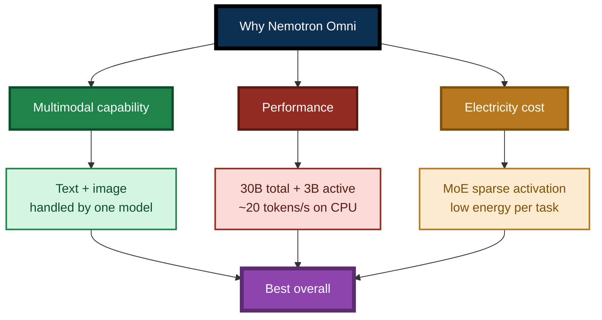

### 0.3 The comparison: why not Qwen3.6 / Qwen3.8 / Meta series

The team tested several model families during selection, including:

| Candidate family | Situation | Why it was not selected (brief) |
|---|---|---|
| **Qwen3.6** | Decent performance | Higher electricity cost; multimodal requires an additional vision model |
| **Qwen3.8** | Newer and stronger | Same as above; less friendly to CPU inference than MoE sparse architectures |
| **Meta series** | Mature ecosystem | Large parameter count, high power draw, multimodal requires a split architecture |
| **Nemotron Omni** | **Best overall** | — |

The **key difference** lies in the **often-overlooked dimension of "electricity cost"**:

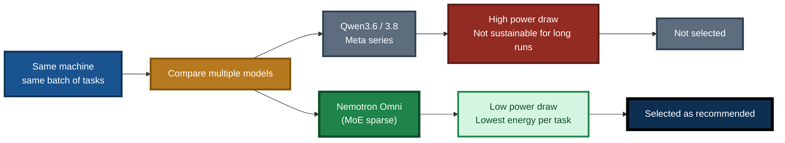

> **Core insight**: **"This is the most electricity-efficient model."** That is not a marketing slogan; it is a **real economic calculation** under long-running, batch-task scenarios. The MoE architecture activates only 3B parameters per step, so the per-token compute cost is far below that of a dense model of the same scale.

### 0.4 Why the current generation is a separate repository

Multimodal is a **derived mechanism** — it is not a single-program upgrade, but an architecture-level change that requires **cooperative support from surrounding programs** to work fully.

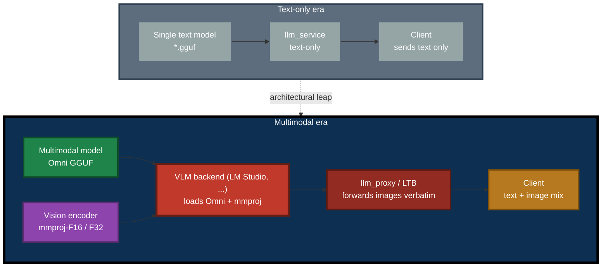

### 0.5 Per-component multimodal behavior (core boundary table)

| Component | Multimodal behavior | Notes |
|---|---|---|
| **`llm_service`** | **Not supported** | The local inference path has no visual encoder loading; no `--mmproj` option. It can load the Omni main model for **text-only** inference. |
| **`llm_proxy`** | **Forwards image attachments verbatim** | Whether it works depends on the **backend** (LM Studio etc.). |
| **`llm_proxy_tool` (LTB)** | **Forwards image attachments verbatim** | Image goes in the first round; subsequent tool rounds use placeholders. Whether it works depends on the **backend**. |
| **Client SDK** | **Builds** multimodal content (text + image attachments) | Via `GenerateWithAttachments` / `GenerateWithImageFile` in the client SDK. |

> **One-sentence memory aid**: **Local inference does not support multimodal; multimodal must be forwarded through `llm_proxy` / LTB to a VLM backend.**

---

## 1. Model Overview

`NVIDIA-Nemotron-3-Nano-Omni-30B-A3B-Reasoning-UD-IQ4_XS.gguf` is the **4-bit quantized (IQ4_XS) GGUF format** version of the NVIDIA **Nemotron 3.5 Lightning Omni** series, designed for **high-frequency task execution in long-running agents**.

Compared with the text-only model (`NVIDIA-Nemotron-3.5-Lightning-30B-A3B-UD-IQ4_NL.gguf`), this model's **core difference is that it is an Omni multimodal model**: it understands not only **text** but also **images**.

### 1.1 Architecture

Nemotron 3.5 Lightning Omni uses a **Mixture-of-Experts (MoE)** architecture:

- **Total parameters**: **30 billion (30B)**; each inference activates only about **3 billion (3B)** parameters
- **Backbone**: hybrid Mamba-2 + MoE + Attention, 52 layers total (23 Mamba-2, 23 MoE, 6 Attention)
- **Vision path**: a **separate vision encoder (mmproj)** handles image → visual token conversion
- **Context length**: up to **1M tokens**; 256K default when deployed on a single H100

The **"large capacity, low activation" design** means the model's **knowledge reserve approaches a 30B dense model**, yet its **inference cost is close to a 3B small model**. As a result, it can achieve **about 20 tokens/s** on CPU — a speed that traditional 30B models struggle to reach in pure CPU environments.

**This is precisely the root cause of its "low electricity cost"**: each step activates only 3B parameters, so per-token computation is small and power draw is naturally low.

### 1.2 Quantization diversity (see Chapter 2)

This model supports **multiple quantization architectures**. The `UD-IQ4_XS` in this document's title is only one of them:

- `IQ4_XS` (this document's example)
- `IQ4_NL`
- `UD-Q4_K_XL`
- `Q4_K_M`
- …and more

**Each quantization architecture behaves differently in layer offloading, performance, and compatibility under the llama.cpp support layer.** Downloading several and evaluating them on your own hardware is strongly recommended. See Chapter 2.

### Diagram 1 — Where the multimodal model sits in the agent loop

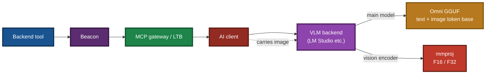

> **Note**: the VLM backend in the diagram is an **external program such as LM Studio**, **not `llm_service`**. `llm_service` can only load the main model for text-only inference.

---

## 2. Quantization Architecture Diversity: IQ4_XS, IQ4_NL, and Others

> This chapter is new in v3.1. **Understanding it helps you make a better choice for your own hardware in the llama.cpp ecosystem.**

### 2.1 What is a "quantization architecture"

**Quantization** is the process of compressing model weights from high precision (e.g. FP16) to low precision (e.g. 4-bit), in order to reduce file size, lower memory footprint, and speed up inference.

**Quantization architecture** refers to the **design of the quantization algorithm itself**. Even with the same target of "4-bit", different architectures differ in how they achieve it, and the resulting files can differ in **size, precision, speed, and compatibility**.

### 2.2 Common quantization architectures at a glance

| Architecture | Bits | Typical size | Precision | Compatibility | Notes |
|---|:---:|:---:|:---:|:---:|---|
| **`Q4_K_M`** | 4-bit | Medium | Medium-high | Excellent | Most universal, best compatibility; works on older llama.cpp |
| **`Q4_K_XL` (incl. `UD-Q4_K_XL`)** | 4-bit | Medium | High | Good | Dynamic quantization, per-layer precision allocation; quality better than K_M |
| **`IQ4_NL`** | 4-bit | Medium | High | Good | Nonlinear lattice quantization; excellent precision/size balance |
| **`IQ4_XS`** | 4-bit | Slightly smaller | Medium-high | Good | Extra-small block quantization; smallest size, good for memory-constrained scenarios |
| **`Q5_K_M`** | 5-bit | Larger | Very high | Excellent | Higher precision, larger size; good when memory is abundant |
| **`Q8_0`** | 8-bit | Very large | Extremely high | Excellent | Nearly lossless; nearly 2× the size; generally used only for comparison |

> **Note**: different repositories may name the same algorithm slightly differently (e.g. the `UD` prefix in `UD-Q4_K_XL` indicates Unsloth dynamic quantization), but the core algorithm is the same category.

### 2.3 Why "download several" is a wise move

**Key fact**: even when the quantization bit width is identical (all 4-bit), **different architectures behave differently under the llama.cpp support layer** — this is not theory but a commonly observed empirical result.

The differences appear in three dimensions:

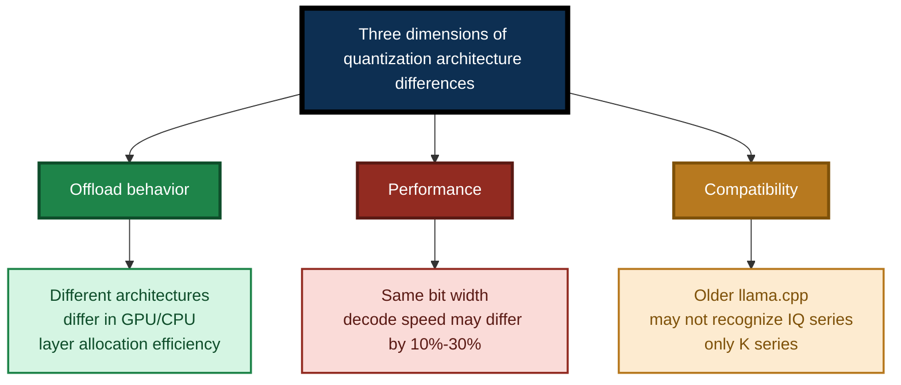

#### Difference 1 — Offload behavior

`--gpu-layers` allocates model layers to GPU. **Different quantization architectures have different efficiency when splitting layers**:

- Some architectures have layer boundaries that align better with GPU memory allocation, resulting in higher splitting efficiency.
- Some architectures produce extra data movement overhead when only partially offloaded.

**Empirical suggestion**: on your machine, try `--gpu-layers` from `0` to `-1` step by step, and see which architecture is notably more stable/faster at a specific offload point.

#### Difference 2 — Performance

At the same 4-bit, **decode speed (tokens/s) can differ by 10%–30%** between architectures:

- `Q4_K_M` is usually fastest (optimized on CPU).
- `IQ4_XS` is smaller but may actually be slightly slower on some CPUs (higher decode cost).
- `IQ4_NL` is balanced on most devices.

**Empirical suggestion**: measure tokens/s for each architecture on the same prompts and the same context length.

#### Difference 3 — Compatibility

- **Older `llama-cpp-python` / `llama.cpp`** may **not support the IQ series** (IQ4_XS, IQ4_NL, etc.) and only supports the Q series (Q4_K_M, Q5_K_M, etc.).
- **Newer versions** gradually add IQ series support.

**Empirical suggestion**: if loading an IQ series fails, upgrade `llama-cpp-python` first; if you cannot upgrade, switch to `Q4_K_M` or `Q4_K_XL`.

### 2.4 Recommended download strategy

**Do not download only one architecture.** Download 2–3 at once:

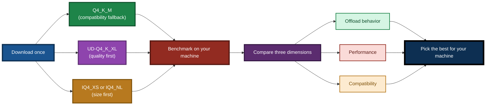

**Recommended combination**:

| Priority | Architecture | Purpose |
|:---:|---|---|
| 1 | **`Q4_K_M`** | Compatibility fallback — guarantees it runs on older devices/versions |
| 2 | **`UD-Q4_K_XL`** or **`Q4_K_XL`** | Quality first — see whether the quality gain justifies the performance cost |
| 3 | **`IQ4_XS`** or **`IQ4_NL`** | Size first — for memory-constrained setups |

> **Empirical mindset**: do not presume "which one is best". **On your machine, your tasks, and your electricity bill**, only the measured result counts.

### 2.5 A simple comparison method

**Scenario 1 — Text-only inference (`llm_service`)**

```powershell
# Load only the main model; no vision encoder (llm_service does not support mmproj)
.\llm_service.exe --model-path .\NVIDIA-Nemotron-3-Nano-Omni-30B-A3B-Reasoning-Q4_K_M.gguf --gpu-layers -1
.\llm_service.exe --model-path .\NVIDIA-Nemotron-3-Nano-Omni-30B-A3B-Reasoning-UD-Q4_K_XL.gguf --gpu-layers -1
.\llm_service.exe --model-path .\NVIDIA-Nemotron-3-Nano-Omni-30B-A3B-Reasoning-UD-IQ4_XS.gguf --gpu-layers -1
```

**Scenario 2 — Multimodal inference (VLM backend)**

Switch model architecture in **LM Studio** and repeat the same image Q&A, observing response speed and quality.

**Observe three metrics**:

1. **Load time**: does the model load successfully?
2. **Generation speed**: what is the tokens/s?
3. **Power/temperature**: fan noise, CPU/GPU temperature, power meter reading.

**Record in a table and compare** to pick the best overall on your machine.

---

## 3. Core Parameters at a Glance

| Parameter | Value |
|---|---|
| **Model name** | NVIDIA-Nemotron-3-Nano-Omni-30B-A3B-Reasoning |
| **Model type** | **Multimodal (Omni)** — text + image (requires a VLM backend) |
| **Architecture** | MoE — hybrid Mamba-2 + MoE + Attention |
| **Total parameters** | 30B |
| **Active parameters** | ~3B / token |
| **Context length** | Up to 1M tokens (256K native default) |
| **Quantization architectures** | `Q4_K_M` / `UD-Q4_K_XL` / `IQ4_NL` / `IQ4_XS` / `Q5_K_M` / `Q8_0` and more |
| **Example quantization in this document** | `IQ4_XS` (block-32, ~4.0 bpw) |
| **Example main model size** | ~19.7 GB |
| **Vision encoder** | **mmproj-F16** (recommended) / **mmproj-F32** (higher precision) — **loaded by the VLM backend** |
| **Inference mode** | Configurable thinking mode (`enable_thinking=True/False`) |
| **Speculative decoding** | Supports DSpark, DFlash, MTP (Multi-Token Prediction) |
| **Supported languages** | English (incl. code), Spanish, French, German, Italian, Japanese |
| **Recommended sampling** | Thinking mode: Temperature 1.0, Top_P 0.95 |
| **License** | OpenMDW License Agreement v1.1 (commercial use permitted) |
| **Release date** | August 11, 2026 |
| **Pretraining data cutoff** | September 2025 |
| **Post-training data cutoff** | May 2026 |

> **Key understanding**: 30B total parameters means the model has a rich knowledge reserve; 3B active parameters means only a small subset of expert networks is invoked per inference, so **CPU inference is far faster than traditional 30B models**, and **energy per task is far lower than a dense model of the same scale**.

---

## 4. Multimodal Fundamentals

> This chapter is aimed at **readers who are new to multimodal models**, explaining what it is, how it works, and why extra files are needed.

### 4.1 What is multimodal

**Multimodal** means the model can understand **multiple input modalities** at the same time. This model supports two:

| Modality | Description | Example |
|---|---|---|
| **Text** | User prompts, system prompts, multi-turn history | "analyze this image" |
| **Image** | Charts, screenshots, photos, scans | `chart.png` |

**Difference from a traditional text-only model**:

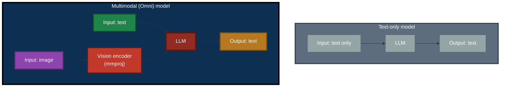

### 4.2 How a multimodal model works

The full pipeline of one image Q&A:

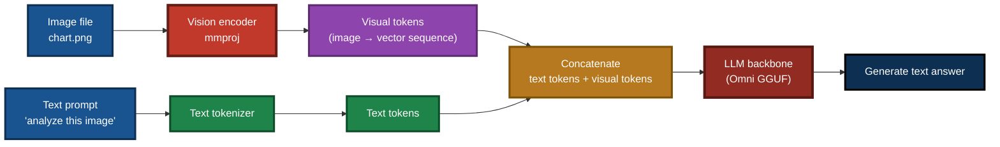

**Four key steps**:

1. **Image → visual tokens**: the vision encoder (mmproj) encodes the image into a sequence of **vectors** (called "visual tokens"). This is mmproj's job.
2. **Text → text tokens**: the text tokenizer splits the text into tokens.
3. **Concatenate**: visual tokens and text tokens are combined into a single sequence.
4. **LLM backbone inference**: the main model (LLM part) of the Omni GGUF does autoregressive generation on this mixed sequence and produces the text answer.

### 4.3 Why the mmproj encoder is needed

> **Core awareness**: **the Omni GGUF main model does not include the vision encoder.**

This is the trap that most first-time multimodal developers fall into. The GGUF format's design philosophy is **modular**:

| Component | Responsibility | File |
|---|---|---|
| **Main model (LLM backbone)** | Language understanding and generation | `NVIDIA-Nemotron-3-Nano-Omni-...gguf` (~19.7 GB) |
| **Vision encoder (mmproj)** | Image → visual tokens | `mmproj-F16.gguf` or `mmproj-F32.gguf` (a few hundred MB) |

> **Important**: both the main model and the mmproj **are loaded by the VLM backend (e.g. LM Studio)**. `llm_service` does **not** load mmproj.

**Without mmproj**:


**With mmproj**:


### 4.4 Choosing between mmproj-F16 and mmproj-F32

The vision encoder comes in two precision variants:

| Version | Precision | File size (approx.) | Quality | Memory/VRAM | Recommended for |
|---|:---:|:---:|:---:|:---:|---|
| **mmproj-F16** | 16-bit float | Smaller | High | Lower | **Almost all scenarios (recommended)** |
| **mmproj-F32** | 32-bit float | Larger | Higher | Higher | Extreme image understanding precision requirements |

**Recommendation**:

- **Choose `mmproj-F16` by default** — quality is already sufficient and footprint is smaller.
- **Consider `mmproj-F32` only when**:
  - You need extremely high precision for fine image details (medical imaging, engineering drawings)
  - Your hardware has ample memory/VRAM and you do not care about the extra footprint
  - You are sensitive to F16 quantization error and empirically find F32 clearly better

> **Note**: the precision of mmproj and the main model are **independent**. You can pair an IQ4_XS main model with an F16 mmproj, or a Q4_K_M main model with an F32 mmproj. Neither affects the other.

### 4.5 Multimodal capability matrix

How each component of the ecosystem supports multimodal:

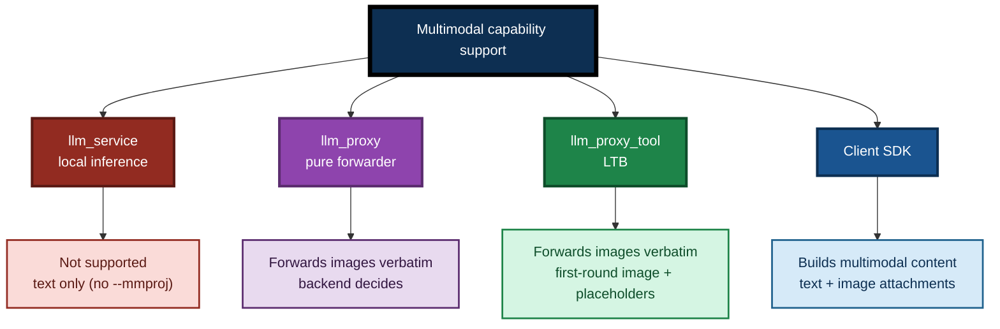

---

## 5. Downloading the Model and mmproj

### 5.1 Main model download

#### 5.1.1 Sources

| Source | Repository page | Notes |
|---|---|---|
| **Unsloth** | [unsloth/NVIDIA-Nemotron-3.5-Lightning-30B-A3B-GGUF](https://huggingface.co/unsloth/NVIDIA-Nemotron-3.5-Lightning-30B-A3B-GGUF) | Dynamic quantization (`UD-*`), excellent quality |
| **AtomicChat** | [AtomicChat/NVIDIA-Nemotron-3.5-Lightning-30B-A3B-GGUF](https://huggingface.co/AtomicChat/NVIDIA-Nemotron-3.5-Lightning-30B-A3B-GGUF) | IQ4_NL and other quantizations |
| **ModelScope** | [modelscope.cn/collections/nv-community/Nemotron-35-Lightning](https://modelscope.cn/collections/nv-community/Nemotron-35-Lightning) | Faster access from some regions |

#### 5.1.2 Download suggestion: multiple architectures in parallel

**Again** (see Chapter 2): **do not download only one architecture**. Download 2–3 and evaluate them yourself.

**Using `huggingface-cli` to download several architectures together**:

```bash
pip install -U huggingface_hub

# Download three typical architectures + mmproj
huggingface-cli download unsloth/NVIDIA-Nemotron-3.5-Lightning-30B-A3B-GGUF \
    --include "*Q4_K_M*.gguf" "*UD-Q4_K_XL*.gguf" "*mmproj*F16*.gguf" \
    --local-dir . \
    --local-dir-use-symlinks False
```

### 5.2 Downloading the vision encoder (mmproj)

The mmproj encoder is usually provided **in the same Hugging Face repository** alongside the main model, but **the actual file listing in the repository is authoritative** — some repositories place mmproj in a separate directory or sub-repository.

**File name convention**:

```
mmproj-F16.gguf      <- recommended
mmproj-F32.gguf      <- optional, higher precision
```

Different repositories may name them slightly differently, e.g. `mmproj-model-f16.gguf`, `mmproj-Nemotron-F16.gguf`, etc. **Any GGUF file whose name contains `mmproj` is acceptable.**

**Downloading mmproj separately**:

```bash
huggingface-cli download unsloth/NVIDIA-Nemotron-3.5-Lightning-30B-A3B-GGUF \
    --include "*mmproj*" \
    --local-dir . \
    --local-dir-use-symlinks False
```

### 5.3 Renaming after download

For easier management, consider renaming:

| Downloaded file | Suggested rename |
|---|---|
| `NVIDIA-Nemotron-3.5-Lightning-30B-A3B-...-IQ4_XS.gguf` | `NVIDIA-Nemotron-3-Nano-Omni-30B-A3B-Reasoning-UD-IQ4_XS.gguf` |
| `...-Q4_K_M.gguf` | `NVIDIA-Nemotron-3-Nano-Omni-30B-A3B-Reasoning-Q4_K_M.gguf` |
| `...-UD-Q4_K_XL.gguf` | `NVIDIA-Nemotron-3-Nano-Omni-30B-A3B-Reasoning-UD-Q4_K_XL.gguf` |
| `mmproj-*.gguf` (F16 or F32) | `mmproj-F16.gguf` or `mmproj-F32.gguf` (keep the variant marker) |

> **Important**:
>
> - `llm_service`'s **default load file name** is `./NVIDIA-Nemotron-3.5-Lightning-30B-A3B-UD-IQ4_NL.gguf`. If you rename the main model to the Omni file name, you **must pass `--model-path`**; otherwise `llm_service` will not find the file.
> - The VLM backend (LM Studio etc.) selects files via **GUI**, so it does not depend on the default file name and is unaffected by renames.

### Diagram 2 — Download and placement flow

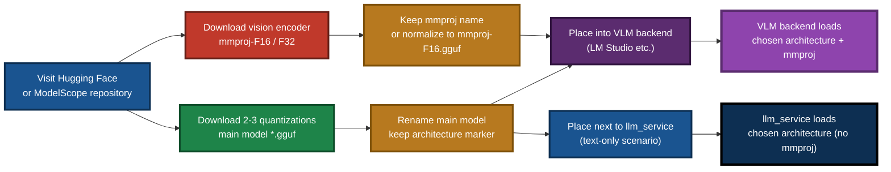

---

## 6. Deployment

> **This chapter is the core correction of this document.** Multimodal deployment is **not done on `llm_service`**, but on a **VLM backend (e.g. LM Studio)**, after which `llm_proxy` / `llm_proxy_tool` forward to it.

### 6.1 Two deployment paths

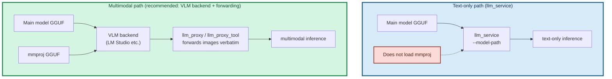

### 6.2 Text-only deployment (`llm_service`)

**Use case**: text Q&A only, no images needed.

**File placement**:

```
<directory containing llm_service>/
├── NVIDIA-Nemotron-3-Nano-Omni-30B-A3B-Reasoning-UD-IQ4_XS.gguf    <- main model (example architecture)
├── NVIDIA-Nemotron-3-Nano-Omni-30B-A3B-Reasoning-Q4_K_M.gguf       <- alternate architecture 1
└── NVIDIA-Nemotron-3-Nano-Omni-30B-A3B-Reasoning-UD-Q4_K_XL.gguf   <- alternate architecture 2
```

**Prerequisite: confirm the `llama-cpp-python` backend**

`llm_service`'s CPU / CUDA support is determined by the installed `llama-cpp-python` wheel:

- **CPU version**:
  ```bash
  pip install llama-cpp-python --extra-index-url https://abetlen.github.io/llama-cpp-python/whl/cpu
  ```
- **CUDA version** (example CUDA 12.4):
  ```bash
  pip install llama-cpp-python --extra-index-url https://abetlen.github.io/llama-cpp-python/whl/cu124
  ```

**Example startup command**:

```powershell
# --model-path must be passed explicitly (the default file name is the older model)
.\llm_service.exe `
  --model-path .\NVIDIA-Nemotron-3-Nano-Omni-30B-A3B-Reasoning-UD-IQ4_XS.gguf `
  --gpu-layers 0 `
  --threads 8 `
  --context-size 8192
```

> **There is no `--mmproj` option.** `llm_service` has no multimodal loading capability. If it is passed, it is ignored or rejected.

### 6.3 Multimodal deployment (VLM backend + forwarding) — recommended

**Use case**: image Q&A is needed.

#### 6.3.1 File placement (for the VLM backend)

Place in the **LM Studio** (or other VLM backend) model directory:

```
<LM Studio model directory>/
├── NVIDIA-Nemotron-3-Nano-Omni-30B-A3B-Reasoning-UD-IQ4_XS.gguf    <- main model
└── mmproj-F16.gguf                                                  <- vision encoder
```

#### 6.3.2 Loading in LM Studio

1. Open LM Studio.
2. In the model list, **select both the main model and the mmproj** (LM Studio pairs them automatically).
3. Start the local server (default port `1234`).
4. Confirm the model ID (visible via `/v1/models`).

#### 6.3.3 Starting LTB for forwarding

```powershell
# LTB forwards the client's image attachments verbatim to LM Studio
.\llm_proxy_tool.exe `
  --backend-url http://127.0.0.1:1234/v1 `
  --backend-model "nvidia-nemotron-3-nano-omni-30b-a3b-reasoning" `
  --mcp-reg-agent-app llm_proxy_agent
```

If tool calling is not needed, use `llm_proxy` instead:

```powershell
.\llm_proxy.exe `
  --backend-url http://127.0.0.1:1234/v1 `
  --backend-model "nvidia-nemotron-3-nano-omni-30b-a3b-reasoning"
```

#### 6.3.4 Verifying multimodal

Send an image directly in the LM Studio GUI to test. If LM Studio understands the image, the VLM is loaded correctly, and LTB / `llm_proxy` forwarding will also work.

### 6.4 Memory requirement estimates

> **Note**: the following is split into "text-only (`llm_service`)" and "multimodal (VLM backend)" cases. Their resource consumption differs.

| Scenario | Component | Memory/VRAM (estimate) |
|---|---|---|
| **Text-only** | `llm_service` + 8K context | ~24–26 GB RAM |
| **Text-only** | `llm_service` + 32K context | ~28–30 GB RAM |
| **Text-only** | `llm_service` + full GPU offload + 8K context | ~20 GB VRAM |
| **Multimodal** | LM Studio + mmproj-F16 + 8K context | ~24–26 GB VRAM/RAM + a few hundred MB for mmproj |
| **Multimodal** | LM Studio + mmproj-F16 + 32K context | ~28–30 GB VRAM/RAM + a few hundred MB for mmproj |

> **Notes**:
> - The main model itself is about 19.7 GB (varies slightly by quantization).
> - mmproj-F16 adds a few hundred MB, **only when the VLM backend loads it**.
> - Including KV cache and runtime overhead, at least **32 GB** of system RAM is recommended.

### Diagram 3 — Memory and context length trade-off

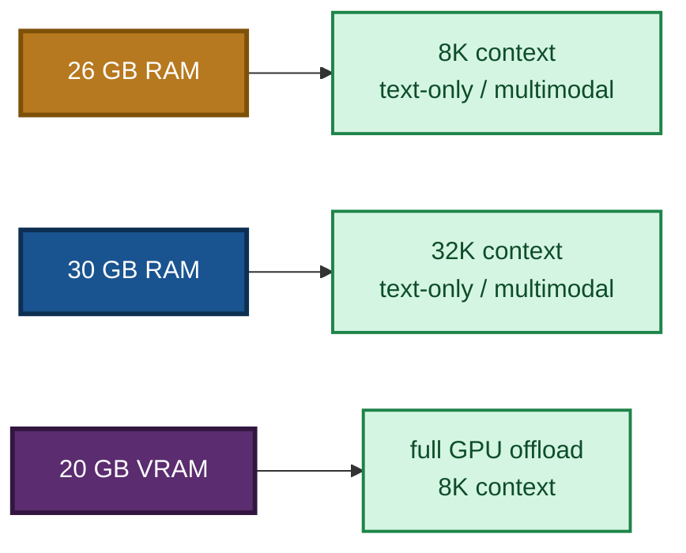

### 6.5 Gradual tuning when VRAM is insufficient

**Text-only (`llm_service`)**:

```powershell
# Try 20 layers first
.\llm_service.exe --model-path .\NVIDIA-Nemotron-3-Nano-Omni-...gguf --gpu-layers 20

# If still OOM, drop to 10 layers
.\llm_service.exe --model-path .\NVIDIA-Nemotron-3-Nano-Omni-...gguf --gpu-layers 10

# Finally fall back to pure CPU
.\llm_service.exe --model-path .\NVIDIA-Nemotron-3-Nano-Omni-...gguf --gpu-layers 0
```

**Multimodal (LM Studio)**: lower the GPU offload layer count in the LM Studio model settings (GUI panel), or reduce the context length.

### 6.6 Alternative: forward to a remote backend

If you do not want to load a ~20 GB model locally, forward to a **cloud OpenAI-compatible API** or a **VLM backend on another machine**:

```powershell
# Forward to the cloud (text-only)
.\llm_proxy.exe --backend-url https://api.deepseek.com/v1 --backend-key sk-xxx

# Forward to the cloud (multimodal, if the backend supports a VLM)
.\llm_proxy_tool.exe `
  --backend-url https://api.some-vlm-provider.com/v1 `
  --backend-key sk-xxx `
  --backend-model "some-vlm-model"

# Forward to a VLM backend on another machine on the LAN
.\llm_proxy_tool.exe `
  --backend-url http://192.168.1.100:1234/v1 `
  --backend-model "nvidia-nemotron-3-nano-omni-30b-a3b-reasoning" `
  --mcp-reg-agent-app llm_proxy_agent
```

See the `llm_proxy` CLI guide and the LTB CLI guide for detailed usage.

### 6.7 How a client sends an image

> **Prerequisite**: the client is connected to **`llm_proxy` / `llm_proxy_tool`** (not `llm_service`).

**Client SDK example (language-neutral pseudocode)**:

```
images = []
images.push({
    name: "chart.png",
    mime: "image/png",
    data_b64: readBase64("chart.png")
})

client.generateWithAttachments("analyze this image", "", images)
```

> **`llm_service` rejects image attachments** (`code: -1` with an error stating that multimodal is not supported). Connect to `llm_proxy` / `llm_proxy_tool` instead.

---

## 7. Model Use Cases

### 7.1 Agent tasks (core positioning)

Nemotron 3.5 Lightning Omni is **designed for agents**. NVIDIA officially describes it as built for "high-frequency task execution in long-running agents", aimed at frequent agent calls including: **tool use, output validation, result formatting, sub-agent delegation**.

On the **PinchBench** benchmark, this family reaches **86% accuracy**, completing 10,000 tasks about **30% faster** than Qwen3.6 35B.

### 7.2 Multimodal tasks (new value in the current generation, requires a VLM backend)

> **The following scenarios require a VLM backend (LM Studio etc.) plus `llm_proxy` / LTB forwarding.** `llm_service` does not support them.

| Scenario | Notes |
|---|---|
| **Chart analysis** | Upload a data chart and let the model interpret trends, anomalies, comparisons |
| **Screenshot understanding** | Upload a UI screenshot and let the model advise on operations or diagnose errors |
| **Scanned documents** | Upload a scanned PDF page and let the model extract key information |
| **Multimodal + tools** | See an image and call backend tools to take further action |

### 7.3 Daily conversation and mainline tasks (text-only)

The 30B knowledge reserve enables the model to handle complex **multi-step reasoning** and **long-context tasks**. The 1M-token context window makes it especially suitable for scenarios requiring **heavy document reading** or **long conversation histories**.

> **Text-only tasks can use `llm_service` directly**, with no VLM backend needed.

### 7.4 CPU inference (~20 tokens/s)

Because each token activates only 3B parameters, CPU inference speed is significantly better than traditional 30B dense models. On modern CPUs with AVX2 support (12th-gen Core i5+ / Ryzen 5000+), with reasonable thread settings, **15–25 tokens/s** is achievable, satisfying the real-time needs of daily conversation and agent calls.

> **Note**: this is the **text-only inference speed**. Multimodal inference speed depends on the VLM backend implementation and is usually slightly slower (visual tokens require extra encoding).

### 7.5 Long-running, high-load tasks (electricity savings)

This is the **most underappreciated value** of this model:

| Dimension | Traditional 30B dense | Nemotron Omni (MoE) |
|---|:---:|:---:|
| Active parameters per inference | 30B | **3B** |
| Compute per token | High | **Low** |
| Power per task | High | **Low** |
| 24/7 electricity bill | High | **Low** |

**This is why "it is the most electricity-efficient model"** — when you let an AI run locally at long duration and high frequency (industrial sites, intranet services, edge devices), **the energy advantage of MoE sparse activation shows up directly on the electricity bill**.

### Diagram 4 — Comparison with a traditional 30B model

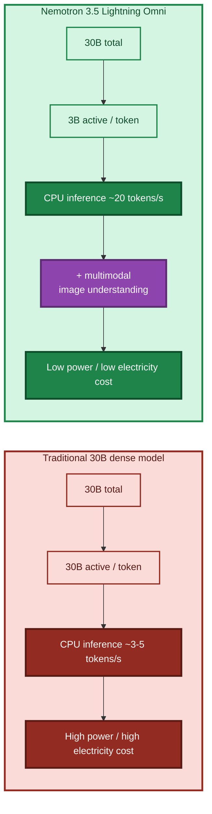

---

## 8. Special Note on Speech Support

> **This chapter explicitly informs the reader about a boundary.**

### 8.1 Current status

The recommended Omni model does **not support speech input or speech output**.

| Modality | Support |
|---|:---:|
| **Text** | Supported |
| **Image** | Supported (requires a VLM backend + mmproj) |
| **Speech (input / output)** | **Not supported** |

### 8.2 Why speech is not supported

This is not a technical incapability but a matter of **two practical constraints**:

#### Constraint 1 — The complexity of Chinese speech: Mandarin plus dialects

Chinese speech processing is far more complex than English:

| Challenge | Notes |
|---|---|
| **Internal variation of Mandarin** | Even within "Mandarin", regional accents differ significantly |
| **Many dialects** | Cantonese, Hokkien, Wu, Sichuanese, Hakka… each has its own phonology |
| **Further sub-division within dialects** | Each dialect has sub-accents of its own (Cantonese alone includes Guangfu, Siyi, Gaoyang, etc.) |
| **Scarce training data** | High-quality annotated dialect speech datasets are far rarer than English ones |
| **Very high compatibility cost** | Making a single model "understand" all dialects increases both training and inference cost dramatically |

**Simply put**: fitting "Mandarin plus major dialects" into a single model is a **huge and ever-expanding** engineering task with poor compatibility.

#### Constraint 2 — Open-source licensing and ownership limits of speech synthesis / playback

Even if speech **recognition** (ASR) is solved, speech **synthesis** (TTS) brings its own problems:

| Issue | Notes |
|---|---|
| **Open-source license limits** | Many high-quality TTS models use **non-commercial** licenses or have extra terms for **commercial** use |
| **Training data copyright** | Some TTS models are trained on **copyrighted audio sources** (voice actors, broadcast programs, etc.) |
| **Ownership disputes** | Some voices are highly similar to identifiable people, raising **voice ownership** issues |
| **Commercial risk** | Once used in production, it may trigger legal disputes |

**Simply put**: on the speech **playback** side, many **high-quality** solutions **carry legal chains** — unacceptable for a permissively licensed project that emphasizes "free use, free commercial use".

### 8.3 Future plans

> **This will be supported in the future when an opportunity arises.**

Speech has **not been abandoned**, only **not done now**. Possible future paths:

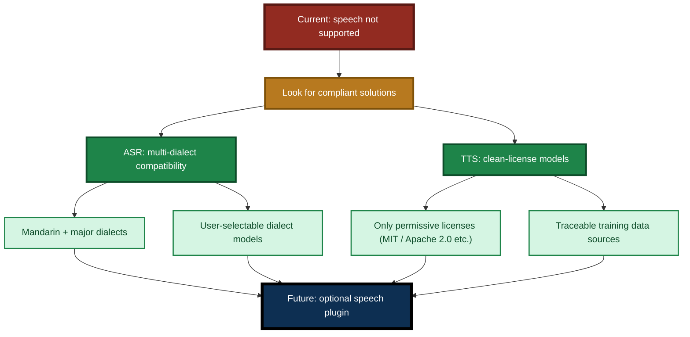

**Current advice**:

- If you need speech, **use an external compliant ASR / TTS service** and integrate it with the ecosystem through the attachment mechanism of `llm_proxy` / LTB.
- If you have a **commercial-grade, clean-license** Chinese speech solution, feedback to the project is welcome — it will be an important reference for future speech support.

---

## 9. Comparison with Other Models

| Item | Qwen2.5-7B | Qwen3.6 / 3.8 | Meta series | **Nemotron Omni (this document)** |
|---|:---:|:---:|:---:|:---:|
| Total parameters | 7B | varies | varies | 30B (3B active) |
| **Multimodal** | No | Some versions | Some versions | **Yes — text + image** |
| Context length | 32,768 | varies | varies | up to 1,000,000 tokens |
| CPU inference speed | ~5–10 t/s | slower | slower | **~20 t/s** |
| Power per task | Medium | **High** | **High** | **Low (most electricity-efficient)** |
| Agent stability | Average | Good | Good | **Excellent — designed for high-frequency agent calls** |
| File size | ~4.7 GB | varies | varies | ~19.7 GB (+ mmproj) |
| Recommended use | Learning, demos | General | General | **Production, agents, multimodal, long-running high-load** |

> **Migration advice**: Qwen2.5-7B served as the entry-level learning model. **New projects should prefer Nemotron Omni** — it has the best overall balance across **multimodal, performance, and electricity cost**. Older models **remain usable** and can still be selected for specific scenarios.

---

## 10. Troubleshooting

### Q1 — `llm_service` reports the model file was not found

**Diagnosis**:

- `llm_service`'s **default load file name** is `./NVIDIA-Nemotron-3.5-Lightning-30B-A3B-UD-IQ4_NL.gguf` (the older text-only model).
- To use the Omni main model, **`--model-path` must be passed explicitly**:
  ```powershell
  .\llm_service.exe --model-path .\NVIDIA-Nemotron-3-Nano-Omni-30B-A3B-Reasoning-UD-IQ4_XS.gguf
  ```
- Confirm the main model file name matches the architecture you actually use (e.g. `...-UD-IQ4_XS.gguf` or `...-Q4_K_M.gguf`).
- Or pass an absolute path to `--model-path`.

### Q2 — `llm_service` fails to load an IQ series architecture

**Symptom**: loading `IQ4_XS` / `IQ4_NL` reports unsupported.

**Fix**:

- Upgrade `llama-cpp-python` to the latest version (older versions do not support the IQ series).
- Or switch to a Q series architecture such as `Q4_K_M` / `UD-Q4_K_XL`.

### Q3 — Image Q&A does not work / the backend says "I do not see an image"

**Important**: **`llm_service` does not support multimodal**. Confirm you are connecting to **`llm_proxy` / `llm_proxy_tool`** with a **VLM backend (LM Studio etc.)**.

**Diagnosis order**:

1. **Is the connection target correct?** The client should connect to `llm_proxy` / `llm_proxy_tool`, **not** `llm_service`.
2. **Did the VLM backend load mmproj?** In LM Studio, confirm both the main model and mmproj are selected.
3. **Is the mmproj file complete?** A download may have been interrupted. Check the file size (a few hundred MB).
4. **Is the mmproj version compatible with the main model?** It must come from the **same repository** as the paired file. Do not mix mmproj from different models.
5. **Does the LM Studio `/v1/models` return a model ID?** If not, LTB / `llm_proxy` cannot connect.
6. **Does `--backend-model` point to the VLM?** If empty, LTB / `llm_proxy` grabs the first model from `/v1/models` — which may not be a VLM.

### Q4 — Different architectures perform very differently

**Symptom**: at the same 4-bit, `IQ4_XS` and `Q4_K_M` differ notably in speed and compatibility.

**Interpretation**: this is **normal** (see Chapter 2). llama.cpp supports and optimizes different quantization architectures to different degrees.

**Fix**:

- Benchmark each one and choose the best for your machine.
- If stability is a priority, use `Q4_K_M` (best compatibility).

### Q5 — `llm_service` is out of memory (pure CPU scenario)

**Fix**:

- Reduce `--context-size` (e.g. 4096).
- Reduce `--threads`.
- Switch to a smaller quantization architecture (e.g. `IQ4_XS`).
- Forward through `llm_proxy` to LM Studio (LM Studio can run on a machine with a discrete GPU).

### Q6 — `llm_service` is out of VRAM (CUDA scenario)

**Fix**:

- Step down `--gpu-layers` (e.g. 20 → 10 → 0).
- Reduce `--context-size`.

### Q7 — VLM backend is out of VRAM (multimodal scenario)

**Fix**:

- Lower the GPU offload layer count in LM Studio.
- Reduce the context length.
- Consider placing the mmproj vision encoder on CPU (depends on the backend implementation).
- Switch to a smaller quantization architecture.

### Q8 — `llm_service` CPU too slow / fans too loud

**Fix**:

- Reduce `--threads` (e.g. from 8 to 4).
- Check whether the CPU supports AVX2/AVX512.
- Switch to `Q4_K_M` (specifically optimized on CPU).

### Q9 — Exits immediately after startup

**Diagnosis**:

- Is the main model file missing (see Q1)?
- Is another `llm_service` or `llm_proxy` already occupying `ipc:llm_service`?
- Check the error message in the window.

### Q10 — `llm_service` errors when receiving an image attachment

**Symptom**: the client sends an image to `llm_service` and gets `code: -1`.

**Interpretation**: this is **expected behavior** — `llm_service` explicitly rejects multimodal requests (capability matrix `vision: 0`).

**Fix**: switch to `llm_proxy` / `llm_proxy_tool` with a VLM backend.

### Q11 — Can speech Q&A be used?

**Clear answer**: **not currently supported**. See Chapter 8, "Special Note on Speech Support". Use an external, compliant ASR / TTS service and integrate it with the ecosystem.

---

## Key Takeaways

> **Six sentences to remember this document**:

1. **This model is a "combined choice", not a "replacement"** — `NVIDIA-Nemotron-3-Nano-Omni-30B-A3B-Reasoning-UD-IQ4_XS.gguf` is the recommended choice after a trade-off across **multimodal + performance + electricity cost**; the older model **remains usable**.
2. **Why this one? Because it is the most electricity-efficient** — after empirically comparing Qwen3.6, Qwen3.8, and the Meta series, **MoE sparse activation** gives it the lowest energy per task under long-running, high-load workloads.
3. **Multimodal requires mmproj, but not loaded by `llm_service`** — the main model **does not contain the vision encoder**; mmproj is loaded by the **VLM backend (e.g. LM Studio)**, and `llm_service` **does not support multimodal**.
4. **Many quantization architectures — download several** — `IQ4_XS`, `IQ4_NL`, `Q4_K_M`, `UD-Q4_K_XL`… **differ in offload, performance, and compatibility**; **measure on your own hardware to pick the best**.
5. **Speech not supported** — Mandarin plus dialect compatibility is too complex, and TTS has license and ownership restrictions; **not done now**, **will be looked at again in the future**.
6. **Two deployment paths**:
   - **Text-only**: `llm_service --model-path <main model>` (**no mmproj**)
   - **Multimodal**: VLM backend loads **main model + mmproj**; `llm_proxy` / LTB **forwards images verbatim**

> **One sentence to rule them all**:
>
> **The current generation recommends Nemotron Omni, not because "it is new", but because measurements show it "does the most work, costs the least electricity, and can also read images". For multimodal, forward through `llm_proxy` / LTB to a VLM backend; do not send images to `llm_service`. As for quantization architecture — download several and let your own machine pick the winner.**

---

**Document version**: V3.3 (language-neutral rewrite — removed all language-specific references; the LLM ecosystem is an interface middle layer and is language-agnostic; removed all document links)
**Maintainer**: LingoFuse Team